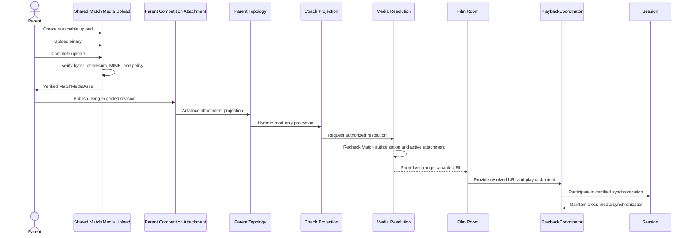

# Shared Match Media — Certified Boundaries v1

Engineering tag: `shared-match-media-architecture-certification-v1`

Status: **CERTIFIED — architecture and contracts only**

Production status: **NOT IMPLEMENTED**. This certification does not authorize implementation before the Required Proof and privacy gates in `SharedMatchMedia-ArchitectureDecision-v1.md` are satisfied.

## 1. Certified domain boundaries

### Match

The existing Parent Competition-owned domain identity addressed by `sharedAthleteId`, `sharedCompetitionId`, and `matchLineageKey`. Shared Match Media cannot create or redefine a Match.

### MatchMediaAttachment

The Parent Competition-owned, revisioned relationship between one Match and zero or one verified `MatchMediaAsset` in v1. It owns attachment state, replacement order, and tombstone state—not binary storage.

### MatchMediaAsset

An immutable Shared Match Media record for binary identity, verification state, storage identity, safe content metadata, and lifecycle. It does not own Match identity or attachment authority.

### CoachMatchMediaProjection

A read-only, revisioned Coach view of the current Match attachment. It contains no writer credential, object key, local path, signed URL, or durable delivery capability.

### DeviceMediaCacheState

Disposable device-local state for resolution, expiry, optional cached-file reference, retry metadata, and last-seen attachment revision. It is non-authoritative and never publishes upstream.

### Media Resolution

The authorization and delivery boundary that rechecks current Match access and converts an active asset reference into a short-lived, range-capable playable URI.

### Film Room

A product playback surface that consumes an already-resolved playable URI. It does not own Match media, publication, authorization, synchronization, or storage.

### PlaybackCoordinator

The certified field playback authority. It owns playback engine lifecycle, field-local intent and execution, engine I/O, and measurement. Shared Match Media introduces no change to this authority.

### Session

The certified cross-media synchronization authority implemented by `FilmRoomSessionCoordinator`. It owns the session playhead, active participant, synchronized seek authority, and cross-media coordination. Shared Match Media introduces no change to this authority.

## 2. Why the attachment exists

The Match does not own binary storage.

The binary asset does not own Match identity.

The `MatchMediaAttachment` is the canonical relationship between the Match and a verified media asset.

This separation allows Parent Competition truth, binary lifecycle, Coach projection, device caching, and playback to evolve without creating a second Match owner or making delivery state canonical.

## 3. Ownership boundaries

| Boundary | Certified authority | Prohibited transfer |
|---|---|---|
| Parent Competition | Active attachment, monotonic revision, replacement, and tombstone | Shared media, Coach, cache, and Film Room cannot mutate attachment truth |
| Shared Match Media | Binary identity, verification, storage identity, delivery metadata, and binary lifecycle | It cannot create Match identity or publish a Match attachment |
| Coach | Read-only projection consumer | It cannot attach, replace, tombstone, or publish canonical media |
| Device cache | Disposable local replica and delivery state | It cannot reconcile or publish upstream |

## 4. Media Resolution boundary

```text
Shared Match Media
→ authorized resolution
→ short-lived playable URI
→ Film Room
```

Certified rules:

- Resolution rechecks current authenticated relationship and Match authorization.
- Knowledge of a `matchMediaAssetId` is insufficient authorization.
- Storage object keys never cross into Film Room.
- Signed delivery URLs never enter synchronized or canonical domain state.
- Resolved URIs are ephemeral delivery capabilities and must be redacted from logs.
- Video delivery must be range-compatible so seeking does not require runtime ownership changes.
- Expiry and revocation recovery remain delivery concerns upstream of the playback runtime.

## 5. Film Room certification

Film Room is not a media ownership system.

Film Room is not an authorization system.

Film Room is not an attachment publication system.

Film Room is not a synchronization authority.

Film Room is a playback consumer of an already-resolved URI.

## 6. Permanent runtime invariant

A `MatchMediaAsset` never directly references Film Room.

Film Room never directly references Shared Match Media storage.

Only an authorized, resolved playable URI crosses the media-delivery-to-runtime boundary.

## 7. Certified sequence



Upload verification and attachment publication are separate transactions. Only verified, exactly Match-bound assets may be published, and publication requires compare-and-swap against the expected attachment revision.

## 8. Forbidden ownership transfers

The following are prohibited under this certification:

- Shared Match Media creating Match identity.
- Coach mutating canonical attachments.
- Film Room resolving authorization.
- Device cache publishing upstream.
- Attachment revisions controlling playback, playhead, seek, pause, or replay.
- PlaybackCoordinator managing upload, verification, publication, authorization, or delivery credentials.
- Session owning upload, authorization, media resolution, storage, or delivery.
- Topology storing device-local paths, storage object keys, or signed delivery URLs.
- Upload verification implicitly publishing an attachment.
- A synchronized `file://` path being treated as Coach-readable media.

## 9. Change-control rule

A new architecture certification is required before changing any of the following:

- attachment cardinality;
- Parent writer authority;
- Coach upload, replace, tombstone, or other write rights;
- retention, recovery, revocation, or deletion semantics;
- guaranteed Coach offline behavior;
- delivery protocol in a way that changes runtime ownership;
- PlaybackCoordinator responsibilities; or
- Session responsibilities.

Until the separate implementation gates are satisfied, the certified result is an architecture and contract boundary only. The upload/resolve proof of concept remains future engineering work.
