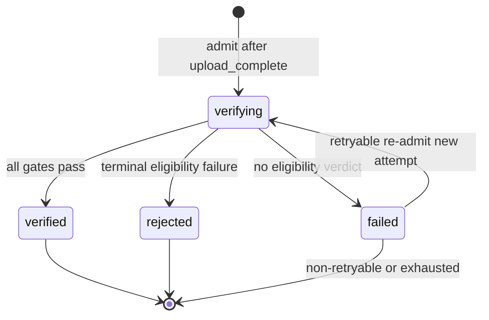

# Shared Match Media — Production Verification Service Contract v1

Engineering tag: `shared-match-media-production-verification-design-v1`

Version: v1

Status: **DESIGN CERTIFIED — RUNTIME NOT IMPLEMENTED**

Production status: **NOT IMPLEMENTED**, **UNDEPLOYED**, **DISABLED**, **RUNTIME-UNCERTIFIED**, **PRODUCT-UNCERTIFIED**

Normative dependencies:

- `SharedMatchMedia-ArchitectureDecision-v1.md`
- `SharedMatchMedia-CertifiedBoundaries-v1.md`
- `SharedMatchMedia-ServiceContracts-v1.md`

Related evidence (non-identity):

- Isolated proof package `shared-match-media-verification-proof/` (mechanics only; certified through 10 GiB)
- Sealed Parent Shared Match Media Upload floor at `upload_complete` only

## 1. Status and certification scope

This document certifies the Production Verification Service **design contract and state machine only**.

It does **not**:

- implement, deploy, or enable Production Verification;
- Product Certify Verification;
- satisfy Required Proof #5 with runtime evidence;
- authorize flag enablement;
- authorize verification of the certified production asset;
- open Publication, Projection, Resolution, Coach visibility, playback, Film Room, or transcript scope.

Permitted design verdict for this artifact: `DESIGN CERTIFIED — RUNTIME NOT IMPLEMENTED`.

## 2. Normative boundary

### Owns

- Eligibility evaluation for a completed immutable media object.
- Admission of an exact completed asset version into verification.
- Durable verification state and evidence.
- Streaming or otherwise bounded binary inspection.
- Observed byte-count validation and declared-versus-observed comparison.
- Whole-object SHA-256 calculation and validation against the controlling expected-digest contract.
- MIME/content-type validation against authoritative signals (not merely an untrusted declared string).
- Privacy-controlled malware/content-scan hook orchestration.
- Terminal reason codes and retryability classification.
- Safe, idempotent retry admission.
- Durable transitions: `verifying → verified | rejected | failed`.
- Publication-eligibility output for the exact verified object version.

### Never owns

- Upload intent, multipart upload-session orchestration, or upload completion.
- Match attachment, Match topology, Match revision, or Match CAS.
- Publication, Projection, Coach visibility, playback authorization, resolved media URI, Film Room wiring, or transcript processing.
- Object deletion, replacement, rename, move, or retention execution.
- Implicit downstream mutation after verification succeeds.

## 3. Lifecycle semantics

### Authoritative lifecycle

```text
upload_pending
  → upload/session-specific intermediate states
  → upload_complete
  → verifying
  → verified | rejected | failed
```

Canonical durable Verification path after Upload:

`upload_complete → verifying → verified | rejected | failed`

Publication and every downstream media boundary remain unopened after any verification terminal state.

### State definitions

| State | Meaning | Publication eligible |
|---|---|---|
| `upload_complete` | Upload authority has durably completed the immutable object. Necessary but insufficient for verification. Does not imply binary eligibility. | No |
| `verifying` | Production Verification has durably admitted the exact asset/object version. Active or recoverably queued. Does not imply success. | No |
| `verified` | All required verification gates passed for the exact object version. Eligible only to be considered by a separately authorized Publication boundary. | Yes (eligibility only; no publish mutation) |
| `rejected` | Verification completed as a process; one or more terminal eligibility checks failed. Automatic retry is not permitted unless a later policy explicitly reclassifies the reason. | No |
| `failed` | Verification could not reach an eligibility verdict. Durable record must state retryable, exhausted, or operator-required. | No |

### `verified` semantic (controlling)

`verified` means only:

> The exact immutable completed object version passed the Production Verification contract and is eligible to be considered by a separately authorized Publication boundary.

`verified` must never mean attached, published, Coach-visible, projected, playable, resolved, transcribed, or approved for deletion/retention changes.

### Completion-semantics conflict resolution

Historical Architecture Decision language titled **Complete and verify** and stated that complete “validates byte count, checksum, detected MIME, and policy,” returning `verifying | verified | rejected` from the upload complete endpoint.

Resolution for this contract:

1. That language is **historical orchestration shorthand** describing a possible future call sequence, **not** a collapse of durable Upload and Verification boundaries.
2. It is **explicitly deprecated** as authority for durable state ownership.
3. Upload completion remains Upload-owned and terminates at durable `upload_complete`.
4. Verification begins only after authoritative `upload_complete` and must pass through durable `verifying`.
5. `upload_complete → verified` without durable `verifying` is forbidden.
6. Historical evidence documents are preserved; they are not rewritten to pretend the conflict never existed.

Upload foundation size checks at completion (declared vs completed object size) remain Upload integrity controls. They do not grant Verification’s eligibility verdict.

## 4. Durable verification-record contract

Production Verification owns a **new production durable verification record**, separate from upload-session orchestration JSON and from create-time object custom metadata.

### Minimum schema

| Field | Role |
|---|---|
| `verificationRecordId` | Stable record identity |
| `contractVersion` | Verification contract/schema version |
| `matchMediaAssetId` | Asset binding |
| `objectVersion` | Immutable storage object version |
| `storageBucketBinding` | Bucket or binding identity |
| `storageObjectKey` | Object key |
| `uploadSessionId` | Optional provenance only |
| `athleteId` | Context provenance |
| `competitionId` | Context provenance |
| `matchId` | Optional if present |
| `matchLineageKey` | Context provenance |
| `declaredByteCount` | Declared size |
| `declaredMimeType` | Declared MIME |
| `expectedWholeObjectSha256` | Controlling expected digest when present |
| `expectedPartDigests` | Optional supporting provenance |
| `state` | `verifying \| verified \| rejected \| failed` |
| `attemptNumber` | Current attempt |
| `admissionKey` | Canonical admission/idempotency key |
| `admittedAt` | Admission timestamp |
| `verifyingStartedAt` | Attempt start |
| `terminalAt` | Terminal timestamp when set |
| `observedByteCount` | Observed streamed/read bytes |
| `observedMimeType` | Detected/validated MIME |
| `calculatedSha256` | Whole-object SHA-256 |
| `scanHookStatus` | Scan-hook outcome class |
| `terminalReasonCode` | Machine-readable reason when terminal |
| `retryClassification` | `retryable \| non_retryable \| exhausted \| operator_required \| not_applicable` |
| `nextRetryEligibleAt` | Optional retry eligibility timestamp |
| `verifierRuntimeVersion` | Verifier/runtime version |
| `evidenceReferences` | Append-only evidence pointers |
| `attemptEvidence` | Append-only per-attempt evidence array |
| `createdAt` / `updatedAt` | Record timestamps |

### Record authority answers

1. **New production record**, not an accidental extension of upload-session JSON. Asset records may later *reference* verification outcomes; they are not the verification state machine authority.
2. Upload-session JSON expires, is orchestration-scoped, and may be deleted after upload recovery windows; it cannot be long-term verification authority.
3. The verification record is authoritative for verification state.
4. Immutable after admission: `verificationRecordId`, `contractVersion` (for that admission), `matchMediaAssetId`, `objectVersion`, `storageBucketBinding`, `storageObjectKey`, `admissionKey`, declared provenance fields, `admittedAt`.
5. Appendable during an attempt: observed measurements, scan-hook status, attempt timestamps, evidence references, retry scheduling fields, `updatedAt`.
6. Attempts are append-only entries; prior attempt evidence is never erased by a later attempt.
7. Terminal evidence is retained with the record and referenced evidence artifacts.
8. `contractVersion` identifies schema; migrations create compatible readers or new admissions under a new contract version — they do not mutate prior terminal verdicts.
9. Asset create-time custom metadata showing `upload_pending` is **immutable intake metadata** and **non-authoritative** relative to durable completion and verification records. It is not a stale-metadata correction task authorized by this design; authority is defined only.

## 5. State-transition table



| Transition | Preconditions | Actor | Concurrency guard | Evidence | Retry | Terminal | Publication eligibility | Forbidden side effects |
|---|---|---|---|---|---|---|---|---|
| no_record → verifying | Authoritative `upload_complete`; flag enabled; object present; completion provenance sufficient; admission key free or retryable-failed | Production Verification Service | CAS create on admission key | Admission + verifyingStartedAt | N/A | No | Unchanged (false) | Match/publication/storage mutation |
| failed(retryable) → verifying | Prior terminal `failed` with retryable classification; retry budget remaining; eligibility time reached | Production Verification Service | CAS on record + single active attempt | New attemptEvidence entry | Continues | No | Remains false | Erasing prior evidence; Match mutation |
| verifying → verified | All gates passed for exact identity | Production Verification Service | CAS state verifying→verified | Observations + terminal reason success class | No further auto | Yes | Becomes true for exact objectVersion only | Publish/project/resolve/play |
| verifying → rejected | Terminal eligibility failure | Production Verification Service | CAS verifying→rejected | Reason code + evidence | No automatic | Yes | Remains false | Auto-retry; Match mutation |
| verifying → failed | Cannot reach eligibility verdict | Production Verification Service | CAS verifying→failed | Reason + retry classification | Per taxonomy | Yes (for this attempt) | Remains false | Silent drop of evidence |
| verified → * | None automatic | None | N/A | N/A | No | Remains terminal | Remains true for that identity | Re-verify same admission identity |
| rejected → * | None automatic | None unless later policy reclassification | N/A | N/A | No automatic | Remains terminal | Remains false | Auto-retry |
| failed(non-retryable/exhausted) → * | None automatic | Operator/policy only if separately authorized | N/A | N/A | No automatic | Remains terminal | Remains false | Silent reopen |
| objectVersion change | New completed version | New admission identity | New key | New record | Independent | Independent | Prior verified result never inherited | Mutating prior verified record |

### Explicit denials

- `upload_complete → verified` without durable `verifying`.
- `verified → verifying` for the same immutable admission identity.
- Reusing an old verification result for a different `objectVersion`.
- Client-only signals as state authority.
- Multiple active attempts for the same admission identity.
- Publication from `upload_complete`, `verifying`, `rejected`, or `failed`.
- Any Match mutation during any verification transition.

## 6. Admission and idempotency contract

### Canonical admission/idempotency key

Canonical key tuple:

```text
(contractVersion, storageBucketBinding, matchMediaAssetId, objectVersion, storageObjectKey)
```

Rationale: bucket/binding and contract version are required so proof-bucket identities, production-bucket identities, and future contract revisions cannot collide or inherit verdicts.

### Serialization

1. UTF-8 encode each component trimmed, with no surrounding whitespace variance.
2. Join with the literal separator `'\u001f'` (unit separator) in the order above.
3. Store both the canonical serialized string and its SHA-256 hex digest as `admissionKey` / `admissionKeyHash`.
4. Equality is on the canonical serialized string; hash is an index aid only.

### Admission preconditions

1. Independent Production Verification flag evaluates enabled (fail closed otherwise).
2. Authoritative Upload completion record shows `upload_complete` for the same `matchMediaAssetId` + `objectVersion` + key/binding.
3. Completion provenance includes declared byte count and enough identity to bind the object.
4. Object HEAD (or equivalent) confirms presence and matching `objectVersion`.
5. No active `verifying` attempt exists for the admission key.
6. No terminal `verified` or `rejected` record exists for the admission key (those are returned idempotently; they are not re-executed).
7. If terminal `failed` exists, it must be retry-classified and within retry budget.

### Authority allowed to request admission

Only the Production Verification Service (server-side). Clients may observe status; they cannot author verification state. A future Upload→Verification hand-off event is permitted as a trigger but is **not wired by this design**.

### Trigger model

Bounded combination:

- **Primary (future):** event/hand-off after durable `upload_complete`.
- **Secondary:** explicit server-side invoke by an authorized operator/reconciliation path.
- **Reconciliation:** recover stuck `verifying` and retryable `failed` without creating duplicate active work.

This design defines the hand-off contract shape only; it does not add or wire it.

### Duplicate / concurrent / terminal behaviors

| Condition | Behavior |
|---|---|
| Duplicate admission, no record | Exactly one CAS winner creates `verifying`; loser observes existing record |
| Duplicate admission while `verifying` | Idempotent observe of same record; no second active attempt |
| Concurrent admission | Compare-and-set / single-admission guard; at most one active attempt per key |
| Terminal `verified` or `rejected` exists | Return existing terminal record; do not re-execute |
| Retryable `failed` exists | May create a new attempt via CAS transition back to `verifying` |
| Stuck `verifying` | Lease/timeout recovery (below); deterministic and idempotent |
| Different `objectVersion` | Distinct admission identity; never mutate prior verdict |
| Different `storageObjectKey` for same asset ID | Distinct admission identity; treat as identity mismatch if completion provenance disagrees |
| Object absent | Do not admit to success path; record/fail with `OBJECT_NOT_FOUND_AFTER_COMPLETION` (non-retryable operational unless policy later says otherwise) |
| Incomplete completion provenance | Deny admission / `INVALID_COMPLETION_PROVENANCE` |
| Proof that admission is after `upload_complete` | Admission must read Upload’s durable completion authority and refuse otherwise |

### Stuck-`verifying` recovery

1. Each attempt carries a lease/heartbeat or hard deadline derived from policy (design placeholder; not implemented).
2. When lease expires without terminal evidence, transition `verifying → failed` with `STUCK_ATTEMPT_REQUIRES_RECONCILIATION` or retryable class if evidence proves infrastructure abort without eligibility verdict.
3. Recovery never creates a second concurrent active attempt for the same admission key.
4. Prior attempt evidence is preserved.
5. Operator reconciliation may be required when classification is `operator_required`.

## 7. Reason-code and retry taxonomy

### A. Terminal rejection (`rejected`)

| Code | Meaning | Retry | Operator | Denies publication | User-facing | Redact internals |
|---|---|---|---|---|---|---|
| `BYTE_COUNT_MISMATCH` | Observed bytes ≠ declared/completed bytes | No | No | Yes | Safe mismatch class | Yes |
| `SHA256_MISMATCH` | Calculated SHA-256 ≠ controlling expected digest | No | No | Yes | Safe integrity class | Yes |
| `MIME_NOT_ALLOWED` | Detected MIME not in allowlist | No | No | Yes | Unsupported media class | Yes |
| `MIME_SIGNATURE_MISMATCH` | Declared MIME conflicts with detected signature | No | No | Yes | Unsupported/invalid media class | Yes |
| `MALWARE_DETECTED` | Approved scan policy detected malware | No | Possibly | Yes | Generic safety rejection | Yes — never raw findings |
| `CONTENT_POLICY_REJECTED` | Approved future content policy rejection | No | Possibly | Yes | Generic policy rejection | Yes |
| `OBJECT_IDENTITY_MISMATCH` | Bound identity fields disagree with object | No | Possibly | Yes | Generic failure | Yes |
| `UNSUPPORTED_MEDIA_FORMAT` | Format unsupported after inspection | No | No | Yes | Unsupported media class | Yes |

### B. Retryable verification failures (`failed`, retryable)

| Code | Meaning |
|---|---|
| `STORAGE_READ_TRANSIENT` | Transient storage read/availability failure |
| `CONTAINER_START_TRANSIENT` | Transient verifier runtime start failure |
| `CONTAINER_EXECUTION_TRANSIENT` | Transient verifier execution failure without eligibility verdict |
| `VERIFIER_TIMEOUT` | Attempt deadline exceeded without verdict |
| `RATE_LIMITED` | Upstream rate limit |
| `SCAN_PROVIDER_TRANSIENT` | Transient scan-provider failure when scan required |
| `EVIDENCE_WRITE_TRANSIENT` | Transient durable evidence write failure |

All: resulting state `failed`; retryable; deny publication; user-facing generic “temporarily unavailable”; redact provider internals.

### C. Non-retryable operational failures (`failed`, non-retryable)

| Code | Meaning |
|---|---|
| `OBJECT_NOT_FOUND_AFTER_COMPLETION` | Object missing after authoritative completion |
| `OBJECT_VERSION_MISMATCH` | Live object version ≠ admitted version |
| `INVALID_COMPLETION_PROVENANCE` | Completion authority incomplete/incoherent |
| `INVALID_VERIFICATION_INPUT` | Admission inputs fail contract validation |
| `CONTRACT_VERSION_UNSUPPORTED` | Verifier cannot execute requested contract version |
| `REQUIRED_SCAN_POLICY_UNAVAILABLE` | Required scan policy configured but unavailable |

All: deny publication; may require operator; redact secrets.

### D. Operator-required / exhausted

| Code | Meaning | State |
|---|---|---|
| `RETRY_BUDGET_EXHAUSTED` | Automatic retries consumed | `failed` exhausted |
| `STUCK_ATTEMPT_REQUIRES_RECONCILIATION` | Stuck verifying unresolved by automatic recovery | `failed` operator_required |
| `POLICY_DECISION_REQUIRED` | Human policy gate unresolved (e.g., scan fail-closed vs defer) | `failed` operator_required |

### Retry policy (contract-level only)

- Attempt counting starts at 1 on first admission.
- Maximum automatic attempts: policy-owned placeholder (not implemented); default design expectation is small and finite.
- Backoff class: exponential with jitter within a bounded window (placeholder constants owned by future implementation policy).
- Retry eligibility requires retryable classification and remaining budget.
- Exhausted behavior: `RETRY_BUDGET_EXHAUSTED`; no automatic re-admission.
- Re-admission is idempotent and CAS-guarded.
- Previous attempt evidence is preserved.
- Terminal binary `rejected` is never automatically retried.

## 8. Independent feature-flag contract

Proposed production flag name (not added to runtime configuration by this mission):

```text
SHARED_MATCH_MEDIA_VERIFICATION_ENABLED
```

### Rules

- Independent from `SHARED_MATCH_MEDIA_UPLOAD_ENABLED`.
- Independent from `EXPO_PUBLIC_SHARED_MATCH_MEDIA_UPLOAD_CLIENT`.
- Independent from isolated proof `PROOF_ENABLED`.
- Upload certification/operation cannot implicitly enable Verification.
- Verification enablement cannot enable Publication or downstream processing.
- Default: disabled (`"0"` / absent).
- Missing or malformed configuration fails closed.
- Flag evaluation occurs before production admission or execution.
- Disabled behavior: deny new admission/execution; do not mutate verification records except an optional non-mutating audit/metric event if implementation later justifies it. Default design: **no record mutation when disabled**.
- Scope: production worker/environment ownership only; Operator authorizes future enablement.
- Rollback: set flag to disabled; in-flight attempts follow stuck/disable policy below; upload certification and completed objects remain unchanged.
- In-flight-at-disable: do not start new admissions; allow currently executing attempt to reach a durable terminal or stuck-recovery path without publishing; do not delete evidence.
- Observability must distinguish `disabled`, `denied`, `admitted`, and `executed`.

## 9. Privacy and scan-hook contract

This design does **not** claim privacy, consent, child-safety, retention, or legal approval.

### Hook location

After byte-count / SHA-256 / MIME core gates have produced provisional technical success measurements, and before terminal `verified`, invoke the privacy-controlled scan hook when policy requires it.

### Hook I/O (provider-abstracted)

- Input: verification identity, storage read capability / content handle, declared/detected MIME, policy identity, timeout budget.
- Output: `scan_not_required` | `scan_required_and_passed` | `scan_rejected` | `scan_failed` | `policy_unresolved`.
- Full-object access may be required by an approved provider; the core verifier must not hard-code a vendor.
- Timeout/failure map to `SCAN_PROVIDER_TRANSIENT` or `REQUIRED_SCAN_POLICY_UNAVAILABLE` / `POLICY_DECISION_REQUIRED` per policy.
- Evidence minimization: store policy identity, status class, and opaque provider reference only.
- Redact raw video, sensitive findings, credentials, and provider secrets from general logs.
- Third-party processing remains disabled until approved.
- Regional, child-video, consent, retention, and deletion obligations remain external human-owned gates.

### Open privacy question classification

| Question | Classification |
|---|---|
| Exact malware/content-scan vendor selection | Does not block design; blocks implementation topology |
| Whether scan is mandatory for production media | Does not block narrow implementation; blocks live rollout / flag enablement |
| Fail-closed vs deferred when scan unavailable | Does not block design; must be resolved before flag enablement |
| Child-video / consent / lawful basis | Does not block design; blocks live rollout |
| Retention/deletion SLA values | Does not block design; blocks live rollout |
| Cross-border processing approval | Does not block design; blocks live rollout |
| Whether design may claim privacy approval | Blocks false certification claims — design must not claim approval |

No open privacy question blocks this **design** certification, provided the hook remains reserved and third-party processing stays disabled.

## 10. Non-mutation guarantees

Production Verification must not:

- change Match attachment, `matchLineageKey`, `matchId`, or competition identity;
- increment Match revision or perform Match CAS;
- publish media, create/update Coach projection, or make media Coach-visible;
- generate/expose playback URI or resolve storage URI;
- trigger Film Room wiring or transcripts;
- delete/replace/rename/move the media object;
- modify upload completion history or immutable `objectVersion`;
- convert `verified` into an implicit downstream command.

### Future proof techniques (not implemented now)

- Dependency boundary and no imports from Publication/Projection/Resolution modules.
- Restricted storage bindings (read + evidence-write only; no object rewrite/delete).
- Output-only publication-eligibility record/event.
- Negative tests and Match-record snapshot invariance.
- Repository-diff / call-spy proofs in Required Proof #5.

## 11. Publication-eligibility contract

| Verification-related state | `publicationEligible` |
|---|---|
| `upload_complete` (no verification record) | `false` |
| `verifying` | `false` |
| `rejected` | `false` |
| `failed` | `false` |
| `verified` for exact `objectVersion` | `true` for that identity only |

Publication before `verified` is denied. A later `objectVersion` cannot inherit a prior verification result.

## 12. Evidence and observability contract

Retain:

- admission identity and timestamps;
- per-attempt measurements (bytes, SHA-256, MIME, scan status class);
- terminal reason codes and retry classification;
- verifier/runtime and contract versions;
- redaction-safe correlation IDs.

Must not log or expose in user-facing fields:

- storage credentials, signed URLs, provider secrets;
- raw scan findings;
- raw video content or content-derived imagery/transcripts unless separately approved;
- unrestricted object keys in general product logs (prefer redacted/hashed forms where logs are broadly retained).

Metrics align with Service Contracts Verification success/latency ownership and must distinguish disabled/denied/admitted/executed.

## 13. Isolated-proof reuse boundary

### May transfer as mechanics

- Workflow-first admission concepts
- Single-concurrency control patterns
- Container execution patterns
- Streaming object reads
- SHA-256 and byte-count calculation
- MIME-validation mechanics
- Terminal evidence patterns
- Retry classification patterns
- Large-object resource evidence through 10 GiB
- Certification harness concepts

### Does not transfer automatically

- Production service identity
- Production bucket binding (`matmind-coach-media`)
- Production object keys
- Production upload-completion authority
- Production durable verification records
- Production admission key
- Production feature flag
- Production privacy policy
- Production observability
- Production deployment / rollback
- Required Proof #5 satisfaction
- Product Certification

The isolated package certifies verification **mechanics** only. It is not the Production Verification Service.

### Stale 1 GiB artifact disposition

| Artifact | Path | Authority | Disposition |
|---|---|---|---|
| Hard-stop / early container failure evidence | `shared-match-media-verification-proof/evidence/verification-runtime-proof-results-v1.md` | Historical evidence of a 2026-07-21 rejected ladder attempt | **Preserve unchanged as historical evidence.** Superseded as current ceiling by later 1/5/10 GiB certifications and the 10 GiB floor in registers/checkpoint/history. |
| Hard-stop JSON | `shared-match-media-verification-proof/evidence/container-runtime-hard-stop-2026-07-21.json` | Historical machine evidence | Preserve; not current floor. |
| Current isolated floor | `docs/engineering-checkpoint.md`, `CERTIFICATION_HISTORY.md`, `protected-systems-register.md` | Authoritative living registers | Certified through **10 GiB**; production service still unimplemented. |

Do not overwrite historical evidence. Authoritative registers already reflect the 10 GiB floor; this contract records the non-identity and supersession relationship.

## 14. Required Proof #5 acceptance contract

Architecture Decision Required Proof item 5:

> Verification for bytes, checksum, MIME, size, and rejected content; publication before verification denied.

### Design acceptance criteria (this mission)

Satisfied by this document when design-certified:

- Completion vs verification semantics separated.
- Durable verification authority and state machine defined.
- Admission/idempotency key and concurrency rules defined.
- Reason/retry taxonomy defined.
- Independent flag contract defined.
- Privacy-hook boundary reserved without claiming approval.
- Non-mutation and publication-eligibility denial defined.
- Isolated-proof non-identity recorded.
- Implementation acceptance checklist below enumerated.

### Implementation acceptance criteria (still open)

A later implementation-certification mission must prove:

1. Admission only for authoritative `upload_complete`.
2. Idempotent admission for the exact production admission key.
3. Concurrent duplicate admission cannot produce multiple active verifications.
4. Binding to immutable `matchMediaAssetId`, `objectVersion`, bucket/binding identity, `storageObjectKey`.
5. Durable `verifying` exists before binary execution.
6. Reads the real production asset binding, not the proof bucket.
7. Observed byte count calculated and compared.
8. SHA-256 calculated and compared to controlling expected digest contract.
9. MIME validation uses authoritative signals, not merely declared string.
10. Valid bytes/checksum/MIME/size can reach `verified`.
11. Byte-count mismatch → `rejected` with correct reason.
12. SHA-256 mismatch → `rejected` with correct reason.
13. Disallowed/mismatched MIME → `rejected`.
14. Missing/version-mismatched object cannot reach `verified`.
15. Transient infrastructure failure → retry-classified `failed`.
16. Terminal rejection not automatically retried.
17. Retryable failure safely re-admitted without duplicate active work.
18. Attempt evidence durable; prior evidence preserved.
19. Independent verification flag defaults disabled and fails closed.
20. Disabled flag prevents new admission/execution.
21. No upload flag controls Verification.
22. No proof-runtime flag controls Production Verification.
23. Does not mutate the certified asset object.
24. Does not mutate Match attachment, topology, or revision.
25. Does not publish, project, resolve, expose playback, or trigger transcripts.
26. Publication eligibility false for `upload_complete`, `verifying`, `rejected`, `failed`.
27. Publication eligibility true only for exact `verified` objectVersion.
28. Later objectVersion cannot inherit prior verification result.
29. Scan-hook follows approved privacy policy configuration.
30. Evidence/logs redact secrets and sensitive provider findings.
31. Stuck-`verifying` recovery deterministic and idempotent.
32. Runtime rollback leaves upload certification and certified asset unchanged.

### Live production evidence criteria (still open)

- Runtime evidence against production bindings under Operator-authorized conditions.
- No claim against the sealed certified asset unless separately authorized.

### Human privacy/product gates (still open)

- Privacy/product owner approvals listed in Architecture Decision Privacy Review.
- Scan mandatory/fail-closed decisions before flag enablement.

**This design mission does not claim Required Proof #5 complete.**

## 15. Explicit open human decisions

- Privacy/consent/child-safety/retention/deletion policy values.
- Whether malware/content scanning is mandatory and which provider.
- Fail-closed vs deferred when required scan is unavailable.
- Exact automatic retry budget and lease durations.
- Operator enablement of `SHARED_MATCH_MEDIA_VERIFICATION_ENABLED`.

## 16. Explicit implementation exclusions (this mission)

No application/worker/proof-runtime code, schemas consumed by runtime, infrastructure, flags, deployments, Metro, uploads, verification triggers, asset access/mutation, Match mutation, publication/downstream work, commits, or pushes.

## 17. Future implementation entry criteria

A later mission may begin Production Verification **implementation** only when separately authorized and after this design remains the controlling contract. That mission must still treat Required Proof #5, privacy gates, and Product Certification as open until proven.

Smallest named next mission (not begun):

> **Production Verification Service — Durable Record and Admission Skeleton v1**

Scope hint only: create the disabled, unwired durable verification record + admission CAS surface with no binary execution, no production asset access, and flag default disabled.

## 18. Rollback / design-reversal implications

Design reversal requires a new certification amendment. It must not rewrite historical upload certification, isolated 10 GiB evidence, or the sealed `upload_complete` floor. Runtime rollback (when a runtime exists) disables the verification flag without mutating upload completion or Match state.

## 19. Certification verdict (design only)

**DESIGN CERTIFIED — RUNTIME NOT IMPLEMENTED** for Production Verification Service Contract and State-Machine Design v1.

Final design certification decision remains with ChatGPT. Privacy/product decisions remain with the Human Product/Privacy Owner. Implementation remains unauthorized. Flag enablement remains Operator-only and unauthorized. Publication/downstream work remains unauthorized.
