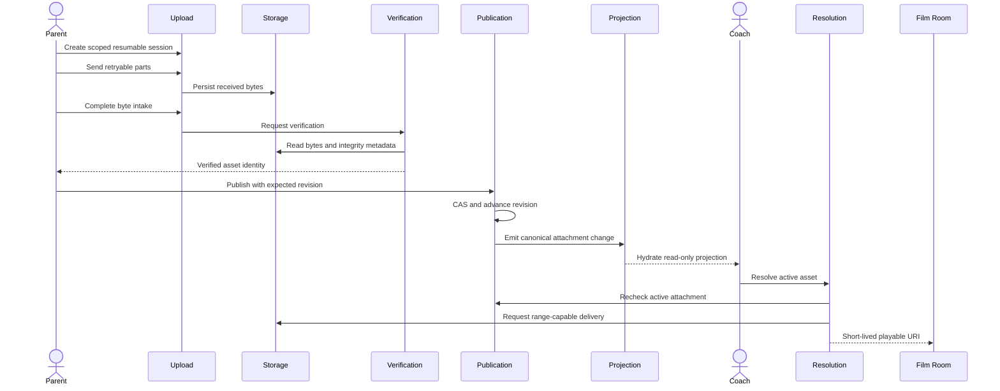
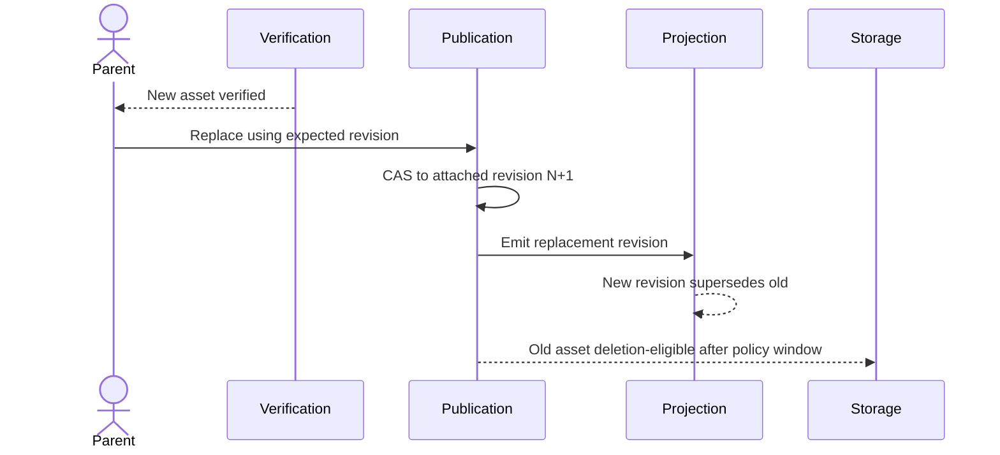
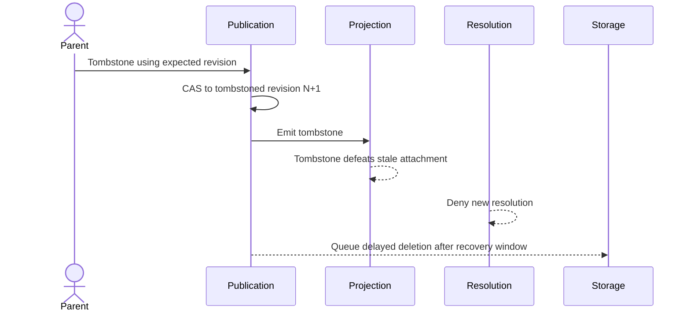
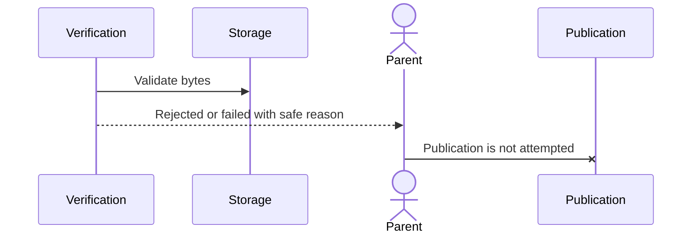
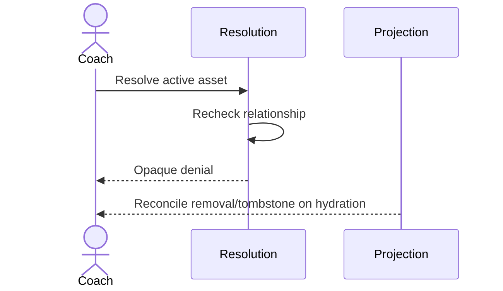
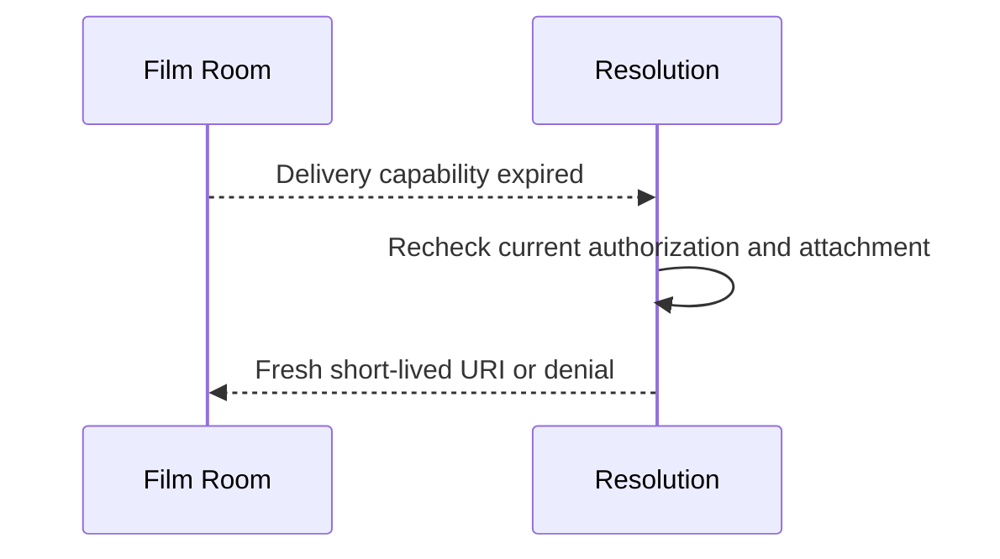
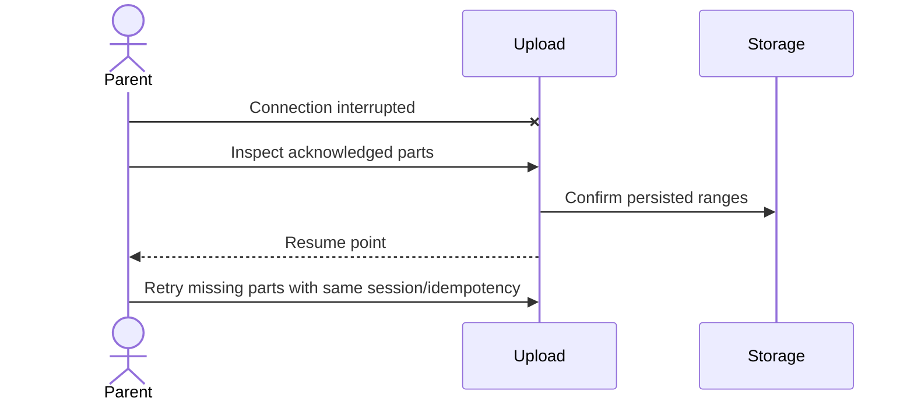

# Shared Match Media — Service Contracts v1

Engineering tag: `shared-match-media-service-contract-certification-v1`

Version: V3 final

Status: **CERTIFIED — service ownership and backend contracts only**

Production status: **NOT IMPLEMENTED**. This document certifies responsibilities and interactions; it does not authorize rollout or certify runtime behavior.

Normative dependencies:

- `SharedMatchMedia-ArchitectureDecision-v1.md`
- `SharedMatchMedia-CertifiedBoundaries-v1.md`

## 1. Purpose and service doctrine

This document defines the backend services required to implement Shared Match Media. It is a service-responsibility contract, not an HTTP API specification, deployment topology, class diagram, or provider selection.

Services may be deployed together, but their ownership remains logically separate. A call chain does not transfer authority. Each durable state transition and each recoverable failure has exactly one owner.

The certified end-to-end responsibility chain is:

```text
Upload Service
→ Verification Service
→ Publication Service
→ Projection Service
→ Resolution Service
→ Film Room resolved-URI boundary
```

Storage Service supports upload, verification, resolution, and lifecycle without becoming Match authority.

## 2. Certified service ownership

| Service | Canonical responsibility | Durable state owned | Explicitly never owns |
|---|---|---|---|
| Upload Service | Resumable byte intake | Upload session and acknowledged parts | Attachment, verification verdict, playback, Match authorization |
| Verification Service | Binary eligibility decision | Verification state and evidence | Publication, Match revision, playback |
| Publication Service | Canonical attachment mutation | Attachment revision, replacement, tombstone | Upload, binary storage, playback |
| Resolution Service | Authorized ephemeral delivery | Resolution audit/result metadata only | Playback, synchronization, attachment mutation |
| Storage Service | Binary object lifecycle | Object identity, storage metadata, deletion lifecycle | Match state, Coach authority, playback |
| Projection Service | Read-only Coach attachment view | Projection checkpoint/read model | Binary storage, upload, playback, canonical attachment mutation |

## 3. Upload Service

### Owns

- resumable upload orchestration;
- creation and binding of an upload session to authenticated Parent, athlete, competition, and Match context;
- chunk or part acceptance and acknowledgement;
- upload-session state, expiry, and resumability metadata;
- safe retry and idempotency for upload-session operations;
- declared integrity request data passed to Verification; and
- transition from byte intake complete to verification requested.

### Never owns

- `MatchMediaAttachment` creation, replacement, revision, or tombstone;
- final checksum, MIME, byte-count, or content-verification verdict;
- durable Match or Coach authorization decisions beyond the scoped upload session;
- binary object lifecycle after handoff to Storage;
- playback, synchronization, seeking, or playable URI generation.

### Contract

Upload completion means all expected bytes were received. It does not mean the asset is verified, attached, published, Coach-visible, or playable. Repeating a chunk or completion request must not duplicate bytes or create a second publication.

## 4. Verification Service

### Owns

- checksum calculation and comparison;
- detected MIME validation against supported policy;
- authoritative byte-count validation;
- malware/content-scan hook orchestration where policy requires it;
- verification evidence and reason codes;
- the `verifying → verified | rejected | failed` transition; and
- retry classification for transient verification failures.

### Never owns

- attachment publication or topology advancement;
- Match revisions, replacement, or tombstone;
- Parent or Coach playback;
- upload-session orchestration; or
- physical object deletion policy.

### Contract

Only `verified` assets are publication-eligible. `verified` never means attached. A rejected asset cannot be published. A transient verification failure may be retried by Verification; a policy rejection requires a new or corrected Parent upload.

## 5. Publication Service

### Owns

- validation of current Parent Competition writer authority;
- exact athlete, competition, Match, and verified-asset binding;
- compare-and-swap using `expectedRevision`;
- atomic attachment creation, replacement, and tombstone publication;
- monotonic revision advancement;
- mutation idempotency and current-safe-state conflict responses; and
- emission of the authoritative attachment change for projection.

### Never owns

- upload sessions or chunk retry;
- binary verification or physical storage;
- playable URI generation;
- Coach mutation authority; or
- playback, synchronization, pause, replay, or seek.

### Contract

Publication is the only service that mutates canonical `MatchMediaAttachment` state. Verification cannot publish implicitly. Replacement publishes the new verified asset at the next revision before the old asset becomes deletion-eligible. Tombstone advances the revision before Storage performs delayed deletion.

## 6. Resolution Service

### Owns

- rechecking current authenticated relationship and exact Match authorization;
- confirming that the requested asset is the active, non-tombstoned attachment;
- generating an ephemeral playable URI;
- delivery capability TTL and safe renewal contract;
- confirming range-capable video delivery;
- opaque authorization/not-found behavior; and
- redaction-safe resolution audit metadata.

### Never owns

- media playback or playback state;
- synchronization, session playhead, pause, replay, or seek;
- attachment creation, replacement, revision, or tombstone;
- durable Coach authorization; or
- storage object keys crossing into Film Room.

### Contract

Asset-ID knowledge is insufficient authorization. Every resolution rechecks current access and attachment state. A resolved URI is a short-lived delivery capability, never synchronized state. Expiry recovery obtains another resolved URI upstream of Film Room playback ownership.

## 7. Storage Service

### Owns

- server-generated object identity and object metadata;
- binary persistence and retrieval primitives;
- object integrity metadata made available to Verification;
- delayed deletion after authoritative tombstone/replacement policy permits it;
- abandoned-upload and verified-orphan cleanup;
- deletion queue state, retries, and terminal deletion evidence; and
- detection/reporting of missing or unavailable blobs.

### Never owns

- Match identity or attachment state;
- Parent or Coach authority;
- attachment revision ordering;
- Coach projection truth;
- playable UI behavior; or
- playback, synchronization, or seeking.

### Contract

Object existence never implies attachment. Object deletion never creates a tombstone. Storage acts only from lifecycle facts issued by the owning service and retains assets through the certified recovery window.

## 8. Projection Service

### Owns

- deriving the read-only `CoachMatchMediaProjection` from canonical attachment state;
- emitting safe attachment fields through Parent topology publication;
- Coach hydration payload compatibility and revision checkpointing;
- monotonic projection reconciliation;
- tombstone-over-stale-attachment behavior; and
- hydration retry for topology lag or transient delivery failure.

### Never owns

- binary bytes, object identity, or storage lifecycle;
- upload or verification state transitions;
- canonical attachment mutation;
- Coach writer authority;
- resolved or signed delivery URIs; or
- playback, synchronization, or seeking.

### Contract

The projection contains Match identity, attachment revision/state, asset ID, safe content metadata, and publication time only. It never contains local paths, object keys, upload credentials, or resolved delivery URIs.

## 9. Primary interaction contract



Film Room receives the URI only after Resolution succeeds. No service in this sequence starts, pauses, replays, synchronizes, or seeks media.

## 10. Replacement and tombstone contracts

### Replacement



The old object is not deleted before the replacement revision is canonical and the recovery window permits deletion.

### Tombstone



## 11. Exception and retry contracts

### Failed verification



Verification owns transient verification retry. Parent initiates a new upload after a policy rejection; Publication remains unchanged.

### Authorization revoked



Resolution owns denial of new capabilities. Projection owns read-model reconciliation. Neither service controls an already-running playback clock.

### Expired URI



Resolution owns URI renewal. Film Room may request recovery but does not generate credentials or alter attachment state.

### Interrupted upload and retry



Upload owns resumability and duplicate-part safety.

## 12. Failure ownership

Each failure has one recovery owner. Consumers may initiate retry, but they do not acquire ownership.

| Failure | Sole recovery owner | Required recovery contract |
|---|---|---|
| Upload interrupted | Upload Service | Preserve acknowledged parts and return a safe resume point |
| Upload session expired | Upload Service | Reject stale session and create a new scoped session without publication |
| Duplicate chunk or completion | Upload Service | Idempotently acknowledge existing work |
| Verification transient failure | Verification Service | Retry within policy and preserve one verification state machine |
| Verification rejected | Verification Service | Record terminal safe reason; require new Parent upload |
| CAS conflict | Publication Service | Return current safe revision/state; perform no partial mutation |
| Replacement race | Publication Service | Admit exactly one expected revision and reject stale writers |
| Tombstone ordering conflict | Publication Service | Preserve monotonic revision and tombstone precedence |
| Expired resolved URI | Resolution Service | Reauthorize and issue a fresh capability or deny |
| Coach authorization revoked | Resolution Service | Deny every new resolution immediately according to policy |
| Blob missing | Storage Service | Mark storage failure, prevent delivery, and raise lifecycle evidence |
| Storage unavailable | Storage Service | Retry with bounded backoff and expose unavailable status upstream |
| Topology/projection lag | Projection Service | Retry hydration/reconcile to the newest attachment revision |
| Stale projection after tombstone | Projection Service | Apply monotonic tombstone precedence |
| Orphan asset | Storage Service | Queue deletion after certified grace and recovery windows |
| Deletion failure | Storage Service | Retain queue item and retry without changing Match state |

## 13. Operational architecture metrics

These metrics define required observability contracts, not dashboards or product analytics. Logs and dimensions must exclude credentials, signed URIs, local paths, object keys, and child-media content.

| Metric | Owning service | Definition |
|---|---|---|
| Upload success | Upload Service | Completed byte-intake sessions divided by eligible started sessions, classified by size and retry outcome |
| Upload retry rate | Upload Service | Sessions requiring part/session retry divided by active sessions |
| Verification success | Verification Service | Verified assets divided by completed uploads, separated from rejected and transient-failed |
| Verification latency | Verification Service | Byte-intake completion to terminal verification state |
| Publication latency | Publication Service | Accepted mutation start to committed attachment revision |
| CAS conflict rate | Publication Service | Revision conflicts divided by publication attempts |
| Hydration latency | Projection Service | Attachment commit to Coach projection acknowledgement/checkpoint |
| Projection retry rate | Projection Service | Hydration retries divided by emitted attachment changes |
| Resolve latency | Resolution Service | Authorized resolve request to delivery-capability response |
| Authorization failures | Resolution Service | Denials by safe reason class, never by exposed sensitive identifier |
| Expired-URI renewal rate | Resolution Service | Renewal requests divided by successful resolutions |
| Playback start latency | Client delivery boundary | Resolved-URI receipt to first playable frame/status; diagnostic only, not service playback ownership |
| Orphan assets | Storage Service | Assets unattached beyond the configured grace window |
| Deletion queue depth/age | Storage Service | Pending lifecycle deletions and oldest eligible age |
| Storage retry rate | Storage Service | Retried storage operations divided by storage operations |

Metrics do not transfer authority. In particular, measuring playback start does not make Resolution, Storage, or Projection a playback owner.

## 14. Runtime protection

The following boundaries are re-certified unchanged:

- `PlaybackCoordinator` remains the field playback authority.
- `FilmRoomSessionCoordinator`/Session remains the synchronization and session-playhead authority.
- Film Room remains a consumer of an already-authorized resolved playable URI.
- Coach Runtime remains a read-only projection consumer for Match media.

No Shared Match Media service may:

- call play, pause, replay, or seek as a media authority;
- own or advance the playback clock;
- register as a Session playback participant;
- synchronize audio and video;
- persist a signed URI into topology or Coach synchronized state;
- hand a storage object key to Film Room; or
- mutate PlaybackCoordinator, Session, or Film Room runtime ownership.

## 15. V1 → V2 → V3 certification review

### V1 — Service ownership clarity

Established five bounded services plus Projection, separated upload from verification and publication, and preserved Parent Competition attachment authority.

Finding: acceptable ownership split, but recovery ownership and lifecycle interactions required explicit treatment.

### V2 — Boundary and operational correctness

Added replacement, tombstone, verification failure, revocation, expiry, retry, and single-owner failure recovery contracts.

Finding: boundaries were correct, but implementation readiness required metrics and stronger runtime-negative guarantees.

### V3 — Final certification

Added operational metric ownership, privacy-safe telemetry rules, full runtime protection, and explicit non-transfer of authority through orchestration or measurement.

Review grades:

| Criterion | V3 assessment |
|---|---|
| Service ownership clarity | PASS — every durable transition has one owner |
| Boundary correctness | PASS — conforms to certified Match/asset/attachment boundaries |
| Runtime protection | PASS — no service owns playback, synchronization, or seek |
| Operational correctness | PASS — recovery and metrics have explicit owners |
| Implementation readiness | CONDITIONAL PASS — contracts are ready; Required Proof and privacy gates remain |

## 16. Certification verdict and change control

**CERTIFIED — Shared Match Media service ownership and backend contracts v1.**

This certification does not certify deployed services, production authorization, security correctness, storage-provider suitability, privacy policy, or runtime performance.

A new certification is required before:

- merging any service ownership listed here;
- allowing Verification to publish;
- allowing Storage or Resolution to mutate Match state;
- granting Coach upload or attachment-write rights;
- changing one-video attachment cardinality;
- changing retention/deletion/revocation semantics; or
- assigning playback, synchronization, or seek responsibility to any backend service.

Implementation must remain behind independently reversible service flags and must satisfy the Required Proof in `SharedMatchMedia-ArchitectureDecision-v1.md` before production certification.
