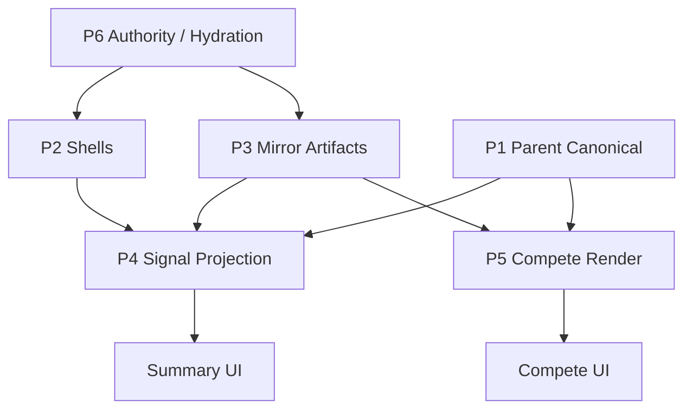

# Competition Runtime Governance

| Field | Value |
|-------|--------|
| **Status** | Canonical governance entrypoint (documentation only) |
| **Version** | v1 |
| **Scope** | Competition runtime: hydration, invalidation, projection, replay, recovery |
| **Grounding rule** | All claims trace to current repo behavior and existing architecture docs |
| **Companion docs** | See [Source documents](#source-documents) |

---

## Objective

Define deterministic ownership, hydration, invalidation, replay, projection, and recovery governance for the competition runtime system.

This document is the **runtime constitution** for competition architecture. It does not prescribe implementation. It synthesizes observed behavior, documents governance boundaries, registers known risks, and states deterministic targets for future work.

**Use as:**

- Canonical architecture constitution
- Onboarding map for competition runtime
- Recovery governance reference
- Codex / Cursor grounding source
- Proof-of-work architecture artifact
- Distributed runtime cognition index

---

## Source documents

| Document | Path | Role |
|----------|------|------|
| Hydration orchestration | `docs/architecture/hydration-orchestration-v1.md` | Observed hydrate order, consumer boundaries |
| Runtime dependency maps | `docs/architecture/runtime-dependency-maps-v1.md` | Planes, invalidation chains, render deps |
| Recovery systems | `docs/architecture/recovery-systems-v1.md` | Survivability, reconstruction, data loss |
| Invalidation & cache | `docs/architecture/invalidation-cache-systems-v1.md` | Version counters, cache overwrite rules |
| Sequence diagrams | `docs/architecture/sequence-diagrams-v1.md` | End-to-end call-path diagrams |
| Overlay doctrine (companion) | `docs/architecture/competition-overlay-architecture-v2.md` | Governing overlay vs canonical separation |
| Runtime invariants (companion) | `docs/architecture/competition/competition-runtime-invariants-v1.md` | Runtime safety doctrine; hard invariant floor and mutation boundaries |

---

# Runtime Plane Model

Six planes partition competition runtime. All artifacts on coach devices are keyed by `sharedAthleteId` (OAI). Route params (`kidId`, `entryId`) are join hints only.



---

## P1 — Parent Canonical Plane

| Attribute | Definition |
|-----------|------------|
| **Purpose** | Authoritative competition shells and match detail on the parent device |
| **Primary stores** | `kidCompetitionStore`, `competitionStore` |
| **Writers** | Parent shell CRUD; `setCompetitionDetailForEntryId`, `copyCompetitionDetailToCanonicalKeyForEntry` (parent only) |
| **Readers** | `loadCanonicalAthleteCompetitionSlice`, `getKidCompetitionEntriesWithMatchDetailForKid/SharedAthlete`, `computeSignals` inputs, parent Compete |
| **Invalidation sources** | `emitCompetitionChange` on detail write and shell CRUD (when emit called) |
| **Replay sensitivity** | Local full replace per entry id; no remote timestamp gate on parent device |
| **Bounded responsibilities** | Own match results, outcomes, media refs, shell metadata; publish to worker via `CompetitionSync` |
| **Prohibited responsibilities** | Coach device must not write `competitionStore` match detail for linked athletes |

**Reference:** `hydration-orchestration-v1.md` § Hydration planes; `runtime-dependency-maps-v1.md` § P1.

---

## P2 — Shared Competition Shell Plane

| Attribute | Definition |
|-----------|------------|
| **Purpose** | Coach-local materialization of remote competition shells (`session.competitions[]`) |
| **Primary stores** | `kidCompetitionStore` (coach reconcile path) |
| **Writers** | `upsertSharedCompetitionsForKid` via `reconcileCoachLinkedCompetitionEntriesFromWriterSessions` |
| **Readers** | Same P1 selectors on coach device; Compete list load; Summary slice via `canonicalCompetitionSource` |
| **Invalidation sources** | `emitCompetitionChange` when shell reconcile triggers emit; `bumpCoachSyncHydrationVersion` after full reconcile |
| **Replay sensitivity** | Remote list is authority for shared ids; local-only rows (no `sharedCompetitionId`) retained across reconcile |
| **Bounded responsibilities** | Shell metadata sync; drop shells absent from remote after reconcile |
| **Prohibited responsibilities** | Must not write match detail rows to `competitionStore`; must not mint topology or aggregate locally |

**Reference:** `recovery-systems-v1.md` § Shell survivability; `invalidation-cache-systems-v1.md` § Shell list cache.

---

## P3 — Coach Artifact Mirror Plane

| Attribute | Definition |
|-----------|------------|
| **Purpose** | Overwrite-only caches of parent-published bounded artifacts and coach overlay artifacts |
| **Primary stores** | `coachCompetitionAggregateStore`, `coachCompetitionTopologyStore`, `coachMatchBreakdownArtifactStore` |
| **Writers** | `writeCoachCompetitionAggregate`, `writeCoachCompetitionTopology` (hydrate only); session cache hydrate for breakdown artifacts |
| **Readers** | `useSignals` (aggregate), `peekCoachCompetitionTopology`, `CompetitionCard`, `overlayCompetitionAggregateSignals` |
| **Invalidation sources** | `emitCoachCompetitionAggregateChange` (aggregate accept); `emitCompetitionChange` (topology accept); `bumpCoachSyncHydrationVersion` (reconcile complete) |
| **Replay sensitivity** | **Aggregate:** accept if `updatedAt >= existing` (equal allowed). **Topology:** accept only if `updatedAt > existing` (equal rejected) |
| **Bounded responsibilities** | Mirror remote artifacts; prune keys outside roster union; in-process memory mirrors for sync peek |
| **Prohibited responsibilities** | Never writes P1; never creates or merges topology rows locally; never stores raw match rows in aggregate |

**Reference:** `invalidation-cache-systems-v1.md` § Cache layers; `runtime-dependency-maps-v1.md` § Cache overwrite boundaries.

---

## P4 — Signal Projection Plane

| Attribute | Definition |
|-----------|------------|
| **Purpose** | Derive Summary metrics and insights from local data plus coach mirror overlays |
| **Primary functions** | `computeSignals`, `overlayCompetitionAggregateSignals`, `overlayTrainingProofSignals`, `buildSummaryViewModel` |
| **Writers** | None — pure functions and in-memory merges |
| **Readers** | `SummaryScreen`, `SummaryCompetitionCard`, `SummaryHeroCard` |
| **Invalidation sources** | `useAthleteData` reload; `coachAggregateVersion`; `hydrationVersion`; athlete scope change |
| **Replay sensitivity** | `hasFullLocalMatchLineage` always returns `false` (suppression retired); overlay gated by `hasBoundedAggregateVisibility` |
| **Bounded responsibilities** | Base metrics from P1 merged entries; coach bounded metrics overlay from P3 aggregate; optional `competitionCount` from topology peek |
| **Prohibited responsibilities** | Must not persist; must not write any store; must not derive structural match authority from overlays |

**Reference:** `hydration-orchestration-v1.md` § Summary (coach); `sequence-diagrams-v1.md` § Aggregate overlay flow.

---

## P5 — Compete Render Plane

| Attribute | Definition |
|-----------|------------|
| **Purpose** | Present competition history: list load plus per-card ephemeral projection |
| **Primary surfaces** | `compete.tsx`, `CompetitionCard`, `projectCompetitionCompeteView`, `mergeCoachBreakdownIntoMatches` (parent) |
| **Writers** | None persisted — `projectCompetitionCompeteView` returns ephemeral view only |
| **Readers** | Compete tab UI, medal gallery, match cards |
| **Invalidation sources** | `competitionVersion`, `hydrationVersion`, `useFocusEffect`; card re-render on topology peek / async overlay hydrate |
| **Replay sensitivity** | `competeEntriesSameProjection` may skip `setEntries` when fingerprint unchanged |
| **Bounded responsibilities** | List from P1 detail merge; coach cards project from P3 topology with P1 fallback; overlay annotations attach by `matchLineageKey` |
| **Prohibited responsibilities** | List load must not apply topology projection (card-scoped only); projection must not persist to stores |

**Reference:** `runtime-dependency-maps-v1.md` § compete.tsx chain; `sequence-diagrams-v1.md` § Compete render flow.

---

## P6 — Authority / Hydration Orchestration Plane

| Attribute | Definition |
|-----------|------------|
| **Purpose** | Network reconcile, roster hygiene, version bumps that drive P1–P5 re-reads |
| **Primary functions** | `refreshCoachWriterSessionsAndReconcileStores`, `buildAthleteAuthoritySnapshot`, `refreshActiveAthleteAuthority`, `bumpCoachSyncHydrationVersion` |
| **Writers** | Orchestrator writes P2/P3 via reconcile; bumps in-process `hydrationVersion` |
| **Readers** | `useActiveAthlete`, all hydration-version subscribers |
| **Invalidation sources** | Self — `bumpCoachSyncHydrationVersion` at reconcile complete; breakdown artifact hydrate path |
| **Replay sensitivity** | Reconcile idempotent for unchanged remote; partial failure skips reconcile when no successful session fetches |
| **Bounded responsibilities** | Single entry point for coach writer-session GET + reconcile sequence; authority snapshot for operating athlete |
| **Prohibited responsibilities** | Must not bypass overwrite rules in P3 stores; must not write parent canonical detail on coach device |

**Reference:** `hydration-orchestration-v1.md` § Coach reconcile entry point; `sequence-diagrams-v1.md` § Coach hydration flow.

---

# Core Runtime Principles

Derived from observed repo behavior and companion architecture docs. These are **governance principles**, not enforced runtime invariants unless noted as observed.

### Single canonical writer philosophy

- **P1 match detail** has one writer: parent device (`competitionStore`).
- **P3 mirrors** have one write path each: hydrate functions fed by remote session or parent publish.
- Coach reconcile **overwrites**; it does not merge or mint canonical structural rows locally.

### Bounded mirror architecture

- Aggregate carries **bounded metrics only** (no raw match rows on wire).
- Topology carries **structural match facts** (`matchLineageKey`, `ordinal`, `result`, `finishType`, media refs).
- Mirrors are keyed by `sharedAthleteId` and pruned when athlete leaves roster union.

### Overlay vs canonical separation

- Overlays (coach notes, breakdown artifacts) attach by `matchLineageKey` and are **commentary-only**.
- Structural facts on coach Compete come from topology when present; aggregate replaces Summary **metrics only**, not timelines or placement history.
- `projectCompetitionCompeteView` never persists; `overlayCompetitionAggregateSignals` never writes stores.

### Deterministic replay preference

- Topology: strict newer-wins (`>`) — equal timestamp rejected (`hydrate_skipped_stale`).
- Aggregate: accept equal timestamp (`same_timestamp_refresh`).
- Governance **prefers** predictable replay outcomes; current topology equal-timestamp rejection is a known divergence surface (see Risk Registry).

### Convergence over immediate mutation

- Parent publish is fire-and-forget; coach caches update on **next reconcile**, not synchronously with parent save.
- `bumpCoachSyncHydrationVersion` drives recompute without navigation remount.
- Transient stale state between parent mutation and coach reconcile is expected and documented.

### Invalidation-driven recompute

- Three independent version counters (`competitionVersion`, `aggregateVersion`, `hydrationVersion`) drive subscriber reloads.
- Consumers re-read local state; orchestration does not push partial patches into UI.

### No hidden dual ownership

- P3 never writes P1.
- Coach device never writes `competitionStore` detail for linked athletes.
- Shell reconcile ≠ detail hydrate on coach device.

**Reference:** `competition-overlay-architecture-v2.md` (doctrine); `runtime-dependency-maps-v1.md` § Cross-plane dependency notes.

---

# Ownership Rules

## Parent-owned systems

| System | Plane | Authority |
|--------|-------|-----------|
| `kidCompetitionStore` shell CRUD (parent) | P1 | Parent device |
| `competitionStore` match detail | P1 | Parent device only |
| `buildCompetitionAggregateArtifact` | Publish | Parent builds from merged local entries |
| `buildCompetitionTopologyArtifact` | Publish | Parent builds from merged local entries |
| `CompetitionSync` / `parentKidCompetitionDelete` | P1 | Parent mutation boundary |
| Worker session competition rows | Transport | Parent writer via API |

## Coach-owned systems

| System | Plane | Authority |
|--------|-------|-----------|
| Coach breakdown overlays / local annotations | P3 overlay | Coach device (commentary) |
| `coachMatchBreakdownArtifactStore` coach publishes | P3 | Coach device |
| Coach roster archive / local pilot rows | P2 adjunct | Coach device (non-shared rows) |

## Mirror-only systems

| System | Plane | Write rule |
|--------|-------|------------|
| `coachCompetitionAggregateStore` | P3 | Hydrate overwrite only |
| `coachCompetitionTopologyStore` | P3 | Hydrate overwrite only |
| Coach `kidCompetitionStore` shells | P2 | Remote session authority for shared ids |

## Projection-only systems

| System | Plane | Persists? |
|--------|-------|-----------|
| `computeSignals` | P4 | No |
| `overlayCompetitionAggregateSignals` | P4 | No |
| `overlayTrainingProofSignals` | P4 | No |
| `projectCompetitionCompeteView` | P5 | No |
| `projectCompetitionEditorView` | P5 | No (wraps compete projection) |
| `mergeCoachBreakdownIntoMatches` | P5 | No (render-time merge) |

## Prohibitions (governance)

| Prohibition | Applies to |
|-------------|------------|
| **Must NEVER mutate P1 canonical state** | P3 stores, P4 functions, P5 projection, coach reconcile (detail) |
| **Must NEVER overwrite topology locally** | Coach device — no local topology minting; only `writeCoachCompetitionTopology` from remote artifact |
| **Must NEVER derive structural match authority from overlays** | `overlayCompetitionAggregateSignals`, breakdown artifacts, shell `coachNote` |
| **Must NEVER write match detail on coach device** | `competitionStore.setCompetitionDetailForEntryId` — parent only |
| **Must NEVER persist projection output** | `projectCompetitionCompeteView`, Summary overlay merges |

**Reference:** `runtime-dependency-maps-v1.md` § Write prohibition boundaries; `recovery-systems-v1.md` § No in-repo path reconstructs parent canonical match rows from overlays alone.

---

# Hydration Governance

## Observed current hydrate order

Single orchestrator: `refreshCoachWriterSessionsAndReconcileStores` (`coachKidStore.ts`).

**Observed sequence (code, not aspirational):**

```text
1. coachSyncFetchSession (per active writer link)
2. setCachedWeeklyForLinkToken
3. reconcileCoachKidRosterFromWriterSessions
   └─ pruneCoachCompetitionAggregates / Topology / TrainingProof
4. reconcileCoachLinkedCompetitionEntriesFromWriterSessions   (P2 shells)
5. reconcileCoachCompetitionAggregatesFromWriterSessions      (P3 aggregate)
6. reconcileCoachCompetitionTopologyFromWriterSessions        (P3 topology)
7. reconcileCoachTrainingProofFromWriterSessions
8. reconcileCoachMatchBreakdownArtifacts
9. pruneCoachMatchBreakdownArtifactsAfterRosterReconcile
10. bumpCoachSyncHydrationVersion({ reason: "refreshCoachWriterSessionsAndReconcileStores_complete" })
```

**Reference:** `hydration-orchestration-v1.md` § Coach reconcile entry point; `sequence-diagrams-v1.md` § Coach hydration flow.

## Aggregate-before-topology behavior (observed)

Within step 10 of a single reconcile tick:

1. Aggregate hydrate (step 5) may emit `aggregateVersion++` per athlete accept.
2. Topology hydrate (step 6) may emit `competitionVersion++` per topology accept.
3. Final `hydrationVersion++` (step 10) notifies all subscribers.

Summary aggregate overlay may update **before** topology cache and Compete card projection in the same tick.

## Topology replay acceptance / rejection

| Condition | Result | Trace |
|-----------|--------|-------|
| `incoming.updatedAt > existing.updatedAt` | Accept; full overwrite; `emitCompetitionChange` | `hydrate_store_overwrite` |
| `incoming.updatedAt === existing.updatedAt` | Reject | `incoming_equal_updatedAt_rejected`, `hydrate_skipped_stale` |
| `incoming.updatedAt < existing.updatedAt` | Reject | `incoming_older_updatedAt_rejected` |
| Invalid artifact | Reject | `hydrate_invalid` |

## Aggregate equal-timestamp behavior

| Condition | Result | Trace |
|-----------|--------|-------|
| `incoming.updatedAt >= existing.updatedAt` | Accept | `same_timestamp_refresh` or `incoming_newer` |
| `incoming.updatedAt < existing.updatedAt` | Reject | `incoming_older_rejected` |

## Summary vs Compete refresh differences (observed)

| Surface | Focus alone | Pull-to-refresh | Hydration bump |
|---------|-------------|-----------------|----------------|
| **Summary** | `useAthleteData` P1 reload; weekly fetch only — **no full reconcile** | Weekly + `refreshActiveAthleteAuthority` → full reconcile | Cache-only weekly + subscriber reload |
| **Compete** | `loadCompetitions` P1 reload | Same as focus unless user navigated away | Focus effect re-runs load |

## Pull-to-refresh authority flow (observed)

```text
SummaryScreen.onSummaryRefresh (coach)
  → refreshCoachWeeklySessionSnapshot()
  → refreshActiveAthleteAuthority()
       → fetchIdentitySnapshot("soft_refresh")
       → buildAthleteAuthoritySnapshot()
       → refreshCoachWriterSessionsAndReconcileStores()
       → bumpCoachSyncHydrationVersion
  → useAthleteData / useSignals / compete subscribers re-read
```

**Reference:** `runtime-dependency-maps-v1.md` § Authority refresh flows; `hydration-orchestration-v1.md` § Navigation-triggered refresh.

## Observed vs desired (hydration)

| Topic | Observed runtime behavior | Desired deterministic target (governance only) |
|-------|---------------------------|-----------------------------------------------|
| Reconcile artifact order | Aggregate before topology | Topology before aggregate optional — shared cache generation for count + projection |
| Parent publish | Aggregate + topology scheduled post-mutation; topology flag-gated | Co-scheduled from same mutation boundary |
| Focus refresh | P1 local merge only; P3 may be stale | Documented gap — pull-to-refresh required for P3 |
| Invalidation during reconcile | Three counters may fire mid-tick | Single consumer-visible generation after all P3 writes |
| Peek before mirror warm | `peek*` returns null until disk read/write | Explicit warm/read before sync overlay paths |

**Reference:** `runtime-dependency-maps-v1.md` § Deterministic ordering candidates; `invalidation-cache-systems-v1.md` § Hydration timing observations.

---

# Invalidation Governance

## Version counter map

| Counter | Store / module | Incremented by | Primary subscribers |
|---------|----------------|----------------|---------------------|
| `competitionVersion` | `kidCompetitionStore` | `emitCompetitionChange(caller?)` | `compete.tsx` via `useSyncExternalStore(subscribeCompetition)` |
| `aggregateVersion` | `coachCompetitionAggregateStore` | `emitCoachCompetitionAggregateChange` | `useCoachCompetitionAggregateVersion` → `useSignals` effect |
| `hydrationVersion` | `coachSyncHydrationStore` | `bumpCoachSyncHydrationVersion` | `useAthleteData`, `useSignals`, `compete.tsx`, `SummaryScreen` (weekly cache-only), `useActiveAthlete` |

Counters are **independent** — they do not cascade automatically except where a write explicitly calls both.

## emitCompetitionChange fan-out

**Emitters (observed):**

- `setCompetitionDetailForEntryId`, `copyCompetitionDetailToCanonicalKeyForEntry` (parent detail)
- `kidCompetitionStore` save paths (when emit called)
- `writeCoachCompetitionTopology` on accept only
- `repairCanonicalAthleteLineage` (lineage repair path)

**Subscriber chain:**

```text
emitCompetitionChange
  → competitionVersion++
  → compete.tsx useFocusEffect deps
  → loadCompetitions
  → getKidCompetitionEntriesWithMatchDetail*
  → [optional] competeEntriesSameProjection skip
```

Does **not** directly invalidate `useSignals` aggregate overlay (separate counter).

## Recompute triggers by surface

| Surface | Triggers full P1 re-read | Triggers P3 overlay reload | Triggers signal recompute |
|---------|--------------------------|----------------------------|---------------------------|
| Summary | `hydrationVersion`, focus | `aggregateVersion`, `hydrationVersion` | All above + athlete scope |
| Compete list | `competitionVersion`, `hydrationVersion`, focus | N/A (list is P1) | N/A |
| Compete card | Re-render | Sync topology peek; async overlay hydrate | Ephemeral projection |

## Stale overlay surfaces

| Trace | Meaning | Plane |
|-------|---------|-------|
| `overlay_missing` | No aggregate artifact | P4 |
| `overlay_hidden_visibility` | Aggregate fails visibility gate | P4 |
| `cache_peek_memory_not_loaded` | Mirror not warmed | P3 |
| `projection_fallback_used` | Topology row absent | P5 |
| `projection_missing_overlay_attachment` | Overlay keys without topology lineage | P5 |
| `readingStaleCompetitionEntry` | Artifacts present; entry matches lack notes | P5 |
| `readingStaleCompetitionShell` | Shell coachNote; artifacts empty (parent) | P5 |
| `stale_projection_skipped` | Reload ran; fingerprint unchanged | P5 |

**Reference:** `invalidation-cache-systems-v1.md` § Stale overlay findings; `runtime-dependency-maps-v1.md` § Invalidation trigger map.

## Replay-sensitive invalidation timing

During one `refreshCoachWriterSessionsAndReconcileStores`:

1. Step 5 may fire `aggregateVersion++` (Summary overlay recomputes).
2. Step 6 may fire `competitionVersion++` (Compete reload) — or skip if topology replay rejected.
3. Step 10 fires `hydrationVersion++` (all subscribers).

**Governance note:** Mid-tick subscriber updates can produce transient Summary vs Compete divergence until step 10 completes.

---

# Projection Governance

## Authority matrix

| Data class | Authoritative source (coach) | Presentation-only |
|------------|------------------------------|-------------------|
| Bounded Summary metrics (W/L, win rate, submission rate, timing) | P3 aggregate via `overlayCompetitionAggregateSignals` | `computeSignals` local values when overlay not applied |
| Summary placement, trends, buckets, `recentResults` | P1 shell + local `computeSignals` | Aggregate overlay does not modify |
| Summary `competitionCount` (when overlay applied) | P3 topology peek (optional supplement) | Local shell count when peek null |
| Compete match structure (coach) | P3 topology via `projectCompetitionCompeteView` | P1 detail merge as `fallbackMatches` |
| Compete coach notes | P3 overlay annotations on topology rows | Shell `coachNote` legacy fallback |
| Compete list entry array | P1 detail merge | Not topology-projected at list level |

## Aggregate overlays (Summary)

**Function:** `overlayCompetitionAggregateSignals`  
**Applied in:** `useSignals` coach branch, after `computeSignals`

**Gate order (observed):**

1. `deviceRole !== "coach"` → skip
2. `hasFullLocalMatchLineage` → always `false` (never skips)
3. No artifact → `overlay_missing`
4. `!hasBoundedAggregateVisibility` → `overlay_hidden_visibility`
5. Apply overlay

**Fields replaced:** `totalMatches`, `wins`, `losses`, `winRate`, `submissionRate`, `fastestSubmission`, `averageMatchTime`, `winStyle`, `record`; optionally `competitionCount` from topology peek.

**Fields preserved from base:** `recentResults`, `placementTrend`, `bucketHistory`, `lastCompetition*`, raw match arrays.

## Topology overlays (Compete)

**Function:** `projectCompetitionCompeteView`  
**Applied in:** `CompetitionCard` when `deviceRole === "coach"`

**Fallback ordering:**

1. Topology row for `(sharedAthleteId, sharedCompetitionId)` → topology matches by `ordinal`
2. Else → `fallbackMatches` from P1 detail merge
3. Overlay annotations attach by `matchLineageKey` (commentary only)

## Signal overlays (training — orthogonal)

**Function:** `overlayTrainingProofSignals`  
**Applied in:** `useSignals` after competition overlay  
**Authority:** P3 `coachTrainingProofStore` for weekly session proof metrics.

## Summary projection chain

```text
useAthleteData → competitions[]
  → computeSignals → base SignalOutput
  → [coach] overlayCompetitionAggregateSignals
  → buildSummaryViewModel
  → SummaryCompetitionCard / SummaryHeroCard
```

## Compete card projection chain

```text
compete.tsx → entries[] (P1 merge, no topology)
  → CompetitionCard
       → peekCoachCompetitionTopology (sync)
       → hydrateCompetitionMatchOverlayAnnotations (async, coach)
       → projectCompetitionCompeteView (coach)
       → mergeCoachBreakdownIntoMatches (parent)
```

## Precedence rules (summary table)

| Layer | Precedence | Persists? |
|-------|------------|-----------|
| P1 detail merge | Base for list + computeSignals | Yes (P1) |
| P3 aggregate | Overrides bounded Summary metrics when gate passes | Mirror only |
| P3 topology | Overrides coach Compete match structure | Mirror only |
| Overlay annotations | Coach notes on topology snapshots | Mirror / ephemeral |
| Projection output | Render-time only | **Never** |

**Reference:** `runtime-dependency-maps-v1.md` § Overlay precedence, § Topology precedence; `sequence-diagrams-v1.md` § Topology projection flow, § Aggregate overlay flow.

---

# Replay + Recovery Governance

## Bounded recovery philosophy

- Recovery is **bounded**: coach mirrors re-hydrate from remote session after parent publish; no coach-local reconstruction of parent canonical match rows from overlays alone.
- **Convergence** requires successful network path: parent publish → worker → coach `refreshCoachWriterSessionsAndReconcileStores`.
- Transient stale state between parent mutation and coach reconcile is expected, not exceptional.

**Reference:** `recovery-systems-v1.md` (entire document).

## Survivable planes after parent deletion

| Substrate | Survives until reconcile? | Post-reconcile outcome |
|-----------|---------------------------|------------------------|
| P2 shell | May persist locally | Dropped when remote omits `sharedCompetitionId` |
| P3 topology | May persist stale artifact | Updated when new artifact excludes deleted competition/matches |
| P3 aggregate | May persist stale totals | Updated when recomputed artifact excludes deleted matches |
| P3 breakdown overlays | Keys may persist | Orphan keys possible; projection skips unmatched lineage |
| P1 on coach | Not authoritative | Detail merge may retain stale rows; Compete coach prefers topology |

## Reconstructible data

| Desired state | Required actions |
|-------------|------------------|
| Coach Summary metrics match parent | Parent publish aggregate → coach reconcile → `writeCoachCompetitionAggregate` → `useSignals` overlay |
| Coach Compete matches match parent | Parent publish topology → coach reconcile → topology peek → `projectCompetitionCompeteView` |
| Shell list matches worker | `reconcileCoachLinkedCompetitionEntriesFromWriterSessions` |
| Clear stale caches for removed athlete | Roster prune, `removeCoachCompetitionAggregate/Topology`, or `deleteKidPilot` |

## Permanently lost data (no coach-only reconstruction)

- Parent-owned match results removed by parent delete
- Parent media deleted with detail row
- Worker session competition row after successful remote DELETE
- Topology/aggregate content for parent-removed competitions without new parent publish

Coach-only orphan overlay keys may exist on disk but are **not displayed** without matching topology lineage.

## Topology recovery substrate

- Storage: `mm:v1:coachCompetitionTopologyByAthleteId`
- In-process: `topologyMemory` — repopulated on disk read/write
- Removal paths: `removeCoachCompetitionTopology`, `pruneCoachCompetitionTopology`, `deleteKidPilot`, `clearKidSharedAthleteLink`

## Overlay survivability

| Overlay type | After parent match delete |
|--------------|----------------------------|
| Coach breakdown artifacts | Keys may remain; projection attaches only to topology rows |
| Coach local overlay store | Orphan keys possible; no auto-tombstone |
| Parent shell `coachNote` | Logged as stale when artifacts empty |

## Shell survivability

| Event | Outcome |
|-------|---------|
| Parent deletes competition | Shell dropped on next `upsertSharedCompetitionsForKid` when remote omits id |
| Local-only coach row | Retained across reconcile |
| Roster orphan | `deleteKidPilot` removes competitions + P3 caches for athlete |

## Aggregate survivability

- Without aggregate: Summary uses `computeSignals` local metrics (`overlay_missing` / `overlay_hidden_visibility`)
- Parent delete reduces totals in next published aggregate; coach Summary updates after reconcile + `aggregateVersion` bump

## Deterministic reconstruction goals (governance only)

- Topology-first structural recovery on coach Compete
- Aggregate refresh drives Summary bounded metrics after same reconcile boundary
- Roster prune clears all P3 keys for removed athletes atomically
- Explicit handling of orphan overlay keys (target — not fully implemented)

**Reference:** `recovery-systems-v1.md` § Recovery reconstruction possibilities, § Permanently lost data classes.

---

# Runtime Risk Registry

Grounded registry of observed divergence surfaces. **Mitigation status** reflects current repo state only.

| Risk | Observed symptom | Current runtime cause | Impacted planes | Mitigation status | Open? |
|------|------------------|----------------------|-----------------|-------------------|-------|
| Stale aggregate overlays | Summary shows old W/L until refresh | Focus reloads P1 only; P3 updates on reconcile | P3, P4 | Documented — pull-to-refresh required | **Open** |
| Topology replay rejection | Coach Compete unchanged after parent republish | Equal `updatedAt` → `hydrate_skipped_stale` | P3, P5 | Observed strict gate; no equal-timestamp accept | **Open** |
| Split render pipelines | Summary metrics ≠ Compete match count on same athlete | Aggregate overlay vs topology projection / detail fallback | P3, P4, P5 | By design today; traces log divergence | **Open** |
| Summary vs Compete divergence | DEV parity traces show source mismatch | Summary uses overlay; Compete list uses P1 merge | P4, P5 | DEV fingerprints only | **Open** |
| Non-deterministic invalidation ordering | Transient UI mismatch mid-reconcile | `aggregateVersion`, `competitionVersion`, `hydrationVersion` fire in sequence not atomically | P4, P5, P6 | Converges after step 10 bump | **Open** |
| Partial hydration ordering | `competitionCount` from topology peek may lag aggregate overlay | Aggregate reconcile before topology in same tick | P3, P4 | Documented in invalidation-cache-systems-v1 | **Open** |
| Authority refresh timing gap | Coach shows deleted competition until reconcile | Parent delete local; coach stale until network reconcile | P2, P3, P5 | Expected; gap between delete and reconcile | **Open** |
| Overlay precedence drift | Coach notes missing on first render | Async overlay hydrate; `hydrationPending` | P5 | Transient; re-render on hydrate complete | **Open** |
| Topology peek null before warm | First render uses fallback matches | `topologyMemory` not loaded until read/write | P3, P5 | Cold-start trace `cache_peek_memory_not_loaded` | **Open** |
| Orphan overlays after delete | Disk retains breakdown keys | No per-`matchLineageKey` tombstone sync | P3 overlay | Projection skips unmatched keys | **Open** |
| Shell reconcile ≠ detail hydrate | Coach list shows shells with empty/sparse detail | Coach never writes `competitionStore` detail | P1, P2, P5 | Compete coach uses topology projection | **Open** |
| Topology publish flag off | Coach topology never updates from worker | `schedulePublishParentCompetitionTopology` no-op when flag off | P3 | Environment/build flag dependent | **Open** |
| Compete list vs card projection | List count differs from card match count | List not topology-projected | P5 | Card-scoped projection by design | **Open** |

**Reference:** `invalidation-cache-systems-v1.md` § Convergence gaps; `hydration-orchestration-v1.md` § Stale-state observations.

---

# Deterministic Architecture Targets

Governance targets only — **not implemented**, **not speculative code**. These describe desired runtime properties for future validation.

| Target | Rationale | Current gap |
|--------|-----------|-------------|
| **Deterministic hydration ordering** | Single observable generation after all P3 writes complete | Aggregate before topology; mid-tick counter fires |
| **Replay-safe invalidation sequencing** | Subscribers update once per reconcile epoch | Three counters per tick |
| **Topology-first reconstruction** | Compete structural authority from topology after every successful reconcile | Fallback to P1 detail when peek null or row missing |
| **Bounded recovery bootstrap** | Roster prune + artifact prune atomic per athlete removal | Partial orphan overlay retention |
| **Canonical projection convergence** | Summary bounded metrics and Compete cardinality derive from same artifact generation | Split aggregate vs topology pipelines |
| **Explicit replay epochs** | Monotonic epoch counter per athlete artifact set | Per-store `updatedAt` only |
| **Stable cross-device recompute behavior** | Equal parent republish accepted consistently | Topology rejects equal timestamp |
| **Parent co-publish boundary** | Aggregate + topology from same mutation | Topology flag-gated; fire-and-forget |
| **Focus path documentation** | Users know P3 requires authority refresh | Focus = P1 + weekly only |
| **Overlay tombstone hygiene** | Orphan keys pruned when topology omits lineage | No tombstone sync observed |

**Reference:** `hydration-orchestration-v1.md` § Deterministic orchestration goals; `invalidation-cache-systems-v1.md` § Deterministic invalidation goals; `runtime-dependency-maps-v1.md` § Deterministic ordering candidates.

---

# Repo Trace Index

File paths only. Grouped for grounding searches.

## Key stores

| Store | Path |
|-------|------|
| `kidCompetitionStore` | `src/storage/kidCompetitionStore.ts` |
| `competitionStore` | `src/storage/competitionStore.ts` |
| `coachCompetitionAggregateStore` | `src/storage/coachCompetitionAggregateStore.ts` |
| `coachCompetitionTopologyStore` | `src/storage/coachCompetitionTopologyStore.ts` |
| `coachSyncHydrationStore` | `src/storage/coachSyncHydrationStore.ts` |
| `coachMatchBreakdownArtifactStore` | `src/storage/coachMatchBreakdownArtifactStore.ts` |
| `coachWeeklySyncCacheStore` | `src/storage/coachWeeklySyncCacheStore.ts` |
| `coachKidStore` | `src/storage/coachKidStore.ts` |

## Hooks

| Hook | Path |
|------|------|
| `useSignals` | `src/hooks/useSignals.ts` |
| `useAthleteData` | `src/hooks/useAthleteData.ts` |
| `useActiveAthlete` | `src/hooks/useActiveAthlete.ts` |

## Projection systems

| Function | Path |
|----------|------|
| `computeSignals` | `src/lib/signals/computeSignals.ts` |
| `overlayCompetitionAggregateSignals` | `src/domain/competition/overlayCompetitionAggregateSignals.ts` |
| `overlayTrainingProofSignals` | `src/domain/training/overlayTrainingProofSignals.ts` |
| `projectCompetitionCompeteView` | `src/domain/competition/projectCompetitionCompeteView.ts` |
| `projectCompetitionEditorView` | `src/domain/competition/projectCompetitionEditorView.ts` |
| `mergeCoachBreakdownIntoMatches` | `src/domain/competition/mergeCoachBreakdownIntoMatches.ts` |
| `hydrateCompetitionMatchOverlayAnnotations` | `src/domain/competition/hydrateCompetitionMatchOverlayAnnotations.ts` |
| `buildSummaryViewModel` | `src/lib/summary/buildSummaryViewModel.ts` |
| `loadCanonicalAthleteCompetitionSlice` | `src/features/competition/canonicalCompetitionSource.ts` |

## Orchestration functions

| Function | Path |
|----------|------|
| `refreshCoachWriterSessionsAndReconcileStores` | `src/storage/coachKidStore.ts` |
| `buildAthleteAuthoritySnapshot` | `src/identity/buildAthleteAuthoritySnapshot.ts` |
| `refreshActiveAthleteAuthority` | `src/hooks/useActiveAthlete.ts` |
| `bumpCoachSyncHydrationVersion` | `src/storage/coachSyncHydrationStore.ts` |
| `CompetitionSync` | `src/domain/competition/CompetitionSync.ts` |
| `parentKidCompetitionDelete` | `src/family/parentKidCompetitionDelete.ts` |

## Reconcile functions

| Function | Path |
|----------|------|
| `reconcileCoachKidRosterFromWriterSessions` | `src/storage/coachKidStore.ts` |
| `reconcileCoachLinkedCompetitionEntriesFromWriterSessions` | `src/storage/coachKidStore.ts` |
| `reconcileCoachCompetitionAggregatesFromWriterSessions` | `src/storage/coachKidStore.ts` |
| `reconcileCoachCompetitionTopologyFromWriterSessions` | `src/storage/coachKidStore.ts` |
| `reconcileCoachTrainingProofFromWriterSessions` | `src/storage/coachKidStore.ts` |
| `reconcileCoachMatchBreakdownArtifacts` | `src/storage/coachKidStore.ts` |
| `writeCoachCompetitionAggregate` | `src/storage/coachCompetitionAggregateStore.ts` |
| `writeCoachCompetitionTopology` | `src/storage/coachCompetitionTopologyStore.ts` |
| `upsertSharedCompetitionsForKid` | `src/storage/kidCompetitionStore.ts` |

## Parent publish / artifact builders

| Function | Path |
|----------|------|
| `buildCompetitionAggregateArtifact` | `src/domain/competition/buildCompetitionAggregateArtifact.ts` |
| `buildCompetitionTopologyArtifact` | `src/domain/competition/buildCompetitionTopologyArtifact.ts` |
| `publishParentCompetitionAggregate` / schedule | `src/domain/competition/publishParentCompetitionAggregate.ts` |
| `publishParentCompetitionTopology` / schedule | `src/domain/competition/publishParentCompetitionTopology.ts` |

## Invalidation emitters

| Emitter | Path |
|---------|------|
| `emitCompetitionChange` | `src/storage/kidCompetitionStore.ts` |
| `emitCoachCompetitionAggregateChange` | `src/storage/coachCompetitionAggregateStore.ts` |
| `bumpCoachSyncHydrationVersion` | `src/storage/coachSyncHydrationStore.ts` |
| `setCompetitionDetailForEntryId` | `src/storage/competitionStore.ts` |

## Runtime entrypoints (UI)

| Surface | Path |
|---------|------|
| `SummaryScreen` | `src/features/summary/SummaryScreen.tsx` |
| Compete tab | `app/(tabs)/compete.tsx` |
| `CompetitionCard` | `src/features/competition/CompetitionCard.tsx` |
| Competition edit (coach) | `app/(tabs)/coach/kid/[kidId]/competition/edit.tsx` |
| `CoachRoster` | `src/features/coach/CoachRoster.tsx` |

## DEV trace / parity

| Function | Path |
|----------|------|
| `competitionSummaryAggregationTrace` | `src/features/summary/competitionSummaryAggregationTrace.ts` |
| `canonicalCompetitionSliceFingerprint` | `src/features/competition/canonicalCompetitionSource.ts` |
| `coachHydrationResolveTrace` | `src/identity/coachHydrationResolveTrace.ts` |

---

## Document maintenance

When runtime behavior changes:

1. Update grounded companion docs first (`hydration-orchestration-v1.md`, `runtime-dependency-maps-v1.md`, etc.).
2. Revise this governance doc to reflect new observed behavior or closed risks.
3. Do not mark Deterministic Architecture Targets as achieved until validated against repo traces.

**No runtime changes are authorized by this document alone.**
