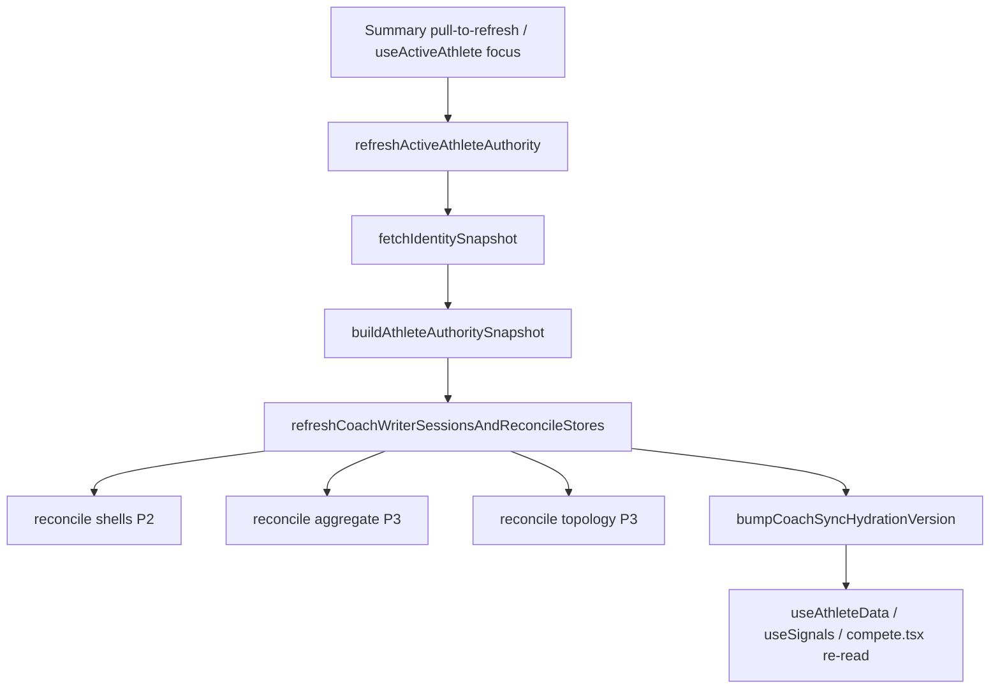

# Competition Runtime Invariants

| Field | Value |
|-------|--------|
| **Status** | Canonical runtime safety doctrine (documentation only) |
| **Version** | v1 |
| **Scope** | Hard invariants across competition hydration, projection, replay, invalidation, and recovery |
| **Grounding rule** | All claims trace to current repo behavior and existing architecture docs |
| **Companion docs** | `competition-runtime-governance-v1.md`, `hydration-orchestration-v1.md`, `runtime-dependency-maps-v1.md`, `invalidation-cache-systems-v1.md`, `recovery-systems-v1.md`, `sequence-diagrams-v1.md` |

---

## Objective

Define the non-negotiable runtime truths that preserve deterministic competition behavior across parent, coach, topology, aggregate, overlay, projection, and recovery systems.

This document is the **runtime safety floor** — not an implementation plan. It states what must remain true for the current architecture to behave predictably, registers where enforcement is partial, and maps mutation boundaries for human and AI collaborators.

**Functions as:**

- Runtime safety floor
- Stabilization guardrails
- Anti-regression governance
- Codex / Cursor mutation boundary map
- Replay protection doctrine

**Does not authorize:** runtime code changes, speculative systems, or hydration/projection rewrites without prior grounding in companion docs and repo traces.

---

# Invariant Classification Model

Eight invariant classes partition competition runtime by the failure mode they prevent and the planes they protect.

| Class | Protects | Failure looks like | Affected planes |
|-------|----------|-------------------|-----------------|
| **Ownership** | Single writer per canonical substrate; mirror/projection never promote to authority | Coach device writes parent match detail; overlay overwrites topology lineage; projection persists to store | P1, P2, P3, P4, P5 |
| **Replay** | Predictable hydrate accept/reject when remote artifacts re-arrive | Equal topology timestamp skipped; aggregate refreshed at same timestamp; stale cache after rejected replay | P3, P5, P6 |
| **Projection** | Presentation-only derivation; structural authority from correct layer | Summary metrics from local detail while aggregate exists; topology row overwritten by overlay annotation | P4, P5 |
| **Hydration** | Reconcile order and partial hydrate do not mint authority | Focus reload shows fresh P1 but stale P3; aggregate overlay before topology in same tick | P2, P3, P6 |
| **Recovery** | Bounded substrates and convergence requirements after delete | Shell survives but match rows gone; orphan overlay keys; coach shows deleted comp until reconcile | P1–P5 |
| **Invalidation** | Version counters drive re-read without hidden dual paths | Mid-tick Summary vs Compete mismatch; `competitionVersion` bump without topology write | P4, P5, P6 |
| **Authority** | Orchestration gates and upstream-only authority resolution | Authority snapshot from overlay; mirror self-promotion; reconcile bypassing overwrite rules | P6 |
| **Convergence** | Eventual alignment across surfaces after invalidate + re-read | Summary W/L from aggregate while Compete card uses detail fallback; transient divergence until `hydrationVersion` bump | P3–P6 |

**How to use this model:** Before any competition-runtime mutation, classify the change by invariant class. A change that touches replay must be checked against topology (`>`) vs aggregate (`>=`) asymmetry. A change that touches projection must be checked against ownership and invalidation classes together.

---

# Canonical Ownership Invariants

All coach competition artifacts are keyed by `sharedAthleteId` (OAI). Route params (`kidId`, `entryId`) are join hints only.

## INV-O1 — Parent canonical stores remain authoritative

| Field | Value |
|-------|--------|
| **Invariant statement** | Match detail and authoritative shell mutations on linked athletes originate on the parent device (`competitionStore`, parent `kidCompetitionStore` CRUD). |
| **Protected planes** | P1 |
| **Observed enforcement** | `setCompetitionDetailForEntryId` in `competitionStore.ts`; `CompetitionSync` parent save path; coach reconcile does not call detail writers for linked athletes. |
| **Known weaknesses** | Coach `competitionStore` merge may retain stale detail rows until shell/topology reconcile; not authoritative for linked athletes but can affect parent-style code paths that read merge without topology. |
| **Risk if violated** | Dual canonical match rows; Summary/Compete derive from divergent structural sources; worker publish builds from wrong local substrate. |

## INV-O2 — Coach mirrors may never become canonical writers

| Field | Value |
|-------|--------|
| **Invariant statement** | `coachCompetitionAggregateStore` and `coachCompetitionTopologyStore` accept writes only via hydrate overwrite from remote session or parent-published artifacts. |
| **Protected planes** | P3 |
| **Observed enforcement** | `writeCoachCompetitionAggregate`, `writeCoachCompetitionTopology` called from `reconcileCoachCompetitionAggregatesFromWriterSessions` / `reconcileCoachCompetitionTopologyFromWriterSessions` only; docstrings state no local row minting. |
| **Known weaknesses** | Orphan overlay keys may persist without matching topology; disk state can outlive remote truth until next reconcile. |
| **Risk if violated** | Coach device becomes shadow canonical; parent publish and worker session no longer single source of structural truth. |

## INV-O3 — Overlays may never mutate canonical state

| Field | Value |
|-------|--------|
| **Invariant statement** | Coach breakdown overlays, shell `coachNote`, and breakdown artifacts attach commentary by `matchLineageKey`; they do not write P1 stores or topology structural rows. |
| **Protected planes** | P3 overlay, P5 |
| **Observed enforcement** | `hydrateCompetitionMatchOverlayAnnotations` and `projectCompetitionCompeteView` attach annotations on topology snapshots; `overlayCompetitionAggregateSignals` shallow-merges in-memory `SignalOutput` only. |
| **Known weaknesses** | Async overlay hydrate causes transient empty coach notes; `readingStaleCompetitionShell` when shell note present but artifacts empty. |
| **Risk if violated** | Commentary promoted to match results; aggregate/topology builders ingest coach-local opinion as fact. |

## INV-O4 — Projections are presentation-only

| Field | Value |
|-------|--------|
| **Invariant statement** | `computeSignals`, `overlayCompetitionAggregateSignals`, `overlayTrainingProofSignals`, `projectCompetitionCompeteView`, `projectCompetitionEditorView`, and `mergeCoachBreakdownIntoMatches` do not persist output to any store. |
| **Protected planes** | P4, P5 |
| **Observed enforcement** | Pure functions and render-time merges; no `writeStore` in projection modules. |
| **Known weaknesses** | In-memory `SignalOutput` merge in `useSignals` can diverge from next render if version deps stale. |
| **Risk if violated** | UI projection becomes hidden writer; invalidation counters no longer reflect canonical mutations. |

## INV-O5 — Topology mirrors are bounded artifacts

| Field | Value |
|-------|--------|
| **Invariant statement** | Topology carries structural match facts (`matchLineageKey`, `ordinal`, `result`, `finishType`, media refs) built parent-side from merged entries; coach store holds bounded overwrite cache keyed by `sharedAthleteId`. |
| **Protected planes** | P3, P5 |
| **Observed enforcement** | `buildCompetitionTopologyArtifact` parent-only; `writeCoachCompetitionTopology` full artifact replace on accept; `peekCoachCompetitionTopology` reads `topologyMemory` mirror. |
| **Known weaknesses** | `topologyPublishV2` flag can no-op parent publish; peek null until mirror warmed (`cache_peek_memory_not_loaded`). |
| **Risk if violated** | Compete structural view decoupled from parent truth; recovery substrate incomplete. |

## INV-O6 — Aggregate mirrors are derived summaries only

| Field | Value |
|-------|--------|
| **Invariant statement** | Aggregate artifacts carry bounded metrics only (no raw match rows on wire); Summary bounded fields may be replaced by overlay, not structural timelines. |
| **Protected planes** | P3, P4 |
| **Observed enforcement** | `buildCompetitionAggregateArtifact` collects matches into bounded artifact; `overlayCompetitionAggregateSignals` replaces listed metric fields only. |
| **Known weaknesses** | `hasBoundedAggregateVisibility` gate can hide overlay when zero matches and zero W+L; focus without reconcile leaves stale aggregate on disk. |
| **Risk if violated** | Summary shows metrics inconsistent with topology/cardinality; false authority for placement/trends from aggregate. |

---

# Replay Invariants

## INV-R1 — Topology replay acceptance rules

| Field | Value |
|-------|--------|
| **Invariant statement** | `writeCoachCompetitionTopology` accepts incoming artifact only when `incoming.updatedAt > existing.updatedAt` (strict newer-wins via `localeCompare`). |
| **Protected planes** | P3, P5 |
| **Observed enforcement** | `coachCompetitionTopologyStore.ts`: reject when `comparison <= 0`; traces `incoming_equal_updatedAt_rejected`, `incoming_older_updatedAt_rejected`, `hydrate_skipped_stale`. |
| **Known weaknesses** | Legitimate parent republish with unchanged `updatedAt` does not refresh coach topology cache. |
| **Risk if violated** | Coach Compete stuck on old structural matches after parent fix; `emitCompetitionChange` not fired on reject. |

## INV-R2 — Equal timestamp replay behavior (asymmetric)

| Field | Value |
|-------|--------|
| **Invariant statement** | Topology: equal `updatedAt` → reject. Aggregate: equal `updatedAt` → accept (`same_timestamp_refresh`). |
| **Protected planes** | P3, P4, P5 |
| **Observed enforcement** | Topology `localeCompare <= 0` reject; aggregate `comparison >= 0` accept with `emitCoachCompetitionAggregateChange`. |
| **Known weaknesses** | Intentional asymmetry documented in governance and invalidation docs; not unified replay epoch. |
| **Risk if violated** | Summary refreshes while Compete topology unchanged on same remote payload generation. |

## INV-R3 — Aggregate replay overwrite behavior

| Field | Value |
|-------|--------|
| **Invariant statement** | On accept, aggregate map entry is full replace per `sharedAthleteId`; older incoming rejected with no emit. |
| **Protected planes** | P3, P4 |
| **Observed enforcement** | `writeCoachCompetitionAggregate` → `map[athleteId] = artifact` + `emitCoachCompetitionAggregateChange`. |
| **Known weaknesses** | Same-timestamp refresh re-emits aggregate version even when payload unchanged. |
| **Risk if violated** | Stale bounded metrics served from partial merge instead of full artifact replace. |

## INV-R4 — Stale replay rejection boundaries

| Field | Value |
|-------|--------|
| **Invariant statement** | Incoming topology/aggregate with older `updatedAt` than cache is rejected; invalid artifacts rejected at hydrate validation (`hydrate_invalid`). |
| **Protected planes** | P3 |
| **Observed enforcement** | Store write decision traces; reconcile loops call write functions per remote pick. |
| **Known weaknesses** | Clock/string ordering relies on ISO `updatedAt` from publisher; no monotonic epoch per athlete set. |
| **Risk if violated** | Time-travel artifact overwrites newer coach cache. |

## INV-R5 — Mirror reconciliation ordering assumptions

| Field | Value |
|-------|--------|
| **Invariant statement** | Within one `refreshCoachWriterSessionsAndReconcileStores` tick: roster prune → shells → **aggregate** → **topology** → training proof → breakdown artifacts → `bumpCoachSyncHydrationVersion`. |
| **Protected planes** | P2, P3, P6 |
| **Observed enforcement** | `coachKidStore.ts` observed sequence in `hydration-orchestration-v1.md` and `runtime-dependency-maps-v1.md`. |
| **Known weaknesses** | Aggregate hydrate may emit `aggregateVersion++` before topology write completes; Summary overlay may update before topology peek populated in same tick. |
| **Risk if violated** | `competitionCount` peek from topology lags aggregate overlay in single reconcile. |

## INV-R6 — Replay-sensitive cache behavior

| Field | Value |
|-------|--------|
| **Invariant statement** | `peekCoachCompetitionTopology` / `peekCoachCompetitionAggregate` read in-process mirrors only; reject paths do not bump invalidation for topology. |
| **Protected planes** | P3, P4, P5 |
| **Observed enforcement** | `emitCompetitionChange` on topology accept only; aggregate accept uses `emitCoachCompetitionAggregateChange`. |
| **Known weaknesses** | Cold start: peek null until disk read/write; card uses `projection_fallback_used`. |
| **Risk if violated** | Subscribers assume cache updated when replay skipped; UI shows fallback while cache logically current. |

### Determinism classification (replay surfaces)

| Surface | Classification | Evidence |
|---------|----------------|----------|
| Topology accept/reject by `updatedAt` | **Currently deterministic** | Strict `>` gate in `writeCoachCompetitionTopology` |
| Aggregate accept/reject by `updatedAt` | **Currently deterministic** | `>=` gate in `writeCoachCompetitionAggregate` |
| Equal timestamp across topology vs aggregate | **Partially deterministic** | Deterministic per store rule; cross-store outcome diverges by design |
| Shell reconcile for shared ids | **Currently deterministic** | Remote list authority; local-only rows retained |
| `competeEntriesSameProjection` skip | **Currently deterministic** | Fingerprint unchanged → no `setEntries` |
| Cross-surface convergence after replay | **Non-deterministic (timing)** | Three counters may fire mid-tick; eventual after `hydrationVersion` bump |
| Parent republish → coach visibility latency | **Non-deterministic (network)** | Fire-and-forget publish; coach updates on next reconcile |

---

# Projection Invariants

## INV-P1 — Summary must never directly mutate canonical data

| Field | Value |
|-------|--------|
| **Invariant statement** | `computeSignals` and `overlayCompetitionAggregateSignals` read competitions and mirrors; they do not call store writers. |
| **Protected planes** | P4, P1 |
| **Observed enforcement** | `runtime-dependency-maps-v1.md` write prohibition table; `useSignals` merges overlay into hook state only. |
| **Known weaknesses** | Coach overlay replaces displayed metrics while P1 local rows unchanged on disk. |
| **Risk if violated** | Summary UI becomes persistence path for match outcomes. |

## INV-P2 — Compete projection must remain bounded

| Field | Value |
|-------|--------|
| **Invariant statement** | List load in `compete.tsx` uses P1 detail merge only; coach structural projection runs at `CompetitionCard` via `projectCompetitionCompeteView` (ephemeral). |
| **Protected planes** | P5 |
| **Observed enforcement** | `compete.tsx` does not call `projectCompetitionCompeteView`; card-scoped coach branch only. |
| **Known weaknesses** | List entry count can differ from per-card projected match count on same screen. |
| **Risk if violated** | Unbounded projection work on list scroll; hidden list-level canonical mutation if projection ever persisted. |

## INV-P3 — Overlays may never overwrite topology lineage

| Field | Value |
|-------|--------|
| **Invariant statement** | Overlay annotations attach by `matchLineageKey` on topology snapshots; structural facts come from topology row or `fallbackMatches`, not from overlay keys alone. |
| **Protected planes** | P5 |
| **Observed enforcement** | `projectCompetitionCompeteView`; `projection_missing_overlay_attachment` when keys lack topology join. |
| **Known weaknesses** | Legacy shell `coachNote` fallback path; orphan overlay keys on disk. |
| **Risk if violated** | Commentary redefines match lineage; breakdown keys displayed without topology authority. |

## INV-P4 — Aggregate metrics are presentation overlays

| Field | Value |
|-------|--------|
| **Invariant statement** | Aggregate replaces bounded Summary metrics when gate passes; does not modify `recentResults`, placement trends, buckets, or raw match arrays. |
| **Protected planes** | P4 |
| **Observed enforcement** | `overlayCompetitionAggregateSignals` field list in governance doc; `hasFullLocalMatchLineage` always `false` (suppression retired). |
| **Known weaknesses** | `overlay_missing`, `overlay_hidden_visibility` revert to `computeSignals` local metrics. |
| **Risk if violated** | Placement history appears parent-published when only metrics overlay applied. |

## INV-P5 — Topology structure is lineage authority (coach Compete)

| Field | Value |
|-------|--------|
| **Invariant statement** | When topology row exists for `(sharedAthleteId, sharedCompetitionId)`, card match structure follows topology `matches[]` by `ordinal`; else `fallbackMatches` from P1 merge. |
| **Protected planes** | P3, P5 |
| **Observed enforcement** | `projectCompetitionCompeteView` precedence in `runtime-dependency-maps-v1.md`. |
| **Known weaknesses** | Peek null → fallback despite artifact on disk not yet mirrored. |
| **Risk if violated** | Coach Compete shows local detail rows contradicting parent-published topology. |

## INV-P6 — Signal projection is downstream-only

| Field | Value |
|-------|--------|
| **Invariant statement** | P4 reads P1 slice and P3 mirrors; no write-back to P1/P3/P6. |
| **Protected planes** | P4 |
| **Observed enforcement** | `loadCanonicalAthleteCompetitionSlice` adapter has no P3 reads for base compute; overlays peek P3 after `computeSignals`. |
| **Known weaknesses** | `useSignals` depends on both `coachAggregateVersion` and `hydrationVersion` — reorder-sensitive recompute. |
| **Risk if violated** | Signal pipeline becomes hydration side effect with store writes. |

### Precedence hierarchy (coach, observed)

```text
P1 detail merge (base list, computeSignals inputs)
  → P3 aggregate overlay (bounded Summary metrics when visibility gate passes)
  → P3 topology peek (competitionCount supplement only in overlay)
  → P3 topology row (coach Compete card structure)
  → overlay annotations (coach notes on topology snapshots)
  → ephemeral projection output (never persisted)
```

### Fallback hierarchy (coach Compete card)

1. Topology row for `(sharedAthleteId, sharedCompetitionId)` → topology matches by `ordinal`
2. Else → `fallbackMatches` from P1 detail merge (`projection_fallback_used`)
3. Overlay annotations: async hydrated → legacy shell notes → empty while pending

### Projection conflict surfaces

| Conflict | Planes | Observed trace |
|----------|--------|----------------|
| Aggregate metrics vs topology cardinality | P4 vs P5 | DEV parity / split pipeline |
| Topology vs detail fallback on same card | P3 vs P1 | `projection_fallback_used` |
| Overlay keys without topology lineage | P3 overlay vs P5 | `projection_missing_overlay_attachment` |
| List P1 count vs card topology count | P5 internal | Compete list not topology-projected |

---

# Hydration Invariants

## INV-H1 — Hydration must preserve canonical ownership

| Field | Value |
|-------|--------|
| **Invariant statement** | `refreshCoachWriterSessionsAndReconcileStores` writes P2 shells and P3 mirrors only; never `setCompetitionDetailForEntryId` on coach device for linked athletes. |
| **Protected planes** | P2, P3, P6 |
| **Observed enforcement** | Reconcile functions docstrings; coach shell path `upsertSharedCompetitionsForKid` without detail hydrate. |
| **Known weaknesses** | Shell reconcile ≠ detail hydrate — coach may hold shells with sparse/empty `competitionStore` detail. |
| **Risk if violated** | Coach device gains second canonical detail writer. |

## INV-H2 — Partial hydration must not create authority mutation

| Field | Value |
|-------|--------|
| **Invariant statement** | Summary focus and Compete focus reload P1 local merge without requiring full network reconcile; partial paths do not promote mirrors to canonical. |
| **Protected planes** | P1, P4, P5, P6 |
| **Observed enforcement** | `useAthleteData` focus reload; `loadCompetitions` on focus; no store writes in those paths. |
| **Known weaknesses** | P3 caches stale until `refreshActiveAthleteAuthority` or boot authority path. |
| **Risk if violated** | Users believe focus refresh synced remote artifacts when only local merge re-read. |

## INV-H3 — Refresh orchestration boundaries

| Field | Value |
|-------|--------|
| **Invariant statement** | Full P3 refresh requires `refreshActiveAthleteAuthority` → `buildAthleteAuthoritySnapshot` → `refreshCoachWriterSessionsAndReconcileStores` (coach); Summary pull-to-refresh uses this path. |
| **Protected planes** | P6 |
| **Observed enforcement** | `hydration-orchestration-v1.md` navigation table; `runtime-dependency-maps-v1.md` authority refresh flows. |
| **Known weaknesses** | Summary focus: weekly fetch only; `coachSyncHydrationVersion` effect uses cache-only weekly without full reconcile. |
| **Risk if violated** | Orchestration bypass writes mirrors with ad-hoc network calls outside overwrite rules. |

## INV-H4 — Invalidate-before-recompute assumptions

| Field | Value |
|-------|--------|
| **Invariant statement** | Subscribers re-read local state after version bumps; orchestration does not push partial UI patches. |
| **Protected planes** | P4, P5, P6 |
| **Observed enforcement** | `competitionVersion`, `aggregateVersion`, `hydrationVersion` independent counters; `useSyncExternalStore` on Compete. |
| **Known weaknesses** | Mid-reconcile counter sequence not atomic for all subscribers. |
| **Risk if violated** | UI holds merged partial state across planes without invalidation. |

## INV-H5 — Cross-plane sequencing sensitivities

| Field | Value |
|-------|--------|
| **Invariant statement** | Within one reconcile tick, aggregate reconcile (step 5) precedes topology reconcile (step 6); final `hydrationVersion++` follows all P3 writes in orchestrator. |
| **Protected planes** | P3, P4, P5, P6 |
| **Observed enforcement** | Observed order in `coachKidStore.ts` documented across hydration and dependency maps. |
| **Known weaknesses** | `aggregateVersion` and `competitionVersion` may increment before final bump. |
| **Risk if violated** | Summary displays new aggregate while Compete cards still project old topology until later emit. |

## INV-H6 — Summary vs Compete hydration distinctions

| Surface | P1 reload | P3 network hydrate | Primary invalidation |
|---------|-----------|-------------------|----------------------|
| **Summary focus** | Yes (`useAthleteData`) | No (weekly only) | `hydrationVersion` (cache-only weekly path) |
| **Summary pull-to-refresh** | After authority | Yes (full reconcile) | `hydrationVersion` + `aggregateVersion` |
| **Compete focus** | Yes (`loadCompetitions`) | No | `competitionVersion`, `hydrationVersion` |
| **Compete card** | N/A (render-time) | Uses existing P3 peek + async overlay | Re-render on topology emit / overlay hydrate complete |

**Observed only:** No aspirational reorder documented here.

---

# Recovery Invariants

## INV-RC1 — Topology artifacts are bounded recovery substrates

| Field | Value |
|-------|--------|
| **Invariant statement** | Coach structural recovery for Compete requires topology artifact in worker session → `writeCoachCompetitionTopology` → `peekCoachCompetitionTopology` → `projectCompetitionCompeteView`. |
| **Protected planes** | P3, P5 |
| **Observed enforcement** | `recovery-systems-v1.md` topology survivability; sequence diagram topology projection flow. |
| **Known weaknesses** | Flag-gated parent publish; equal-timestamp replay skip. |
| **Risk if violated** | Coach Compete permanently on detail fallback while parent thinks topology published. |

## INV-RC2 — Shell survival ≠ canonical restoration

| Field | Value |
|-------|--------|
| **Invariant statement** | `kidCompetitionStore` shell on coach may exist while `competitionStore` detail absent or stale; shell reconcile does not restore parent match rows. |
| **Protected planes** | P2, P1 |
| **Observed enforcement** | `upsertSharedCompetitionsForKid` remote authority; no coach detail writer. |
| **Known weaknesses** | Gap between parent delete and coach reconcile shows stale shell. |
| **Risk if violated** | Operators assume shell row implies full match chronology locally. |

## INV-RC3 — Aggregate survival ≠ full chronology restoration

| Field | Value |
|-------|--------|
| **Invariant statement** | Aggregate restore updates bounded Summary metrics only; does not recreate per-match topology or parent detail keys. |
| **Protected planes** | P3, P4 |
| **Observed enforcement** | `overlayCompetitionAggregateSignals` metrics-only replacement. |
| **Known weaknesses** | Without aggregate, Summary uses `computeSignals` local path. |
| **Risk if violated** | Summary metrics restored while Compete cards show wrong match list. |

## INV-RC4 — Overlays survive independently

| Field | Value |
|-------|--------|
| **Invariant statement** | Coach breakdown overlays and artifacts may persist on disk after parent match delete; projection does not display unmatched lineage. |
| **Protected planes** | P3 overlay |
| **Observed enforcement** | `recovery-systems-v1.md` overlay survivability; no per-`matchLineageKey` tombstone sync observed. |
| **Known weaknesses** | Orphan keys consume storage; no auto-prune on parent delete. |
| **Risk if violated** | Stale commentary resurrected if topology matching regresses. |

## INV-RC5 — Parent deletion permanently removes certain local-only state

| Field | Value |
|-------|--------|
| **Invariant statement** | `parentKidCompetitionDelete` immediately removes parent shell, detail, and media; coach cannot reconstruct parent canonical rows from overlays alone. |
| **Protected planes** | P1 |
| **Observed enforcement** | `recovery-systems-v1.md` parent deletion path; explicit "no in-repo path" for coach reconstruction from overlays. |
| **Known weaknesses** | Coach stale until reconcile after worker receives DELETE. |
| **Risk if violated** | Deleted match results reappear from coach-local overlay store. |

## INV-RC6 — Reconstruction requires multi-plane convergence

| Field | Value |
|-------|--------|
| **Invariant statement** | Aligned coach UI requires parent publish → worker → `refreshCoachWriterSessionsAndReconcileStores` → per-plane invalidation → subscriber re-read. |
| **Protected planes** | P1–P6 |
| **Observed enforcement** | Recovery reconstruction table in `recovery-systems-v1.md` and governance doc. |
| **Known weaknesses** | Transient stale window documented as expected. |
| **Risk if violated** | Single-plane fix assumed sufficient (e.g. bump hydration without topology accept). |

### Recovery classification

| Category | Examples (observed) |
|----------|---------------------|
| **Survivable** | Coach breakdown overlay keys on disk; local-only coach shell rows; in-process mirrors until prune |
| **Reconstructible** | Summary bounded metrics (aggregate path); Compete card structure (topology path); shell list (remote session) |
| **Permanently lost** | Parent-deleted match results/media; worker row after DELETE; parent canonical without new publish |
| **Bounded-only** | Aggregate metrics; topology structural rows; training proof — not full raw chronology export on coach |

---

# Invalidation Invariants

## INV-I1 — Version counters drive recompute

| Field | Value |
|-------|--------|
| **Invariant statement** | `competitionVersion`, `coachAggregateVersion` (`aggregateVersion`), and `hydrationVersion` are independent monotonic in-process counters; subscribers re-read on bump. |
| **Protected planes** | P4, P5, P6 |
| **Observed enforcement** | `emitCompetitionChange`, `emitCoachCompetitionAggregateChange`, `bumpCoachSyncHydrationVersion` in respective stores. |
| **Known weaknesses** | Counters do not cascade automatically except where write explicitly calls both. |
| **Risk if violated** | UI shows stale data despite underlying store write. |

## INV-I2 — Stale projections may persist without refresh

| Field | Value |
|-------|--------|
| **Invariant statement** | Focus paths may reload P1 while P3 unchanged; `competeEntriesSameProjection` may skip `setEntries` when fingerprint unchanged. |
| **Protected planes** | P4, P5 |
| **Observed enforcement** | Traces `stale_projection_skipped`, `readingStaleCompetitionEntry`, `readingStaleCompetitionShell`. |
| **Known weaknesses** | Documented product gap: pull-to-refresh / authority for P3. |
| **Risk if violated** | Operators interpret "reload ran" as "data refreshed". |

## INV-I3 — emitCompetitionChange fan-out assumptions

| Field | Value |
|-------|--------|
| **Invariant statement** | `emitCompetitionChange` increments `competitionVersion` and triggers `compete.tsx` reload; does **not** directly invalidate `useSignals` aggregate overlay. |
| **Protected planes** | P5, P4 |
| **Observed enforcement** | Emitter list in governance doc; separate `aggregateVersion` path. |
| **Known weaknesses** | Topology reject → no emit → Compete may not reload for equal-timestamp republish. |
| **Risk if violated** | Assumption that competition emit refreshes Summary metrics. |

## INV-I4 — hydrationVersion sequencing sensitivity

| Field | Value |
|-------|--------|
| **Invariant statement** | `bumpCoachSyncHydrationVersion` at reconcile complete notifies `useAthleteData`, `useSignals`, `compete.tsx`, `SummaryScreen` (weekly cache-only), `useActiveAthlete`. |
| **Protected planes** | P6 → P1/P4/P5 |
| **Observed enforcement** | Reason string `refreshCoachWriterSessionsAndReconcileStores_complete`; breakdown hydrate also bumps with distinct reason. |
| **Known weaknesses** | Earlier per-artifact emits may have already partially updated subscribers. |
| **Risk if violated** | Final bump assumed sole generation boundary while mid-tick updates already occurred. |

## INV-I5 — Aggregate/topology invalidation asymmetry

| Field | Value |
|-------|--------|
| **Invariant statement** | Topology accept → `emitCompetitionChange`; aggregate accept → `emitCoachCompetitionAggregateChange` only. |
| **Protected planes** | P3, P4, P5 |
| **Observed enforcement** | `writeCoachCompetitionTopology` / `writeCoachCompetitionAggregate` emit paths. |
| **Known weaknesses** | Summary can update before Compete topology in same reconcile. |
| **Risk if violated** | Single counter subscribed for both surfaces. |

### Replay-sensitive invalidation zones

- Step 5 aggregate accept → `aggregateVersion++` → `useSignals` overlay effect
- Step 6 topology accept → `competitionVersion++` → `compete.tsx` reload (or skip if replay rejected)
- Step 10 → `hydrationVersion++` → all subscribers

### Mid-tick divergence windows

Between step 5 and step 10, Summary bounded metrics may reflect new aggregate while Compete list/cards still reflect prior topology or P1 fallback. Convergence expected after step 10 re-read, not guaranteed immediate parity between Summary and Compete.

---

# Authority Invariants

## INV-A1 — refreshActiveAthleteAuthority remains orchestration gate

| Field | Value |
|-------|--------|
| **Invariant statement** | User-triggered full coach competition artifact refresh flows through `refreshActiveAthleteAuthority` → `fetchIdentitySnapshot` → `buildAthleteAuthoritySnapshot` → `refreshCoachWriterSessionsAndReconcileStores` (coach role). |
| **Protected planes** | P6 |
| **Observed enforcement** | Summary pull-to-refresh; `useActiveAthlete` boot/focus paths documented in dependency maps. |
| **Known weaknesses** | Direct `refreshCoachWriterSessionsAndReconcileStores` from CoachRoster bypasses Summary UI but same orchestrator. |
| **Risk if violated** | Ad-hoc network fetch mutates P3 without roster prune ordering. |

## INV-A2 — Authority snapshots may not derive from overlays

| Field | Value |
|-------|--------|
| **Invariant statement** | `buildAthleteAuthoritySnapshot` resolves operating athlete from identity/roster substrate, not from projection output or overlay commentary. |
| **Protected planes** | P6 |
| **Observed enforcement** | `buildAthleteAuthoritySnapshot.ts` used upstream of reconcile; overlays consumed only in P4/P5 after slice load. |
| **Known weaknesses** | Stale roster on disk until reconcile completes. |
| **Risk if violated** | Wrong athlete scope drives hydrate keys; cross-athlete mirror bleed. |

## INV-A3 — Mirror stores may not self-promote ownership

| Field | Value |
|-------|--------|
| **Invariant statement** | P3 stores never write P1; reconcile picks remote artifact and applies overwrite rules only. |
| **Protected planes** | P3, P1 |
| **Observed enforcement** | Cross-plane rule in runtime dependency maps; governance prohibitions table. |
| **Known weaknesses** | Stale mirror treated as read source until reject/accept on next hydrate. |
| **Risk if violated** | Mirror becomes de facto canonical when parent offline. |

## INV-A4 — Canonical authority resolution remains upstream-only

| Field | Value |
|-------|--------|
| **Invariant statement** | Structural match authority on coach Compete: topology when present; bounded metrics on coach Summary: aggregate when gate passes; base slice from P1 merge. |
| **Protected planes** | P1, P3, P4, P5 |
| **Observed enforcement** | Authority matrix in `competition-runtime-governance-v1.md` projection section. |
| **Known weaknesses** | Split pipelines by design today. |
| **Risk if violated** | Overlay or local detail promoted over topology/aggregate without explicit governance change. |

### Authority chain (coach refresh)



### Authority mutation prohibitions

| Action | Prohibited on coach device |
|--------|---------------------------|
| Write `competitionStore` match detail for linked athletes | Yes |
| Mint topology rows locally | Yes |
| Persist `projectCompetitionCompeteView` output | Yes |
| Derive `buildAthleteAuthoritySnapshot` from overlay stores | Yes |
| Bypass `writeCoachCompetitionTopology` / `writeCoachCompetitionAggregate` overwrite rules | Yes |

---

# Convergence Invariants

## INV-C1 — Convergence is eventual, not immediate

| Field | Value |
|-------|--------|
| **Invariant statement** | After parent mutation, coach P3 updates on next successful reconcile, not synchronously with parent save (fire-and-forget publish). |
| **Protected planes** | P1, P3, P6 |
| **Observed enforcement** | `CompetitionSync` schedules publish without await; hydration docs stale-window notes. |
| **Known weaknesses** | Authority refresh timing gap after parent delete. |
| **Risk if violated** | Tests expect instant cross-device parity without reconcile. |

## INV-C2 — Summary and Compete may temporarily diverge

| Field | Value |
|-------|--------|
| **Invariant statement** | Summary uses aggregate overlay + optional topology count peek; Compete list uses P1 merge; cards use topology projection — intentional split pipelines. |
| **Protected planes** | P4, P5 |
| **Observed enforcement** | DEV parity traces; `invalidation-cache-systems-v1.md` convergence gaps. |
| **Known weaknesses** | Mid-tick divergence during reconcile. |
| **Risk if violated** | False regression reports when surfaces differ before hydration completes. |

## INV-C3 — Deterministic convergence is a target, not guaranteed

| Field | Value |
|-------|--------|
| **Invariant statement** | Governance docs list deterministic targets (single generation bump, topology-before-aggregate reorder) as **not fully enforced** today. |
| **Protected planes** | P3–P6 |
| **Observed enforcement** | "Deterministic ordering candidates" and "Deterministic Architecture Targets" sections — explicitly aspirational governance only. |
| **Known weaknesses** | Equal topology timestamp replay; three counters per tick. |
| **Risk if violated** | Confusing observed behavior with promised guarantees. |

## INV-C4 — Replay ordering impacts convergence quality

| Field | Value |
|-------|--------|
| **Invariant statement** | Topology replay reject prevents `emitCompetitionChange`; aggregate same-timestamp refresh still emits — surfaces converge differently from same remote tick. |
| **Protected planes** | P3–P5 |
| **Observed enforcement** | Replay classification table in this doc; invalidation doc replay section. |
| **Known weaknesses** | Compete unchanged after parent republish with same topology `updatedAt`. |
| **Risk if violated** | Forced aggregate-only "fix" while Compete structural view stale. |

## INV-C5 — Invalidation ordering impacts convergence timing

| Field | Value |
|-------|--------|
| **Invariant statement** | Subscribers may observe `aggregateVersion` before `competitionVersion` before `hydrationVersion` within one reconcile. |
| **Protected planes** | P4, P5, P6 |
| **Observed enforcement** | Sequence diagrams and invalidation ordering notes. |
| **Known weaknesses** | Non-atomic subscriber generation. |
| **Risk if violated** | UI tests snapshot mid-tick state as final. |

### Observed convergence vs desired convergence

| Topic | Observed convergence | Desired convergence (governance only — not implemented) |
|-------|---------------------|--------------------------------------------------------|
| Post-reconcile UI | Eventually consistent after `hydrationVersion` bump + re-reads | Single consumer-visible generation after all P3 writes |
| Summary vs Compete metrics | May differ when aggregate/topology/detail diverge | Shared artifact generation boundary |
| Topology republish | Equal `updatedAt` skipped on coach | Stable equal-timestamp accept policy |
| Focus refresh | P1 + weekly only | Documented expectation that P3 needs authority refresh |

---

# Runtime Violation Registry

Grounded table of known divergence surfaces. **Observed?** = yes in current repo traces/docs. **Severity** = impact to correctness/trust, not code quality.

| Violation | Impact | Planes | Observed? | Current Mitigation | Severity |
| --------- | ------ | ------ | --------- | ------------------ | -------- |
| Stale aggregate overlays | Summary W/L stale until reconcile | P3, P4 | Yes | Documented: pull-to-refresh / authority path | High |
| Summary/Compete divergence | Same athlete different metrics vs match counts | P4, P5 | Yes | DEV parity traces; by-design split pipelines | Medium |
| Topology replay rejection | Compete unchanged after parent republish (equal `updatedAt`) | P3, P5 | Yes | Strict `>` gate; no equal accept | High |
| Delayed refresh convergence | Parent deleted; coach shows comp until reconcile | P2, P3, P5 | Yes | Expected stale window; network reconcile | Medium |
| Equal timestamp replay asymmetry | Aggregate refreshes; topology skips | P3, P4, P5 | Yes | Documented asymmetry | Medium |
| Invalidation timing gaps | Mid-tick Summary vs Compete mismatch | P4, P5, P6 | Yes | Converges after `hydrationVersion` bump | Medium |
| Partial hydrate drift | Focus updates P1 not P3 | P1, P3, P6 | Yes | Documented in hydration orchestration | Medium |
| Overlay precedence ambiguity | Empty coach notes first render | P5 | Yes | Re-render after async hydrate | Low |
| Coach mirror survivorship drift | Orphan overlay keys after delete | P3 overlay | Yes | Projection skips unmatched lineage | Low |
| Topology peek null before warm | Card uses detail fallback | P3, P5 | Yes | Trace `cache_peek_memory_not_loaded` | Medium |
| Shell reconcile ≠ detail hydrate | Shells without match detail on coach | P2, P1, P5 | Yes | Compete coach uses topology projection | Medium |
| Topology publish flag off | Coach topology never updates from worker | P3 | Yes | Environment flag dependency | High |
| Compete list vs card projection | List count ≠ card match count | P5 | Yes | Card-scoped projection by design | Low |
| `competeEntriesSameProjection` skip | Reload without visible entry change | P5 | Yes | Fingerprint guard | Low |
| `overlay_hidden_visibility` | Aggregate present but overlay not applied | P4 | Yes | Falls back to `computeSignals` | Medium |

---

# Anti-Regression Governance

## Prohibited patterns (hard)

| Rule | Rationale |
|------|-----------|
| **No dual writers** | One canonical writer per substrate (P1 detail, P3 hydrate paths, P2 shell reconcile) |
| **No hidden authority mutation** | Projections and overlays must not persist; mirrors must not write P1 |
| **No topology overwrite by overlays** | Commentary attaches on topology snapshots; lineage from topology or explicit fallback |
| **No direct coach mutation of canonical structures** | No coach `setCompetitionDetailForEntryId` for linked athletes; no local topology minting |
| **No replay without timestamp governance** | P3 writes must go through `writeCoachCompetitionTopology` / `writeCoachCompetitionAggregate` rules |
| **No projection-side canonical writes** | `projectCompetitionCompeteView`, `computeSignals`, overlay merges stay ephemeral |

## Repo review expectations

Before merging competition-runtime changes:

1. Classify touched code by plane (P1–P6) and invariant class.
2. If touching P3 hydrate, verify topology `>` vs aggregate `>=` behavior unchanged or explicitly documented.
3. If touching invalidation, list which counters emit and which subscribers depend on them.
4. If touching projection, confirm no new `writeStore` / `setCompetitionDetail` call paths.
5. Update companion grounded docs when observed behavior changes; then update this invariants doc.

## Investigation-before-mutation doctrine

1. Reproduce with DEV traces (`COMP_TOPOLOGY_HYDRATE`, `COMP_AGGREGATE_TRACE`, `overlay_missing`, `projection_fallback_used`).
2. Identify plane (not symptom UI only).
3. Confirm whether violation is in registry (expected divergence) vs new regression.
4. Only then propose code change in a separate change set — not via this document.

## Evidence-first runtime stabilization policy

- Prefer trace-backed reports over UI screenshots alone.
- Prefer `runtime-dependency-maps-v1.md` call chains over assumed hydrate order.
- Close registry rows only when repo traces prove behavior changed.

---

# Codex / Cursor Safety Rules

## Safe investigation tasks

- Read store write decision logs and trace identifiers
- Map call paths using Repo Trace Index below
- Compare Summary vs Compete sources via DEV parity helpers
- Document observed behavior in companion architecture docs
- Extend violation registry rows with new grounded traces

## Safe documentation tasks

- Update this invariants doc when companion docs change
- Add sequence diagrams mirroring `sequence-diagrams-v1.md` style
- Cross-link plane names (P1–P6) consistently

## Bounded refactor zones

- Pure projection functions (P4/P5) **without** new store writes
- DEV-only trace/logging
- Documentation and governance markdown under `docs/architecture/`

## Prohibited autonomous actions

| Prohibited | Reason |
|----------|--------|
| Speculative hydration rewrites | Reconcile order is observed contract; reorder breaks invalidation timing |
| Autonomous runtime rewrites across P1+P3+P6 in one pass | High blast radius; violates investigation doctrine |
| Changing replay gates without explicit human approval | Topology/aggregate asymmetry is replay doctrine |
| Introducing new canonical writers on coach device | Breaks INV-O1, INV-O2 |
| Persisting projection output | Breaks INV-O4 |

## Required grounding before mutation

1. Cite plane (P1–P6) and invariant IDs from this doc.
2. Cite file paths from Repo Trace Index.
3. State observed vs desired (do not treat governance targets as implemented).
4. Note registry rows affected.

## Prompt conventions

- Reference **planes** and **stores** by canonical names (`coachCompetitionTopologyStore`, not "topology cache").
- Scope investigations: "P3 topology replay only" not "fix Compete".
- Bound network assumptions: distinguish focus reload vs `refreshActiveAthleteAuthority`.

## Bounded investigation flow

```text
Symptom → identify surface (Summary | Compete list | Compete card)
       → identify plane (P1 | P3 | P4 | P5 | P6)
       → check violation registry
       → read store write trace for last hydrate decision
       → check invalidation counter subscribers
       → document finding; separate implementation PR if needed
```

---

# Repo Trace Index

File paths only. Grouped for grounding searches.

## Stores

| Store | Path |
|-------|------|
| `kidCompetitionStore` | `src/storage/kidCompetitionStore.ts` |
| `competitionStore` | `src/storage/competitionStore.ts` |
| `coachCompetitionAggregateStore` | `src/storage/coachCompetitionAggregateStore.ts` |
| `coachCompetitionTopologyStore` | `src/storage/coachCompetitionTopologyStore.ts` |
| `coachSyncHydrationStore` | `src/storage/coachSyncHydrationStore.ts` |
| `coachMatchBreakdownArtifactStore` | `src/storage/coachMatchBreakdownArtifactStore.ts` |
| `coachWeeklySyncCacheStore` | `src/storage/coachWeeklySyncCacheStore.ts` |
| `coachTrainingProofStore` | `src/storage/coachTrainingProofStore.ts` |
| `coachKidStore` | `src/storage/coachKidStore.ts` |

## Hydration orchestrators

| Function | Path |
|----------|------|
| `refreshCoachWriterSessionsAndReconcileStores` | `src/storage/coachKidStore.ts` |
| `reconcileCoachKidRosterFromWriterSessions` | `src/storage/coachKidStore.ts` |
| `reconcileCoachLinkedCompetitionEntriesFromWriterSessions` | `src/storage/coachKidStore.ts` |
| `reconcileCoachCompetitionAggregatesFromWriterSessions` | `src/storage/coachKidStore.ts` |
| `reconcileCoachCompetitionTopologyFromWriterSessions` | `src/storage/coachKidStore.ts` |
| `reconcileCoachTrainingProofFromWriterSessions` | `src/storage/coachKidStore.ts` |
| `reconcileCoachMatchBreakdownArtifacts` | `src/storage/coachKidStore.ts` |
| `upsertSharedCompetitionsForKid` | `src/storage/kidCompetitionStore.ts` |
| `setCachedWeeklyForLinkToken` | `src/storage/coachWeeklySyncCacheStore.ts` |

## Replay systems

| Function | Path |
|----------|------|
| `writeCoachCompetitionTopology` | `src/storage/coachCompetitionTopologyStore.ts` |
| `writeCoachCompetitionAggregate` | `src/storage/coachCompetitionAggregateStore.ts` |
| `pickRemoteCompetitionTopologyForLinkedAthlete` | `src/storage/coachKidStore.ts` |
| `pickRemoteCompetitionAggregateForLinkedAthlete` | `src/storage/coachKidStore.ts` |
| `hasFullLocalMatchLineage` | `src/domain/competition/overlayCompetitionAggregateSignals.ts` |

## Topology systems

| Function | Path |
|----------|------|
| `buildCompetitionTopologyArtifact` | `src/domain/competition/buildCompetitionTopologyArtifact.ts` |
| `buildCompetitionTopologyArtifactFromEntries` | `src/domain/competition/buildCompetitionTopologyArtifact.ts` |
| `publishParentCompetitionTopology` / schedule | `src/domain/competition/publishParentCompetitionTopology.ts` |
| `peekCoachCompetitionTopology` | `src/storage/coachCompetitionTopologyStore.ts` |
| `getCoachCompetitionTopology` | `src/storage/coachCompetitionTopologyStore.ts` |
| `pruneCoachCompetitionTopology` | `src/storage/coachCompetitionTopologyStore.ts` |
| `removeCoachCompetitionTopology` | `src/storage/coachCompetitionTopologyStore.ts` |

## Projection systems

| Function | Path |
|----------|------|
| `computeSignals` | `src/lib/signals/computeSignals.ts` |
| `overlayCompetitionAggregateSignals` | `src/domain/competition/overlayCompetitionAggregateSignals.ts` |
| `overlayTrainingProofSignals` | `src/domain/training/overlayTrainingProofSignals.ts` |
| `projectCompetitionCompeteView` | `src/domain/competition/projectCompetitionCompeteView.ts` |
| `projectCompetitionEditorView` | `src/domain/competition/projectCompetitionEditorView.ts` |
| `mergeCoachBreakdownIntoMatches` | `src/domain/competition/mergeCoachBreakdownIntoMatches.ts` |
| `hydrateCompetitionMatchOverlayAnnotations` | `src/domain/competition/hydrateCompetitionMatchOverlayAnnotations.ts` |
| `buildSummaryViewModel` | `src/lib/summary/buildSummaryViewModel.ts` |
| `loadCanonicalAthleteCompetitionSlice` | `src/features/competition/canonicalCompetitionSource.ts` |
| `competeEntriesSameProjection` | `src/features/competition/competeEntriesSameProjection.ts` |

## Invalidation emitters

| Emitter | Path |
|---------|------|
| `emitCompetitionChange` | `src/storage/kidCompetitionStore.ts` |
| `emitCoachCompetitionAggregateChange` | `src/storage/coachCompetitionAggregateStore.ts` |
| `bumpCoachSyncHydrationVersion` | `src/storage/coachSyncHydrationStore.ts` |
| `setCompetitionDetailForEntryId` | `src/storage/competitionStore.ts` |

## Authority systems

| Function | Path |
|----------|------|
| `buildAthleteAuthoritySnapshot` | `src/identity/buildAthleteAuthoritySnapshot.ts` |
| `refreshActiveAthleteAuthority` | `src/hooks/useActiveAthlete.ts` |
| `fetchIdentitySnapshot` | `src/identity/fetchIdentitySnapshot.ts` |
| `CompetitionSync` | `src/domain/competition/CompetitionSync.ts` |
| `parentKidCompetitionDelete` | `src/family/parentKidCompetitionDelete.ts` |

## Parent publish / artifact builders

| Function | Path |
|----------|------|
| `buildCompetitionAggregateArtifact` | `src/domain/competition/buildCompetitionAggregateArtifact.ts` |
| `publishParentCompetitionAggregate` / schedule | `src/domain/competition/publishParentCompetitionAggregate.ts` |

## UI render chains

| Surface | Path |
|---------|------|
| `SummaryScreen` | `src/features/summary/SummaryScreen.tsx` |
| `useSignals` | `src/hooks/useSignals.ts` |
| `useAthleteData` | `src/hooks/useAthleteData.ts` |
| Compete tab | `app/(tabs)/compete.tsx` |
| `CompetitionCard` | `src/features/competition/CompetitionCard.tsx` |
| Competition edit | `app/(tabs)/coach/kid/[kidId]/competition/edit.tsx` |
| `CoachRoster` | `src/features/coach/CoachRoster.tsx` |

## DEV trace / parity

| Function | Path |
|----------|------|
| `competitionSummaryAggregationTrace` | `src/features/summary/competitionSummaryAggregationTrace.ts` |
| `canonicalCompetitionSliceFingerprint` | `src/features/competition/canonicalCompetitionSource.ts` |
| `coachHydrationResolveTrace` | `src/identity/coachHydrationResolveTrace.ts` |

---

## Document maintenance

When runtime behavior changes:

1. Update grounded companion docs (`hydration-orchestration-v1.md`, `runtime-dependency-maps-v1.md`, `invalidation-cache-systems-v1.md`, `recovery-systems-v1.md`, `sequence-diagrams-v1.md`, `competition-runtime-governance-v1.md`).
2. Revise invariant statements, registry rows, and determinism classifications to match new traces.
3. Do not mark desired convergence rows as observed without repo evidence.

**No runtime changes are authorized by this document alone.**
