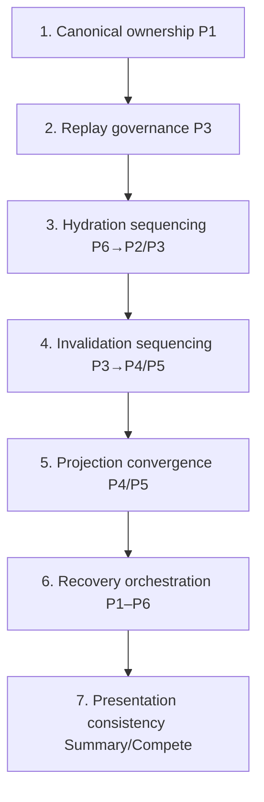
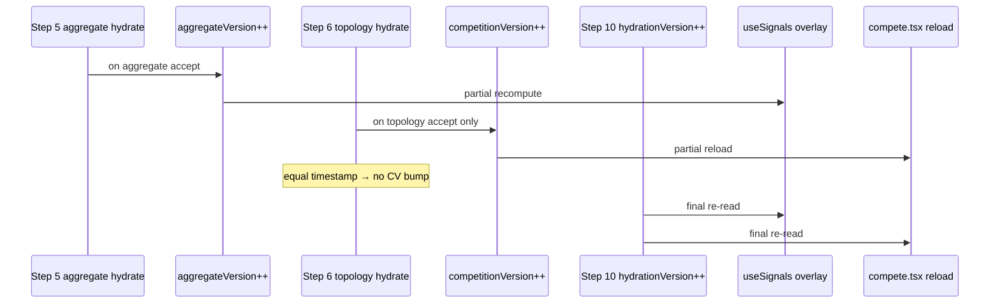

# Competition Stabilization Roadmap

| Field | Value |
|-------|--------|
| **Status** | Canonical stabilization sequencing governance (documentation only) |
| **Version** | v1 |
| **Scope** | Deterministic mutation ordering for competition runtime stabilization |
| **Grounding rule** | All claims trace to current repo behavior and existing architecture docs |
| **Companion docs** | See [Source documents](#source-documents) |

---

## Objective

Define the safest deterministic sequencing for stabilizing:

- hydration
- replay
- invalidation
- projection
- convergence
- recovery behavior

without violating runtime invariants or ownership boundaries.

This document is the **runtime stabilization roadmap** — not an implementation plan. It governs *when* and *in what order* future runtime work may proceed, based on observed repo behavior and documented risks.

**Functions as:**

- Runtime stabilization roadmap
- Dependency-aware mutation ordering
- Architecture ROI sequencing guide
- Replay-safe execution plan
- Future sprint governance layer

**Does not authorize:** runtime code changes, speculative systems, hydration/projection rewrites, or cross-plane refactors without prior grounding in companion docs and human review.

---

## Source documents

| Document | Path | Role in this roadmap |
|----------|------|----------------------|
| Runtime governance | `docs/architecture/competition/competition-runtime-governance-v1.md` | Constitution, planes, risk registry, deterministic targets |
| Runtime invariants | `docs/architecture/competition/competition-runtime-invariants-v1.md` | Hard invariant floor, mutation boundaries, violation registry |
| Hydration orchestration | `docs/architecture/hydration-orchestration-v1.md` | Observed reconcile order, consumer boundaries, stale-state observations |
| Runtime dependency maps | `docs/architecture/runtime-dependency-maps-v1.md` | Planes, invalidation chains, render deps, ordering candidates |
| Invalidation & cache | `docs/architecture/invalidation-cache-systems-v1.md` | Version counters, cache overwrite rules, convergence gaps |
| Recovery systems | `docs/architecture/recovery-systems-v1.md` | Survivability, reconstruction, data loss classes |
| Sequence diagrams | `docs/architecture/sequence-diagrams-v1.md` | End-to-end call-path diagrams |

---

# Stabilization Philosophy

These principles govern all stabilization work. They are derived from observed repo behavior and companion architecture docs — not aspirational runtime guarantees.

### Evidence-first stabilization

- Prefer trace-backed reports (`COMP_TOPOLOGY_HYDRATE`, `COMP_AGGREGATE_TRACE`, `overlay_missing`, `projection_fallback_used`) over UI screenshots alone.
- Close risk registry rows only when repo traces prove behavior changed.
- Reproduce divergence on a specific plane (P1–P6) before proposing mutation.

### Invariant-preserving mutation strategy

- Classify every change by invariant class (Ownership, Replay, Projection, Hydration, Recovery, Invalidation, Authority, Convergence) per `competition-runtime-invariants-v1.md`.
- A change touching replay must be checked against topology (`>`) vs aggregate (`>=`) asymmetry (INV-R1, INV-R2).
- A change touching projection must be checked against ownership and invalidation classes together.

### Replay-safe sequencing

- P3 mirror writes must go through `writeCoachCompetitionTopology` / `writeCoachCompetitionAggregate` overwrite rules — no bypass.
- Replay gate changes require explicit human approval; topology/aggregate asymmetry is replay doctrine, not incidental bug.
- Stabilization phases must not reorder reconcile steps until replay governance is understood and documented.

### Topology-before-presentation preference

- Structural match authority on coach Compete: topology when present (INV-P5); bounded Summary metrics: aggregate when gate passes (INV-P4).
- Governance targets prefer topology-first convergence for structural recovery; presentation layers (P4/P5) stabilize after mirror substrates (P3).

### Deterministic convergence targets

- Governance docs list deterministic targets (single generation bump, topology-before-aggregate reorder) as **not fully enforced** today (INV-C3).
- Stabilization work distinguishes observed runtime from target runtime at all times.

### No speculative runtime rewrites

- No autonomous hydration rewrites across P1+P3+P6 in one pass.
- No new canonical writers on coach device.
- No new systems beyond documented planes and stores.

### Bounded mutation zones

- Safe: DEV-only trace/logging, pure projection functions without new store writes, documentation under `docs/architecture/`.
- Prohibited: speculative hydration rewrites, replay gate changes without approval, persisting projection output.

### Runtime governance before implementation

- Phase 0 (governance + runtime mapping) is complete.
- Future phases require updated companion docs before code mutation.
- This roadmap sequences governance-approved work; it does not authorize implementation by itself.

---

# Runtime Dependency Ordering

Stabilization must respect this dependency-aware ordering. Each layer depends on the stability of prior layers.



### 1. Canonical ownership

| Depends on | Nothing — foundation layer |
|------------|---------------------------|
| **Why first** | INV-O1: parent canonical stores (`competitionStore`, parent `kidCompetitionStore`) remain authoritative. All downstream planes read or mirror P1; dual writers break every other invariant. |
| **Risk if violated** | Coach device writes parent match detail; Summary/Compete derive from divergent structural sources; worker publish builds from wrong local substrate. |

### 2. Replay governance

| Depends on | Canonical ownership (P1 publish produces artifacts; P3 mirrors consume them) |
|------------|-------------------------------------------------------------------------------|
| **Why second** | INV-R1/R2: topology accepts only `updatedAt > existing`; aggregate accepts `>=`. Replay rules determine whether P3 caches update at all — invalidation and projection depend on accept/reject outcomes. |
| **Risk if violated** | Changing replay gates without understanding asymmetry causes Summary to refresh while Compete topology unchanged on same remote payload; `emitCompetitionChange` not fired on topology reject. |

### 3. Hydration sequencing

| Depends on | Replay governance (write functions enforce accept/reject before stores change) |
|------------|-------------------------------------------------------------------------------|
| **Why third** | INV-H5: observed order in `refreshCoachWriterSessionsAndReconcileStores` — roster prune → shells → aggregate → topology → training proof → breakdown → `bumpCoachSyncHydrationVersion`. Reorder affects mid-tick subscriber behavior. |
| **Risk if violated** | Aggregate overlay updates before topology peek populated; `competitionCount` supplement lags; focus reload shows fresh P1 but stale P3. |

### 4. Invalidation sequencing

| Depends on | Hydration sequencing (counters fire when writes accept/reject) |
|------------|-------------------------------------------------------------|
| **Why fourth** | INV-I1/I4/I5: three independent counters (`competitionVersion`, `aggregateVersion`, `hydrationVersion`) drive subscriber re-reads. Mid-tick sequence is non-atomic. |
| **Risk if violated** | Summary recomputes before Compete reloads; tests snapshot mid-tick state as final; assumption that `emitCompetitionChange` refreshes Summary metrics (it does not — separate `aggregateVersion` path). |

### 5. Projection convergence

| Depends on | Invalidation sequencing (subscribers re-read after version bumps) |
|------------|------------------------------------------------------------------|
| **Why fifth** | INV-P1–P6: P4/P5 are presentation-only; authority matrix defines aggregate vs topology vs detail fallback precedence. Projection stabilizes only when P3 mirrors and invalidation timing are understood. |
| **Risk if violated** | Overlay or local detail promoted over topology/aggregate; list-level projection before card-scoped contract is documented; persistence of ephemeral projection output. |

### 6. Recovery orchestration

| Depends on | Projection convergence (recovery reconstructs desired UI state through known planes) |
|------------|-----------------------------------------------------------------------------------|
| **Why sixth** | INV-RC1–RC6: aligned coach UI requires parent publish → worker → reconcile → per-plane invalidation → subscriber re-read. Recovery paths assume bounded substrates and multi-plane convergence. |
| **Risk if violated** | Single-plane fix assumed sufficient (e.g. bump hydration without topology accept); coach reconstruction from overlays alone (no in-repo path). |

### 7. Presentation consistency

| Depends on | Recovery orchestration (survivability and reconstruction paths documented) |
|------------|---------------------------------------------------------------------------|
| **Why last** | INV-C2: Summary and Compete may temporarily diverge by design — split pipelines. Presentation consistency work addresses Summary vs Compete parity, focus vs pull-to-refresh UX, and DEV trace maturity — not substrate correctness. |
| **Risk if violated** | False regression reports when surfaces differ before hydration completes; UX changes that mask stale P3 without authority refresh path. |

### Cross-layer invalidation dependency (within one reconcile tick)



---

# Current Stabilization State

Grounded table from companion docs and violation registry. Ratings reflect **observed repo state only** — no speculative assessments.

| Runtime Area | State | Observed Behavior | Stability | Notes |
| ------------ | ----- | ----------------- | --------- | ----- |
| **Canonical ownership** | Partial | Parent-only detail writes enforced; coach reconcile does not call `setCompetitionDetailForEntryId` for linked athletes | Partial | Coach `competitionStore` merge may retain stale detail rows; not authoritative for linked athletes (INV-O1 weakness) |
| **Topology replay** | Open | Strict `>` gate; equal `updatedAt` → `hydrate_skipped_stale`; no `emitCompetitionChange` on reject | High Risk | Legitimate parent republish with unchanged timestamp does not refresh coach topology (INV-R1) |
| **Aggregate replay** | Partial | `>=` gate; equal timestamp → `same_timestamp_refresh` + `aggregateVersion++` | Partial | Same-timestamp refresh re-emits even when payload unchanged |
| **Invalidation fan-out** | Open | Three independent counters; mid-tick `aggregateVersion` → `competitionVersion` → `hydrationVersion` sequence | High Risk | Non-atomic subscriber generation; Summary may update before Compete (INV-I4, INV-C5) |
| **Summary projection** | Partial | `computeSignals` base + `overlayCompetitionAggregateSignals` when visibility gate passes | Partial | `overlay_missing`, `overlay_hidden_visibility` fall back to local metrics; focus without reconcile leaves stale aggregate |
| **Compete projection** | Partial | List: P1 detail merge only; card: `projectCompetitionCompeteView` with topology-first fallback | Partial | List count ≠ card match count by design; `projection_fallback_used` when peek null |
| **Authority refresh** | Partial | Full P3 refresh requires `refreshActiveAthleteAuthority` → reconcile; Summary focus = weekly only | Partial | Documented gap: pull-to-refresh required for P3 (INV-H2, INV-H3) |
| **Overlay persistence** | Open | Breakdown overlays may persist as orphan keys after parent delete; no per-`matchLineageKey` tombstone | Open | Projection skips unmatched lineage; disk state can outlive remote truth (INV-RC4) |
| **Cross-device convergence** | Open | Fire-and-forget parent publish; coach updates on next reconcile only | Open | Expected stale window between parent mutation and coach reconcile (INV-C1) |
| **Parent recovery substrate** | Partial | `parentKidCompetitionDelete` removes shell, detail, media immediately; schedules aggregate + topology republish | Partial | Coach stale until reconcile after worker receives DELETE |
| **Deterministic hydration ordering** | Open | Aggregate reconcile (step 5) before topology (step 6) in observed code | High Risk | Summary `competitionCount` peek may lag aggregate overlay in same tick (INV-R5, INV-H5) |

---

# Phase Sequencing Model

Phased stabilization governance. Phases are **sequencing boundaries** — not sprint commitments. Each phase must complete its governance artifacts before the next phase authorizes runtime mutation in its domain.

---

## Phase 0 — Governance + Runtime Mapping

**Status:** Completed

| Attribute | Value |
|-----------|-------|
| **Objective** | Map observed runtime planes, call paths, invariants, risks, and trace index |
| **Deliverables** | `competition-runtime-governance-v1.md`, `competition-runtime-invariants-v1.md`, `hydration-orchestration-v1.md`, `runtime-dependency-maps-v1.md`, `invalidation-cache-systems-v1.md`, `recovery-systems-v1.md`, `sequence-diagrams-v1.md`, this roadmap |
| **Protected invariants** | All — documentation only |
| **Mutation risk** | None |
| **Current maturity** | Complete |
| **Blocked by** | Nothing |

---

## Phase 1 — Replay Governance

| Attribute | Value |
|-----------|-------|
| **Objective** | Document and stabilize replay accept/reject semantics before any hydrate reorder or invalidation change |
| **Protected invariants** | INV-R1, INV-R2, INV-R3, INV-R4, INV-R6 |
| **Dependent systems** | `writeCoachCompetitionTopology`, `writeCoachCompetitionAggregate`, `pickRemoteCompetitionTopologyForLinkedAthlete`, `pickRemoteCompetitionAggregateForLinkedAthlete` |
| **Mutation risk** | **High** — replay gate changes affect all downstream P3 consumers |
| **Current maturity** | Documented; asymmetry observed and classified |
| **Blocked by** | Phase 0 (complete) |

### Replay asymmetry

| Store | Accept rule | Equal timestamp | Emit on accept |
|-------|-------------|-----------------|----------------|
| Topology | `incoming.updatedAt > existing` | Rejected (`incoming_equal_updatedAt_rejected`) | `emitCompetitionChange` |
| Aggregate | `incoming.updatedAt >= existing` | Accepted (`same_timestamp_refresh`) | `emitCoachCompetitionAggregateChange` |

**Observed consequence:** Same remote reconcile tick can refresh Summary bounded metrics while Compete structural view unchanged when topology `updatedAt` is equal.

### Equal timestamp behavior

- Topology: deterministic reject per store rule (INV-R1).
- Aggregate: deterministic accept per store rule (INV-R3).
- Cross-store: **partially deterministic** — per-store rules are strict; combined outcome diverges by design (invariants determinism classification).

### Topology ordering

- Topology replay is gate for Compete card structural authority.
- Reject → no disk write, no `emitCompetitionChange`, no compete list reload for topology-driven change.
- `peekCoachCompetitionTopology` reads in-process mirror only; cold start null until disk read/write.

### Aggregate ordering

- Aggregate replay is gate for Summary bounded metrics overlay.
- Accept at equal timestamp → cache refresh + `aggregateVersion++` even if payload unchanged.

### Cache overwrite consistency

- Both stores: full artifact replace per `sharedAthleteId` on accept.
- Both stores: reject paths leave cache and invalidation unchanged.
- **Inconsistency:** equal timestamp treated differently — stabilization of replay must address this before hydrate reorder.

**Phase 1 governance exit criteria (documentation + trace validation only):**

- All replay traces catalogued with accept/reject outcomes
- Equal-timestamp scenarios documented with expected Summary vs Compete divergence
- Human approval required before any replay gate code change

---

## Phase 2 — Hydration Orchestration

| Attribute | Value |
|-----------|-------|
| **Objective** | Stabilize observed reconcile sequence and consumer refresh boundaries |
| **Protected invariants** | INV-H1, INV-H2, INV-H3, INV-H4, INV-H5, INV-H6, INV-R5 |
| **Dependent systems** | `refreshCoachWriterSessionsAndReconcileStores`, `refreshActiveAthleteAuthority`, `useAthleteData`, `compete.tsx` focus paths |
| **Mutation risk** | **High** — reconcile order is observed contract; reorder breaks invalidation timing |
| **Current maturity** | Observed order documented; focus vs pull-to-refresh gap documented |
| **Blocked by** | Phase 1 replay governance understood and signed off for any gate-adjacent reorder |

### Deterministic ordering targets (governance only)

| Target | Observed | Governance target |
|--------|----------|-------------------|
| Reconcile artifact order | Aggregate (step 5) before topology (step 6) | Optional topology-before-aggregate for shared cache generation |
| Consumer-visible generation | Three counter fires mid-tick | Single generation after all P3 writes (step 10) |
| Focus refresh | P1 + weekly only | Documented: P3 requires authority refresh |

### Cross-plane sequencing

Observed reconcile sequence:

```text
1. coachSyncFetchSession (per active writer link)
2. setCachedWeeklyForLinkToken
3. reconcileCoachKidRosterFromWriterSessions (+ prune P3 for roster union)
4. reconcileCoachLinkedCompetitionEntriesFromWriterSessions   (P2 shells)
5. reconcileCoachCompetitionAggregatesFromWriterSessions      (P3 aggregate)
6. reconcileCoachCompetitionTopologyFromWriterSessions        (P3 topology)
7. reconcileCoachTrainingProofFromWriterSessions
8. reconcileCoachMatchBreakdownArtifacts
9. pruneCoachMatchBreakdownArtifactsAfterRosterReconcile
10. bumpCoachSyncHydrationVersion({ reason: "refreshCoachWriterSessionsAndReconcileStores_complete" })
```

### Refresh orchestration

| Surface | Focus | Pull-to-refresh / authority |
|---------|-------|----------------------------|
| Summary | `useAthleteData` P1 reload; weekly fetch only | `refreshActiveAthleteAuthority` → full reconcile |
| Compete | `loadCompetitions` P1 reload | Same as focus unless prior reconcile updated P3 |

### Convergence timing

- Parent publish: fire-and-forget; coach caches update on **next** reconcile.
- Mid-tick: step 5–6 may partially update subscribers before step 10.
- Post step 10: eventual consistency via `hydrationVersion` bump + re-reads.

### Invalidate-before-recompute sequencing

- Subscribers re-read local state after version bumps; orchestration does not push partial UI patches (INV-H4).
- Violation: assuming reload ran implies data refreshed (`stale_projection_skipped`, focus without reconcile).

**Phase 2 governance exit criteria:**

- Hydrate order changes require invalidation impact analysis (which counters, which subscribers)
- Focus vs authority refresh documented in product/QA governance
- No reorder without Phase 1 replay sign-off

---

## Phase 3 — Projection Convergence

| Attribute | Value |
|-----------|-------|
| **Objective** | Stabilize Summary vs Compete authority matrix and fallback ordering |
| **Protected invariants** | INV-P1, INV-P2, INV-P3, INV-P4, INV-P5, INV-P6, INV-C2 |
| **Dependent systems** | `overlayCompetitionAggregateSignals`, `projectCompetitionCompeteView`, `useSignals`, `CompetitionCard`, `compete.tsx` |
| **Mutation risk** | **Medium** — pure projection changes lower blast radius if no store writes |
| **Current maturity** | Precedence documented; split pipelines by design |
| **Blocked by** | Phase 2 hydrate boundaries stable; Phase 1 replay outcomes understood for projection fallback timing |

### Summary vs Compete consistency

| Surface | Structural authority | Bounded metrics authority |
|---------|---------------------|---------------------------|
| Summary | P1 shell + local `computeSignals` for trends/placement | P3 aggregate overlay when gate passes |
| Compete list | P1 detail merge | N/A |
| Compete card (coach) | P3 topology via `projectCompetitionCompeteView` | N/A (card shows matches, not aggregate metrics) |

**Observed divergence:** Same athlete can show different metrics vs match counts — aggregate overlay vs topology projection / detail fallback (open risk).

### Aggregate/topology precedence

Coach Summary overlay gate (observed order):

1. `deviceRole !== "coach"` → skip
2. `hasFullLocalMatchLineage` → always `false`
3. No artifact → `overlay_missing`
4. `!hasBoundedAggregateVisibility` → `overlay_hidden_visibility`
5. Apply overlay; optional `competitionCount` from topology peek

Coach Compete card:

1. Topology row for `(sharedAthleteId, sharedCompetitionId)` → topology matches by `ordinal`
2. Else → `fallbackMatches` from P1 detail merge
3. Overlay annotations attach by `matchLineageKey` (commentary only)

### Overlay precedence

- Annotations: async hydrated → legacy shell notes → empty while pending.
- Overlays never overwrite topology lineage (INV-P3).

### Projection fallback ordering

- `cache_peek_memory_not_loaded` → sync peek null → `projection_fallback_used`.
- Topology publish flag off → coach topology never updates from worker → persistent fallback.

**Phase 3 governance exit criteria:**

- Authority matrix unchanged or explicitly revised in companion docs
- No new store writes in projection path
- DEV parity traces used to validate Summary vs Compete source alignment

---

## Phase 4 — Recovery Orchestration

| Attribute | Value |
|-----------|-------|
| **Objective** | Stabilize bounded reconstruction paths after parent delete and roster prune |
| **Protected invariants** | INV-RC1, INV-RC2, INV-RC3, INV-RC4, INV-RC5, INV-RC6 |
| **Dependent systems** | `parentKidCompetitionDelete`, roster prune, `removeCoachCompetitionTopology`, `pruneCoachCompetitionAggregates`, overlay stores |
| **Mutation risk** | **Medium–High** — recovery touches P1 delete boundary and P3 prune paths |
| **Current maturity** | Survivability documented; orphan overlay retention open |
| **Blocked by** | Phase 3 projection fallback understood; Phase 2 reconcile prune ordering stable |

### Bounded reconstruction

| Desired state | Required path |
|---------------|---------------|
| Coach Summary metrics match parent | Parent publish aggregate → reconcile → `writeCoachCompetitionAggregate` → `useSignals` overlay |
| Coach Compete matches match parent | Parent publish topology → reconcile → topology peek → `projectCompetitionCompeteView` |
| Shell list match worker | `reconcileCoachLinkedCompetitionEntriesFromWriterSessions` |
| Clear stale caches for removed athlete | Roster prune or `removeCoachCompetitionAggregate/Topology` or `deleteKidPilot` |

**No in-repo path** reconstructs parent canonical match rows on coach device from overlays alone.

### Parent deletion recovery

- Parent: immediate local removal + remote DELETE + schedule aggregate/topology republish for remaining comps.
- Coach: stale until `refreshCoachWriterSessionsAndReconcileStores` after worker reflects delete.

### Multi-plane convergence

Aligned coach UI requires: parent publish → worker → reconcile → per-plane invalidation → subscriber re-read.

### Survivable artifact coordination

| Substrate | Post-delete coach state | Convergence mechanism |
|-----------|-------------------------|----------------------|
| Shell | May persist until reconcile | Remote list authority drops id |
| Topology | May persist stale | New artifact excludes deleted competition/matches |
| Aggregate | May persist stale totals | Recomputed artifact excludes deleted matches |
| Breakdown overlays | Keys may persist | Projection skips unmatched lineage |

**Phase 4 governance exit criteria:**

- Recovery reconstruction table validated against traces
- Orphan overlay handling documented (tombstone hygiene is governance target — not implemented)
- Roster prune atomicity for P3 keys confirmed

---

## Phase 5 — Runtime Hardening

| Attribute | Value |
|-----------|-------|
| **Objective** | Instrumentation maturity, convergence metrics, stale-state detection, QA governance |
| **Protected invariants** | INV-C3, INV-C4, INV-C5; all prior phases |
| **Dependent systems** | DEV trace helpers, parity fingerprints, QA checklists |
| **Mutation risk** | **Low–Medium** — DEV traces and documentation low risk; epoch/counter changes high risk |
| **Current maturity** | Partial — DEV traces exist; deterministic epoch not implemented |
| **Blocked by** | Phases 1–4 governance artifacts current |

### Replay epochs

- **Observed:** Per-store `updatedAt` only; no monotonic epoch per athlete artifact set.
- **Governance target:** Explicit replay epoch counter per athlete artifact set (not implemented).

### Deterministic convergence metrics

- **Observed:** Eventual consistency after `hydrationVersion` bump; mid-tick divergence windows.
- **Governance target:** Single consumer-visible generation after all P3 writes.

### Instrumentation maturity

Existing DEV traces: `competitionSummaryAggregationTrace`, `canonicalCompetitionSliceFingerprint`, `coachHydrationResolveTrace`, store hydrate decision logs.

### Stale-state detection

Catalogued traces: `overlay_missing`, `overlay_hidden_visibility`, `projection_fallback_used`, `readingStaleCompetitionEntry`, `readingStaleCompetitionShell`, `stale_projection_skipped`, `cache_peek_memory_not_loaded`.

### QA governance

- Distinguish focus reload vs authority refresh in test plans.
- Do not snapshot mid-reconcile state as final.
- Pull-to-refresh required to validate P3 refresh scenarios.

**Phase 5 governance exit criteria:**

- QA checklist references this roadmap phase model
- New traces added only with companion doc updates
- Deterministic targets remain labeled observed vs target

---

# Mutation Safety Zones

### Safe investigation zones

- Read store write decision logs and trace identifiers
- Map call paths using Repo Trace Index
- Compare Summary vs Compete sources via DEV parity helpers
- Plane-scoped code reading (P3 topology replay only, not "fix Compete")

**AI-assisted edits:** Acceptable for read-only investigation scripts, DEV trace analysis, documentation.

### Safe documentation zones

- `docs/architecture/**` markdown
- Sequence diagrams mirroring `sequence-diagrams-v1.md` style
- Violation registry extensions with grounded traces
- This roadmap and companion doc updates

**AI-assisted edits:** Acceptable with grounding references to companion docs.

### Bounded refactor zones

- Pure projection functions (P4/P5) **without** new store writes
- DEV-only trace/logging
- Documentation and governance markdown

**AI-assisted edits:** Acceptable with invariant class citation and human review on merge.

### Prohibited mutation zones

| Zone | Reason |
|------|--------|
| P1 canonical write paths on coach device | INV-O1, INV-O2 |
| P3 replay gates (`writeCoachCompetitionTopology` / `writeCoachCompetitionAggregate` accept rules) | INV-R1, INV-R2 — human approval mandatory |
| Reconcile step reorder in `refreshCoachWriterSessionsAndReconcileStores` | Observed contract; invalidation timing dependency |
| Persisting `projectCompetitionCompeteView` or overlay merge output | INV-O4 |
| New canonical writers or mirror self-promotion | INV-O2, INV-A3 |
| Cross-plane refactors (P1+P3+P6 single pass) | High blast radius |

**AI-assisted edits:** Prohibited autonomously.

### Replay-sensitive zones

- `writeCoachCompetitionTopology` — strict `>` gate
- `writeCoachCompetitionAggregate` — `>=` gate
- `pickRemoteCompetitionTopologyForLinkedAthlete` / `pickRemoteCompetitionAggregateForLinkedAthlete`
- Parent publish schedulers (`schedulePublishParentCompetitionTopology`, `schedulePublishParentCompetitionAggregate`)

**Human review:** Mandatory for any change.

### Authority-sensitive zones

- `refreshActiveAthleteAuthority`, `buildAthleteAuthoritySnapshot`, `fetchIdentitySnapshot`
- `refreshCoachWriterSessionsAndReconcileStores` entry and ordering
- `parentKidCompetitionDelete`, `CompetitionSync` publish boundary

**Human review:** Mandatory for any change.

### Invalidation-sensitive zones

- `emitCompetitionChange`, `emitCoachCompetitionAggregateChange`, `bumpCoachSyncHydrationVersion`
- Subscriber deps in `useSignals`, `useAthleteData`, `compete.tsx`

**Human review:** Mandatory for counter or subscriber dependency changes.

---

# Runtime Risk Prioritization

Grounded prioritization matrix from governance risk registry and violation registry. **Recommended Phase** indicates when governance work should address the risk — not implementation authorization.

| Risk | Severity | Runtime Impact | Dependency Depth | Recommended Phase |
| ---- | -------- | -------------- | ---------------- | ----------------- |
| **Summary/Compete divergence** | Medium | Same athlete different metrics vs match counts; DEV parity traces | P3, P4, P5 (depth 4) | Phase 3 |
| **Replay asymmetry** | Medium | Aggregate refreshes; topology skips at equal timestamp | P3 (depth 2) | Phase 1 |
| **Invalidation timing gaps** | Medium | Mid-tick Summary vs Compete mismatch; converges after step 10 | P4, P5, P6 (depth 4) | Phase 2 |
| **Stale aggregate overlays** | High | Summary W/L stale until reconcile; focus reloads P1 only | P3, P4 (depth 3) | Phase 2 |
| **Equal timestamp drift** | High | Compete unchanged after parent republish with same topology `updatedAt` | P3, P5 (depth 2) | Phase 1 |
| **Hydration ordering ambiguity** | High | Aggregate before topology; `competitionCount` peek lags overlay | P3, P4, P6 (depth 3) | Phase 2 |
| **Authority refresh timing** | Medium | Coach shows deleted competition until reconcile | P2, P3, P5, P6 (depth 3) | Phase 2 |
| **Projection precedence ambiguity** | Low–Medium | Empty coach notes first render; async overlay hydrate | P5 (depth 5) | Phase 3 |
| **Recovery incompleteness** | Medium | Orphan overlay keys; no tombstone sync; stale window after parent delete | P1–P6 (depth 6) | Phase 4 |
| **Topology publish flag off** | High | Coach topology never updates from worker when flag disabled | P3 (depth 2) | Phase 1 (document) / env config |
| **Topology peek null before warm** | Medium | Card uses detail fallback despite artifact on disk | P3, P5 (depth 3) | Phase 3 |
| **Shell reconcile ≠ detail hydrate** | Medium | Coach shells without match detail; Compete coach uses topology | P2, P1, P5 (depth 3) | Phase 2 |
| **Compete list vs card projection** | Low | List count ≠ card match count by design | P5 (depth 5) | Phase 3 |

**Sequencing rationale:** Phase 1 risks block correct replay interpretation. Phase 2 risks affect all subscriber timing. Phase 3–4 risks assume substrates and invalidation are understood. Phase 5 adds measurement without changing core contracts.

---

# Deterministic Runtime Targets

Governance targets only — **not implemented**, **not speculative code**. Clearly separated from observed runtime.

### Topology-first convergence

| Observed runtime | Target runtime (governance only) |
|------------------|----------------------------------|
| Compete card uses topology when peek hit; else P1 fallback | Structural recovery always from topology after successful reconcile |
| Topology equal timestamp rejected | Stable equal-timestamp accept policy (explicit human decision required) |
| Aggregate reconcile before topology in same tick | Optional topology-before-aggregate for shared cache generation |

### Replay-safe overwrite ordering

| Observed runtime | Target runtime (governance only) |
|------------------|----------------------------------|
| Topology `>`; aggregate `>=`; asymmetric cross-store behavior | Unified replay policy documented and consistently applied (if approved) |
| Per-store `updatedAt` only | Monotonic replay epoch per athlete artifact set |

### Deterministic invalidation fan-out

| Observed runtime | Target runtime (governance only) |
|------------------|----------------------------------|
| Three counters may fire mid-reconcile tick | Single consumer-visible generation after all P3 writes complete |
| `emitCompetitionChange` does not invalidate Summary aggregate overlay | Explicit subscriber map per counter (documented today) |

### Stable projection precedence

| Observed runtime | Target runtime (governance only) |
|------------------|----------------------------------|
| Split Summary aggregate vs Compete topology pipelines | Shared artifact generation boundary for cardinality + bounded metrics |
| List not topology-projected | Optional list-level projection for count parity (governance candidate only) |

### Refresh-independent convergence

| Observed runtime | Target runtime (governance only) |
|------------------|----------------------------------|
| Focus = P1 + weekly; P3 stale until authority refresh | Documented user expectation; optional focus-path reconcile (not implemented) |
| Fire-and-forget parent publish | Co-scheduled aggregate + topology from same mutation boundary |

### Replay epoch governance

| Observed runtime | Target runtime (governance only) |
|------------------|----------------------------------|
| ISO `updatedAt` string compare via `localeCompare` | Explicit epoch counter per athlete artifact set |
| No cross-artifact generation id | Shared generation id for aggregate + topology from same parent mutation |

### Bounded recovery orchestration

| Observed runtime | Target runtime (governance only) |
|------------------|----------------------------------|
| Orphan overlay keys persist | Explicit tombstone/prune when topology omits lineage |
| Roster prune clears P3 keys for removed athletes | Confirmed atomic per athlete removal |
| Transient stale window after parent delete | Documented SLA; QA tests use authority refresh |

---

# AI Collaboration Governance

### How Cursor should be used

- **Investigation:** Plane-scoped prompts with file paths from Repo Trace Index.
- **Documentation:** Update companion docs first; then governance/invariants/this roadmap.
- **Bounded edits:** DEV traces, pure projection (no store writes), docs under `docs/architecture/`.
- **Context loading:** Reference `competition-runtime-governance-v1.md` and `competition-runtime-invariants-v1.md` at session start for competition runtime work.

### How Codex should be used

- **Proof-of-work artifacts:** Architecture docs, trace catalogs, sequence diagrams.
- **Grounding synthesis:** Cross-doc consolidation (like this roadmap) — no code mutation unless explicitly scoped.
- **Review assistance:** Classify PRs by plane and invariant class; flag prohibited patterns.

### Safe prompt patterns

```text
Investigate P3 topology replay only for equal updatedAt rejection.
Ground in coachCompetitionTopologyStore.ts and competition-runtime-invariants-v1.md INV-R1.
Document finding in invalidation-cache-systems-v1.md — no code changes.
```

```text
Phase 2 hydration: map refreshActiveAthleteAuthority call chain.
Reference hydration-orchestration-v1.md and runtime-dependency-maps-v1.md.
Output: subscriber list affected by bumpCoachSyncHydrationVersion.
```

```text
Compare Summary vs Compete sources for athlete X using DEV parity traces.
Cite overlayCompetitionAggregateSignals vs projectCompetitionCompeteView paths.
```

### Prohibited broad-runtime prompts

- "Fix Compete stale data" (no plane scope)
- "Refactor hydration" (cross-plane, no invariant citation)
- "Make Summary and Compete consistent" (without authority matrix reference)
- "Change replay to accept equal timestamps" (replay-sensitive; human approval)
- "Reorder reconcile steps" (invalidation-sensitive; Phase 2 blocked without Phase 1)

### Required grounding references

Before any competition runtime mutation proposal:

1. Plane (P1–P6) and invariant IDs from `competition-runtime-invariants-v1.md`
2. File paths from Repo Trace Index (this doc or governance doc)
3. Stabilization phase from this roadmap
4. Observed vs target — do not treat governance targets as implemented
5. Risk registry row affected

### Bounded investigation doctrine

```text
Symptom → identify surface (Summary | Compete list | Compete card)
       → identify plane (P1 | P2 | P3 | P4 | P5 | P6)
       → identify stabilization phase (0–5)
       → check violation registry / risk prioritization matrix
       → read store write trace for last hydrate decision
       → check invalidation counter subscribers
       → document finding; separate implementation PR if needed
```

### Runtime plane referencing rules

- Use canonical plane names: P1 Parent canonical, P2 Coach shells, P3 Coach mirror artifacts, P4 Signal projection, P5 Compete render, P6 Authority orchestration.
- Use canonical store names: `coachCompetitionTopologyStore`, not "topology cache".
- Route params (`kidId`, `entryId`) are join hints; artifacts keyed by `sharedAthleteId` (OAI).

### Invariant referencing rules

- Cite invariant IDs: INV-O1, INV-R2, INV-P5, etc.
- Classify changes by invariant class before implementation.
- Replay changes: cite INV-R1–R6 together.

### Stabilization-phase-aware prompts

Include phase in scope:

| Phase | Prompt scope example |
|-------|---------------------|
| Phase 1 | Replay traces, equal timestamp scenarios, topology vs aggregate gates |
| Phase 2 | Reconcile order, focus vs authority, invalidation mid-tick |
| Phase 3 | Authority matrix, fallback ordering, Summary vs Compete sources |
| Phase 4 | Parent delete, roster prune, orphan overlays, reconstruction table |
| Phase 5 | DEV traces, QA checklists, convergence metrics |

---

# Repo Trace Index

File paths only. Grouped for grounding searches during stabilization work.

## Replay systems

| Function | Path |
|----------|------|
| `writeCoachCompetitionTopology` | `src/storage/coachCompetitionTopologyStore.ts` |
| `writeCoachCompetitionAggregate` | `src/storage/coachCompetitionAggregateStore.ts` |
| `pickRemoteCompetitionTopologyForLinkedAthlete` | `src/storage/coachKidStore.ts` |
| `pickRemoteCompetitionAggregateForLinkedAthlete` | `src/storage/coachKidStore.ts` |
| `hasFullLocalMatchLineage` | `src/domain/competition/overlayCompetitionAggregateSignals.ts` |
| `competeEntriesSameProjection` | `src/features/competition/competeEntriesSameProjection.ts` |

## Topology writers

| Function | Path |
|----------|------|
| `buildCompetitionTopologyArtifact` | `src/domain/competition/buildCompetitionTopologyArtifact.ts` |
| `buildCompetitionTopologyArtifactFromEntries` | `src/domain/competition/buildCompetitionTopologyArtifact.ts` |
| `publishParentCompetitionTopology` / schedule | `src/domain/competition/publishParentCompetitionTopology.ts` |
| `writeCoachCompetitionTopology` | `src/storage/coachCompetitionTopologyStore.ts` |
| `reconcileCoachCompetitionTopologyFromWriterSessions` | `src/storage/coachKidStore.ts` |
| `peekCoachCompetitionTopology` | `src/storage/coachCompetitionTopologyStore.ts` |
| `getCoachCompetitionTopology` | `src/storage/coachCompetitionTopologyStore.ts` |
| `pruneCoachCompetitionTopology` | `src/storage/coachCompetitionTopologyStore.ts` |
| `removeCoachCompetitionTopology` | `src/storage/coachCompetitionTopologyStore.ts` |

## Aggregate writers

| Function | Path |
|----------|------|
| `buildCompetitionAggregateArtifact` | `src/domain/competition/buildCompetitionAggregateArtifact.ts` |
| `publishParentCompetitionAggregate` / schedule | `src/domain/competition/publishParentCompetitionAggregate.ts` |
| `writeCoachCompetitionAggregate` | `src/storage/coachCompetitionAggregateStore.ts` |
| `reconcileCoachCompetitionAggregatesFromWriterSessions` | `src/storage/coachKidStore.ts` |
| `peekCoachCompetitionAggregate` | `src/storage/coachCompetitionAggregateStore.ts` |

## Hydration orchestrators

| Function | Path |
|----------|------|
| `refreshCoachWriterSessionsAndReconcileStores` | `src/storage/coachKidStore.ts` |
| `reconcileCoachKidRosterFromWriterSessions` | `src/storage/coachKidStore.ts` |
| `reconcileCoachLinkedCompetitionEntriesFromWriterSessions` | `src/storage/coachKidStore.ts` |
| `reconcileCoachTrainingProofFromWriterSessions` | `src/storage/coachKidStore.ts` |
| `reconcileCoachMatchBreakdownArtifacts` | `src/storage/coachKidStore.ts` |
| `upsertSharedCompetitionsForKid` | `src/storage/kidCompetitionStore.ts` |
| `setCachedWeeklyForLinkToken` | `src/storage/coachWeeklySyncCacheStore.ts` |
| `bumpCoachSyncHydrationVersion` | `src/storage/coachSyncHydrationStore.ts` |

## Invalidation emitters

| Emitter | Path |
|---------|------|
| `emitCompetitionChange` | `src/storage/kidCompetitionStore.ts` |
| `emitCoachCompetitionAggregateChange` | `src/storage/coachCompetitionAggregateStore.ts` |
| `bumpCoachSyncHydrationVersion` | `src/storage/coachSyncHydrationStore.ts` |
| `setCompetitionDetailForEntryId` | `src/storage/competitionStore.ts` |

## Authority refresh systems

| Function | Path |
|----------|------|
| `buildAthleteAuthoritySnapshot` | `src/identity/buildAthleteAuthoritySnapshot.ts` |
| `refreshActiveAthleteAuthority` | `src/hooks/useActiveAthlete.ts` |
| `fetchIdentitySnapshot` | `src/identity/fetchIdentitySnapshot.ts` |
| `CompetitionSync` | `src/domain/competition/CompetitionSync.ts` |
| `parentKidCompetitionDelete` | `src/family/parentKidCompetitionDelete.ts` |

## Projection systems

| Function | Path |
|----------|------|
| `computeSignals` | `src/lib/signals/computeSignals.ts` |
| `overlayCompetitionAggregateSignals` | `src/domain/competition/overlayCompetitionAggregateSignals.ts` |
| `overlayTrainingProofSignals` | `src/domain/training/overlayTrainingProofSignals.ts` |
| `projectCompetitionCompeteView` | `src/domain/competition/projectCompetitionCompeteView.ts` |
| `projectCompetitionEditorView` | `src/domain/competition/projectCompetitionEditorView.ts` |
| `mergeCoachBreakdownIntoMatches` | `src/domain/competition/mergeCoachBreakdownIntoMatches.ts` |
| `hydrateCompetitionMatchOverlayAnnotations` | `src/domain/competition/hydrateCompetitionMatchOverlayAnnotations.ts` |
| `buildSummaryViewModel` | `src/lib/summary/buildSummaryViewModel.ts` |
| `loadCanonicalAthleteCompetitionSlice` | `src/features/competition/canonicalCompetitionSource.ts` |

## Runtime entrypoints

| Surface | Path |
|---------|------|
| `SummaryScreen` | `src/features/summary/SummaryScreen.tsx` |
| `useSignals` | `src/hooks/useSignals.ts` |
| `useAthleteData` | `src/hooks/useAthleteData.ts` |
| `useActiveAthlete` | `src/hooks/useActiveAthlete.ts` |
| Compete tab | `app/(tabs)/compete.tsx` |
| `CompetitionCard` | `src/features/competition/CompetitionCard.tsx` |
| Competition edit (coach) | `app/(tabs)/coach/kid/[kidId]/competition/edit.tsx` |
| `CoachRoster` | `src/features/coach/CoachRoster.tsx` |

## Key stores

| Store | Path |
|-------|------|
| `kidCompetitionStore` | `src/storage/kidCompetitionStore.ts` |
| `competitionStore` | `src/storage/competitionStore.ts` |
| `coachCompetitionAggregateStore` | `src/storage/coachCompetitionAggregateStore.ts` |
| `coachCompetitionTopologyStore` | `src/storage/coachCompetitionTopologyStore.ts` |
| `coachSyncHydrationStore` | `src/storage/coachSyncHydrationStore.ts` |
| `coachMatchBreakdownArtifactStore` | `src/storage/coachMatchBreakdownArtifactStore.ts` |
| `coachWeeklySyncCacheStore` | `src/storage/coachWeeklySyncCacheStore.ts` |
| `coachTrainingProofStore` | `src/storage/coachTrainingProofStore.ts` |
| `coachKidStore` | `src/storage/coachKidStore.ts` |

## DEV trace / parity

| Function | Path |
|----------|------|
| `competitionSummaryAggregationTrace` | `src/features/summary/competitionSummaryAggregationTrace.ts` |
| `canonicalCompetitionSliceFingerprint` | `src/features/competition/canonicalCompetitionSource.ts` |
| `coachHydrationResolveTrace` | `src/identity/coachHydrationResolveTrace.ts` |

---

## Document maintenance

When runtime behavior changes:

1. Update grounded companion docs first.
2. Revise **Current Stabilization State** table and **Runtime Risk Prioritization** matrix to match new traces.
3. Advance phase maturity only when governance exit criteria for that phase are met (documentation + trace validation).
4. Do not mark **Deterministic Runtime Targets** as observed without repo evidence.

**No runtime changes are authorized by this document alone.**
