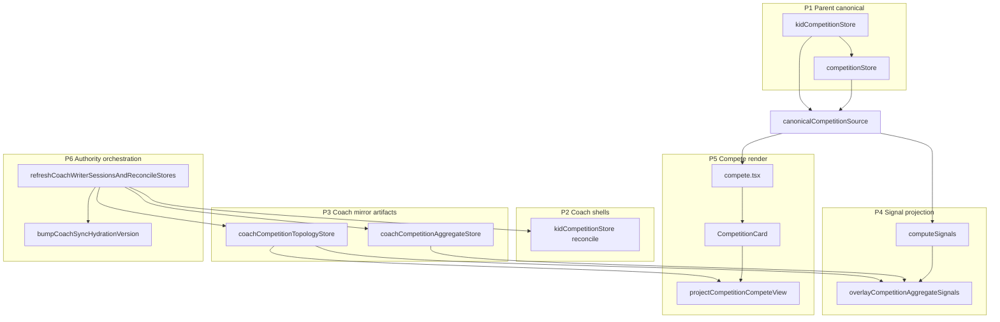
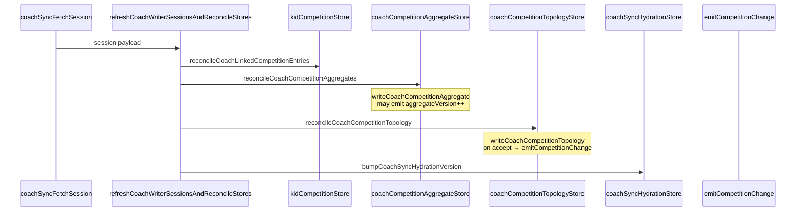
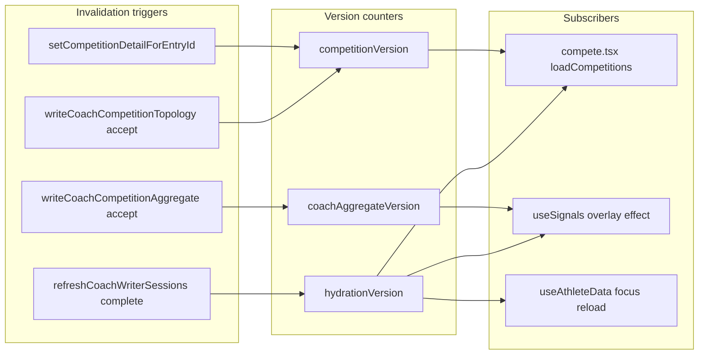
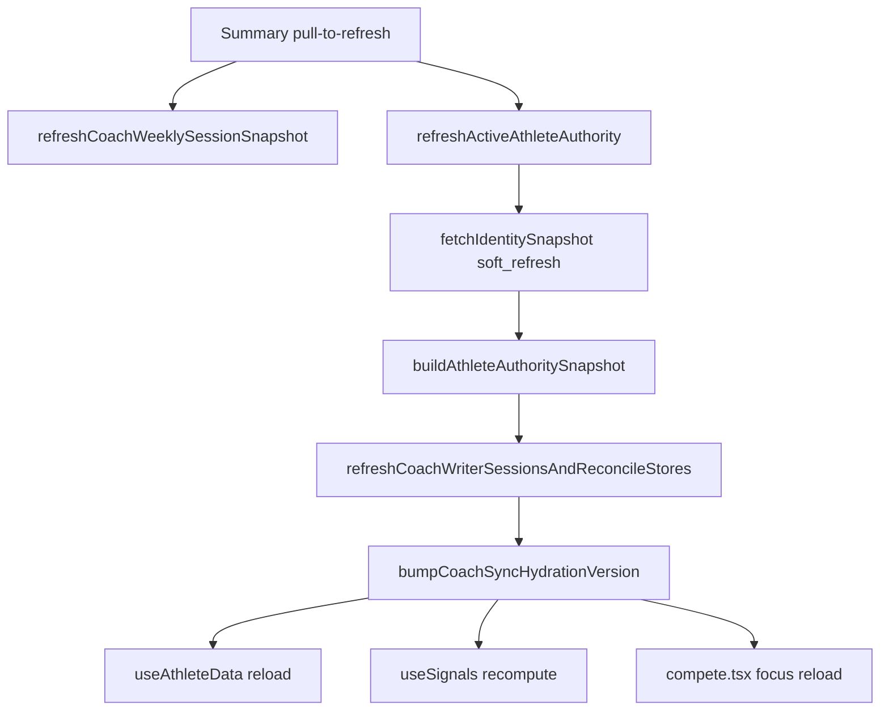
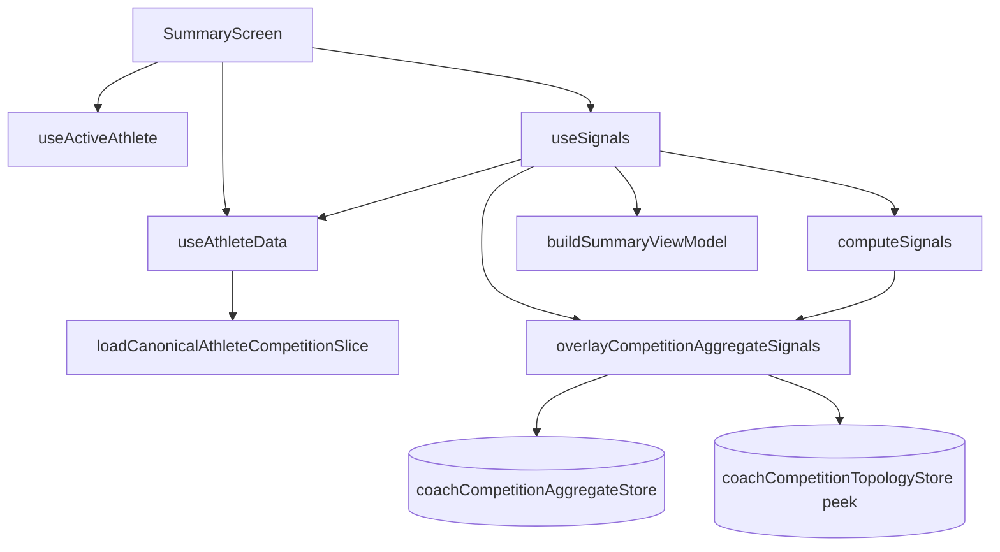

# Runtime Dependency Maps v1

Grounded runtime cognition map for competition hydration, signals, Summary, and Compete. Arrows mean **reads** or **derives from** at runtime. Companion docs: `hydration-orchestration-v1.md`, `invalidation-cache-systems-v1.md`.

**Scope:** observed code paths only — no aspirational behavior.

---

## Runtime planes

Six planes partition where data lives, who writes it, and who reads it at render time.

| Plane | Canonical stores / functions | Writer authority | Primary readers |
|-------|------------------------------|------------------|-----------------|
| **P1 — Parent canonical** | `kidCompetitionStore`, `competitionStore` | Parent device only (`setCompetitionDetailForEntryId`, shell CRUD) | `loadCanonicalAthleteCompetitionSlice`, Compete list load, `computeSignals` inputs |
| **P2 — Coach shells** | `kidCompetitionStore` (via `upsertSharedCompetitionsForKid`) | Remote writer session reconcile | Same as P1 selectors on coach device |
| **P3 — Coach mirror artifacts** | `coachCompetitionAggregateStore`, `coachCompetitionTopologyStore` | `writeCoachCompetitionAggregate`, `writeCoachCompetitionTopology` (hydrate only) | `useSignals` overlay, `CompetitionCard` / `projectCompetitionCompeteView` |
| **P4 — Signal projection** | `computeSignals`, `overlayCompetitionAggregateSignals`, `overlayTrainingProofSignals` | Pure functions; no persistence | `buildSummaryViewModel`, Summary cards |
| **P5 — Compete render** | `compete.tsx` entry list + `CompetitionCard` card projection | Ephemeral; `projectCompetitionCompeteView` never persists | Compete tab UI |
| **P6 — Authority / hydration orchestration** | `refreshCoachWriterSessionsAndReconcileStores`, `buildAthleteAuthoritySnapshot`, `coachSyncHydrationStore` | Network reconcile + version bump | `useActiveAthlete`, all P1–P5 invalidation subscribers |



**Cross-plane rule:** P3 never writes P1. Coach mirror stores are overwrite-only caches keyed by `sharedAthleteId` (OAI). Route params (`kidId`, `entryId`) are join hints only.

---

## Ownership boundaries

| Store / counter | AsyncStorage key | Sole writer(s) | Reader(s) | Plane |
|-----------------|------------------|----------------|-----------|-------|
| `kidCompetitionStore` | `mm:v1:kidCompetitionEntries` | Parent shell CRUD; coach `upsertSharedCompetitionsForKid` | `canonicalCompetitionSource`, `compete.tsx`, `useAthleteData` | P1/P2 |
| `competitionStore` | `competitions` | Parent `setCompetitionDetailForEntryId` only | `mergeCompetitionMatchDetailIntoEntries` (inside competitionStore loaders) | P1 |
| `coachCompetitionTopologyStore` | `mm:v1:coachCompetitionTopologyByAthleteId` | `writeCoachCompetitionTopology` | `peekCoachCompetitionTopology`, `projectCompetitionCompeteView`, `overlayCompetitionAggregateSignals` (count peek) | P3 |
| `coachCompetitionAggregateStore` | `mm:v1:coachCompetitionAggregatesByAthleteId` | `writeCoachCompetitionAggregate` | `useSignals`, `peekCoachCompetitionAggregate` | P3 |
| `coachSyncHydrationStore` | in-process `hydrationVersion` | `bumpCoachSyncHydrationVersion` | `useAthleteData`, `useSignals`, `compete.tsx`, `SummaryScreen` (weekly cache-only path) | P6 |
| `kidCompetitionStore.competitionVersion` | in-process counter | `emitCompetitionChange` | `compete.tsx` via `useSyncExternalStore` | P1/P2 invalidation |
| `coachCompetitionAggregateStore.aggregateVersion` | in-process counter | `emitCoachCompetitionAggregateChange` | `useCoachCompetitionAggregateVersion` → `useSignals` | P3 invalidation |
| `coachMatchBreakdownArtifactStore` | `mm:v1:coachMatchBreakdownArtifactsByAthleteId` | Session cache hydrate, coach publish | `CompetitionCard` overlay hydrate, parent `mergeCoachBreakdownIntoMatches` | P3 overlay (not topology/aggregate) |

**Write prohibition boundaries (observed):**

| Boundary | Never writes |
|----------|--------------|
| `computeSignals` | Any store |
| `overlayCompetitionAggregateSignals` | Any store; shallow merge into in-memory `SignalOutput` only |
| `projectCompetitionCompeteView` | Any store; returns ephemeral view |
| `reconcileCoachCompetitionAggregatesFromWriterSessions` | Competition rows, signals (docstring) |
| `reconcileCoachCompetitionTopologyFromWriterSessions` | Competition rows, projections, UI (docstring) |
| Coach device | `competitionStore` match detail (parent authority) |

---

## Hydration ordering

### Coach reconcile (`refreshCoachWriterSessionsAndReconcileStores`)

Observed order in `coachKidStore.ts` — **not aspirational**:

```text
1. coachSyncFetchSession (per active writer link)
2. setCachedWeeklyForLinkToken (weekly + session payload)
3. reconcileCoachKidRosterFromWriterSessions
   └─ pruneCoachCompetitionAggregates / Topology / TrainingProof (roster union)
4. reconcileCoachLinkedCompetitionEntriesFromWriterSessions   (P2 shells)
5. reconcileCoachCompetitionAggregatesFromWriterSessions      (P3 aggregate)  ← before topology
6. reconcileCoachCompetitionTopologyFromWriterSessions        (P3 topology)
7. reconcileCoachTrainingProofFromWriterSessions
8. reconcileCoachMatchBreakdownArtifacts
9. pruneCoachMatchBreakdownArtifactsAfterRosterReconcile
10. bumpCoachSyncHydrationVersion({ reason: "refreshCoachWriterSessionsAndReconcileStores_complete" })
```

Within each athlete reconcile loop, aggregate hydrate (step 5) may emit `coachAggregateVersion++` **before** topology hydrate (step 6) completes in the same tick. Topology accept (step 6) may call `emitCompetitionChange` independently.



### Per-artifact write acceptance (within reconcile)

| Store | Function | Accept when | Reject when |
|-------|----------|-------------|-------------|
| Aggregate | `writeCoachCompetitionAggregate` | `incoming.updatedAt >= existing.updatedAt` | Older `updatedAt` |
| Topology | `writeCoachCompetitionTopology` | `incoming.updatedAt > existing.updatedAt` | Equal or older `updatedAt` |

### Parent publish (post-mutation, parent device)

```text
CompetitionSync.save/delete
  → kidCompetitionStore
  → competitionStore.setCompetitionDetailForEntryId (parent only)
  → emitCompetitionChange (via detail write)
  → coachSync worker (shell)
  → schedulePublishParentCompetitionAggregate
  → schedulePublishParentCompetitionTopology [flag-gated: topologyPublishV2]
```

Coach device receives artifacts on next `refreshCoachWriterSessionsAndReconcileStores` (or authority refresh that triggers it).

### Consumer hydration (no network)

| Consumer | Load trigger | Data source |
|----------|--------------|-------------|
| `useAthleteData` | `useFocusEffect`, `hydrationVersion` change | `getSessions` + `loadCanonicalAthleteCompetitionSlice` |
| `useSignals` coach overlay | `hydrationVersion`, `coachAggregateVersion`, athlete scope | `peek`/`getCoachCompetitionAggregate`, `peekCoachTrainingProof` |
| `compete.tsx` | `useFocusEffect`, `competitionVersion`, `hydrationVersion` | `getKidCompetitionEntriesWithMatchDetailForKid/SharedAthlete` |
| `CompetitionCard` | Every render + `useFocusEffect` overlay hydrate | Sync `peekCoachCompetitionTopology`; async overlay annotations |

---

## Invalidation trigger map

Three independent version counters drive re-reads. They do **not** cascade automatically except where a write explicitly calls both.

| Trigger | Emitter | Counter | Subscribers / downstream |
|---------|---------|---------|--------------------------|
| Parent detail write | `setCompetitionDetailForEntryId`, `copyCompetitionDetailToCanonicalKeyForEntry` | `competitionVersion++` via `emitCompetitionChange` | `compete.tsx` reload |
| Parent/shell CRUD | `kidCompetitionStore` save paths (when emit called) | `competitionVersion++` | `compete.tsx` reload |
| Topology hydrate accept | `writeCoachCompetitionTopology` → `hydrate_store_overwrite` | `competitionVersion++` via `emitCompetitionChange("writeCoachCompetitionTopology")` | `compete.tsx` reload |
| Aggregate hydrate accept | `writeCoachCompetitionAggregate` | `aggregateVersion++` via `emitCoachCompetitionAggregateChange` | `useCoachCompetitionAggregateVersion` → `useSignals` effect |
| Reconcile complete | `refreshCoachWriterSessionsAndReconcileStores` end | `hydrationVersion++` via `bumpCoachSyncHydrationVersion` | `useAthleteData`, `useSignals`, `compete.tsx` focus deps, `SummaryScreen` weekly cache-only |
| Breakdown artifact hydrate | `setCachedWeeklyForLinkToken` (session artifacts path) | `hydrationVersion++` | Same as reconcile bump subscribers |
| Athlete scope change | `useAthleteData` scope key change | React state reset (no counter) | `useSignals` recompute; `[useSignals] athlete scope transition` DEV log |



**Invalidation ordering note:** A single reconcile tick can produce `aggregateVersion++` (step 5), then `competitionVersion++` (step 6 topology accept), then `hydrationVersion++` (step 10). Summary may recompute aggregate overlay before Compete list reloads for topology — both converge after step 10.

---

## Authority refresh flows

Entry points that invoke full coach reconcile (P6 → P2/P3):

| Entry | Path | Network reconcile? |
|-------|------|-------------------|
| App boot / focus | `useActiveAthlete` → `fetchIdentitySnapshot("focus_effect")` → `buildAthleteAuthoritySnapshot` | Yes (coach role) |
| Summary pull-to-refresh | `onSummaryRefresh` → `refreshActiveAthleteAuthority` → `fetchIdentitySnapshot("soft_refresh")` | Yes |
| CoachRoster / useCoachInsights | Direct `refreshCoachWriterSessionsAndReconcileStores` | Yes |

`refreshActiveAthleteAuthority` (exported from `useActiveAthlete`):

```text
refreshActiveAthleteAuthority()
  → fetchIdentitySnapshot("soft_refresh")
  → buildAthleteAuthoritySnapshot({ parentRole: "coach", skipCoachWriterSessionRefresh: false })
  → refreshCoachWriterSessionsAndReconcileStores()   [coach only]
  → applyStorageSnapshot(snap)
```

Summary focus alone runs `refreshWeeklySessionSnapshot` — **not** full reconcile. Pull-to-refresh runs weekly fetch **then** `refreshActiveAthleteAuthority`.



---

## Render dependency chains

### `canonicalCompetitionSource`

Thin adapter — P1 read only; no P3 reads.

```text
loadCanonicalAthleteCompetitionSlice(athleteId, linkedKidId)
  → linkedKidId ? getKidCompetitionEntriesWithMatchDetailForKid(lk)
                : getKidCompetitionEntriesWithMatchDetailForSharedAthlete(athleteId)
       → mergeCompetitionMatchDetailIntoEntries
            → getCompetitionDetailForEntry (competitionStore)

canonicalCompetitionSliceFingerprint(competitions)   // DEV parity only
```

### `SummaryScreen` chain

```text
SummaryScreen
  ├─ useActiveAthlete → athleteId, linkedKidId, refreshActiveAthleteAuthority
  ├─ useCoachSyncHydrationVersion (weekly cache-only effect on bump)
  ├─ useAthleteData(activeAthleteId, linkedKidId)
  │    └─ loadCanonicalAthleteCompetitionSlice → competitions[]
  ├─ useSignals({ athleteId, kidId, sessions, competitions, declaredInput })
  │    ├─ useAthleteData (internal — same slice)
  │    ├─ computeSignals → base SignalOutput
  │    └─ [coach] overlayCompetitionAggregateSignals ← coachCompetitionAggregateStore
  │              ← peekCoachCompetitionTopology (competitionCount only)
  │         overlayTrainingProofSignals ← coachTrainingProofStore
  ├─ buildSummaryViewModel(signals, ...)
  └─ SummaryCompetitionCard / SummaryHeroCard (consume signals.competition)

DEV parity:
  canonicalCompetitionSliceFingerprint(competitions)
  devGetCompeteTabCompetitionSnapshot — compares Summary vs Compete sources
```



### `useSignals` dependency chain

```text
useActiveAthlete inputs (athleteId, kidId via props)
  → useAthleteData
       → getSessions()
       → loadCanonicalAthleteCompetitionSlice

useSignals useMemo:
  → filterSessionsLikeTrainingRefresh(normalizeSessionsLikeTraining(sessions))
  → computeSignals({ sessions: scopedSessions, competitions: scopedCompetitions, ... })
  → [coach + hasAthlete]
       effectiveCoachAggregate = coachAggregate ?? coachAggregatePeek
       hasFullLocalMatchLineage? → always false (suppression retired)
       hasBoundedAggregateVisibility?
         → overlayCompetitionAggregateSignals(computed, aggregate)
              → peekCoachCompetitionTopology (competitionCount only)
       hasTrainingProofVisibility?
         → overlayTrainingProofSignals
```

**Version deps in `useSignals`:** `useCoachSyncHydrationVersion`, `useCoachCompetitionAggregateVersion` (coach overlay effect + useMemo).

### `computeSignals` (competition lane)

- Input: caller-provided `competitions[]` with merged `matches[]`.
- Flattens matches; computes wins/losses, win rate, submission rate, timing, winStyle, placement trends, bucket history from **local merged entries**.
- Does **not** read `coachCompetitionAggregateStore` or `coachCompetitionTopologyStore`.

Coach Summary final bounded metrics come from `overlayCompetitionAggregateSignals` **after** `computeSignals`, not by replacing `computeSignals` inputs.

### `compete.tsx` chain

```text
compete.tsx
  ├─ useActiveAthlete
  ├─ useCoachSyncHydrationVersion
  ├─ subscribeCompetition → competitionVersion
  ├─ useFocusEffect → loadCompetitions
  │    └─ getKidCompetitionEntriesWithMatchDetailForKid | ForSharedAthlete
  │         └─ mergeCompetitionMatchDetailIntoEntries
  │    └─ competeEntriesSameProjection guard → may skip setEntries
  └─ visibleEntries filter (linkedKidId | sharedAthleteId)

CompetitionCard (per entry) — NOT in compete.tsx load path
  ├─ peekCoachCompetitionTopology(sharedAthleteId)          [sync, render-time]
  ├─ hydrateCompetitionMatchOverlayAnnotations (async)      [coach]
  └─ [coach] projectCompetitionCompeteView({ shell, topologyArtifact, overlayAnnotations, fallbackMatches })
  └─ [parent] mergeCoachBreakdownIntoMatches on entry.matches
```

**Important:** List load in `compete.tsx` does **not** apply topology projection. Projection is **card-scoped** at render time.

---

## Overlay precedence

### Summary aggregate overlay (`overlayCompetitionAggregateSignals`)

Applied in `useSignals` coach branch only, **after** `computeSignals`.

| Precedence | Source | Fields affected |
|------------|--------|-----------------|
| 1 (base) | `computeSignals` local competitions | All `signals.competition.*` including trends, buckets, `recentResults`, `lastCompetition*` |
| 2 (overlay, when applied) | `coachCompetitionAggregateStore` artifact | `totalMatches`, `wins`, `losses`, `winRate`, `submissionRate`, `fastestSubmission`, `averageMatchTime`, `winStyle`, `record` |
| 2b (overlay supplement) | `peekCoachCompetitionTopology` | `competitionCount` only (when topology peek succeeds) |

**Overlay gate (observed order in `useSignals`):**

1. `deviceRole !== "coach"` → no overlay
2. `hasFullLocalMatchLineage` → always `false` (never skips)
3. No aggregate artifact → `overlay_missing`
4. `!hasBoundedAggregateVisibility` → `overlay_hidden_visibility`
5. Else → `overlayCompetitionAggregateSignals`

**Does not modify:** `recentResults`, `placementTrend`, `bucketHistory`, `lastCompetition*`, raw match arrays.

### Compete card projection (`projectCompetitionCompeteView`)

| Precedence | Condition | Match source |
|------------|-----------|--------------|
| 1 | Topology row found for `(sharedAthleteId, sharedCompetitionId)` | Topology `matches[]` sorted by `ordinal`; structural facts from topology |
| 2 | Topology missing | `fallbackMatches` (detail merge from P1) |
| 3 (annotation layer) | Overlay annotations keyed by `matchLineageKey` | Coach notes only; attached on top of topology snapshots |

Join keys: `(sharedAthleteId, sharedCompetitionId, matchLineageKey)`.

`CompetitionCard` overlay annotation source precedence (coach):

1. `hydratedOverlayAnnotations` (async hydrate complete)
2. `legacyOverlayAnnotations` from shell `entry.matches[].coachNote`
3. Empty while `hydrationPending`

---

## Topology precedence

| Stage | Rule | Evidence |
|-------|------|----------|
| Cache write | Newest-wins strict: `incoming.updatedAt > existing.updatedAt` | `writeCoachCompetitionTopology`; equal timestamp → `hydrate_skipped_stale` |
| Cache read (sync) | `peekCoachCompetitionTopology` → in-process `topologyMemory` only | Returns `null` until first disk read/write |
| Card projection | Topology competition row wins over `fallbackMatches` | `projectCompetitionCompeteView` |
| Summary overlay | Topology used only for `competitionCount`; metrics from aggregate | `overlayCompetitionAggregateSignals` |
| Compete list | No topology — detail merge only | `compete.tsx` `loadCompetitions` |

**Split pipeline (observed):** Summary bounded metrics follow aggregate artifact; Compete match cardinality follows topology projection (or detail fallback). Same screen can show different counts when aggregate/topology/detail diverge.

---

## Cross-plane dependency notes

| From | To | Relationship |
|------|-----|--------------|
| P6 reconcile | P2 shells | Remote session `competitions[]` → `upsertSharedCompetitionsForKid` |
| P6 reconcile | P3 aggregate | `session.competitionAggregateByAthleteId` → `writeCoachCompetitionAggregate` |
| P6 reconcile | P3 topology | `session.competitionTopologyByAthleteId` → `writeCoachCompetitionTopology` |
| P1 slice | P4 `computeSignals` | Same merged entries parent and coach (before overlay) |
| P3 aggregate | P4 overlay | Metrics replacement only; no write-back to P1 |
| P3 topology | P4 overlay | Read-only peek for `competitionCount` |
| P3 topology | P5 projection | Structural match rows at card render |
| P1 detail merge | P5 fallback | `fallbackMatches` when topology row absent |
| P3 topology accept | P5 invalidation | `emitCompetitionChange` → compete list reload (detail still P1; cards re-project) |
| P6 bump | P1/P4/P5 consumers | Does not itself write stores; triggers re-read of existing local state |

**Weekly path (orthogonal):** `refreshCoachWeeklySessionSnapshot` → `coachWeeklySyncCacheStore`. Full competition artifact refresh requires authority path through `refreshActiveAthleteAuthority` → `buildAthleteAuthoritySnapshot` → `refreshCoachWriterSessionsAndReconcileStores`.

---

## Cache overwrite boundaries

| Cache | Memory mirror | Populate | Overwrite rule | On reject | Invalidates |
|-------|---------------|----------|----------------|-----------|-------------|
| Topology | `topologyMemory` | `writeCoachCompetitionTopology` | Strict newer (`>`) | No write, no emit | `emitCompetitionChange` on accept only |
| Aggregate | `aggregatesMemory` | `writeCoachCompetitionAggregate` | `updatedAt >= existing` | No write, no emit | `emitCoachCompetitionAggregateChange` on accept |
| Shell list | — | Parent CRUD; coach reconcile | Remote wins for shared ids | — | `emitCompetitionChange` when emit called |
| Match detail | — | Parent `setCompetitionDetailForEntryId` | Full replace per entry id | — | `emitCompetitionChange` |
| Hydration counter | in-process | `bumpCoachSyncHydrationVersion` | Monotonic increment | — | All `useCoachSyncHydrationVersion` subscribers |

**Peek boundary:** `peekCoachCompetitionTopology` / `peekCoachCompetitionAggregate` read memory mirrors only. First render after cold start may see `null` until async `get*` or hydrate write populates mirror — affects sync overlay and card projection paths.

**Prune boundaries:** `pruneCoachCompetitionAggregates` / `pruneCoachCompetitionTopology` drop keys outside roster union during roster reconcile (step 3). Does not tombstone per-deleted `matchLineageKey` in overlay stores.

---

## Replay-sensitive boundaries

| Store / path | Equal `updatedAt` | Older incoming | Re-run reconcile unchanged remote |
|--------------|-------------------|----------------|-----------------------------------|
| Topology | Rejected (`incoming_equal_updatedAt_rejected`) | Rejected | Skip write; no `emitCompetitionChange` |
| Aggregate | Accepted (`same_timestamp_refresh`) | Rejected | May refresh at same timestamp; emits aggregate version |
| `hasFullLocalMatchLineage` | N/A — always returns `false` | — | Aggregate overlay always eligible (gate is visibility, not local lineage) |
| Shell reconcile | N/A | Remote list authority for shared ids | Idempotent for unchanged remote |
| `competeEntriesSameProjection` | N/A | N/A | Reload may run but `setEntries` skipped if fingerprint unchanged |

**Replay implication:** Legitimate parent republish with unchanged topology `updatedAt` is skipped on coach device. Aggregate republish at same timestamp refreshes cache and notifies `useSignals`.

---

## Deterministic ordering candidates

Documented targets from trace infrastructure and governing docs — **not fully enforced in runtime today**:

| Candidate order | Current state | Target |
|-----------------|---------------|--------|
| Reconcile: topology before aggregate | Aggregate (step 5) before topology (step 6) | Optional reorder so Summary `competitionCount` peek and Compete projection share same cache generation |
| Parent publish: aggregate + topology co-scheduled | Both scheduled post-mutation; topology flag-gated | Same mutation boundary for both artifacts |
| Invalidation: single bump after all P3 writes | Three counters may fire in one reconcile tick | Prefer one consumer-visible generation after step 10 |
| Compete list projection | List uses P1 detail only | Optional list-level `projectCompetitionCompeteView` for count parity with cards |
| Summary overlay gate | Uses aggregate visibility; topology optional for count | Topology presence as overlay precondition (partially present via count peek) |
| Focus without reconcile | Summary/Compete focus reloads P1 merge only | Documented gap; pull-to-refresh required for P3 refresh |

---

## Aggregate vs topology reconcile paths

### Aggregate (`reconcileCoachCompetitionAggregatesFromWriterSessions`)

```text
sortWriterSessionSnapshotsNewestFirst(successfulSnapshots)
  → for each primary roster row (sharedAthleteId):
       pickRemoteCompetitionAggregateForLinkedAthlete(sessionsOrdered, sharedAthleteId)
       → writeCoachCompetitionAggregate(artifact)
            → updatedAt >= existing ? write + emitCoachCompetitionAggregateChange : skip
```

### Topology (`reconcileCoachCompetitionTopologyFromWriterSessions`)

```text
sortWriterSessionSnapshotsNewestFirst(successfulSnapshots)
  → for each primary roster row (sharedAthleteId):
       pickRemoteCompetitionTopologyForLinkedAthlete(sessionsOrdered, sharedAthleteId)
       → writeCoachCompetitionTopology(artifact)
            → updatedAt > existing ? write + emitCompetitionChange : hydrate_skipped_stale
```

Both paths: overwrite-only; no local row minting; no direct UI side effects beyond invalidation emits.

---

## Artifact build dependencies (parent-only publish)

```text
buildCompetitionTopologyArtifact(sharedAthleteId)
  → getKidCompetitionEntriesWithMatchDetailForSharedAthlete
  → buildCompetitionTopologyArtifactFromEntries
       → match.id → matchLineageKey
       → throws on missing sharedCompetitionId or duplicate lineage

buildCompetitionAggregateArtifact(sharedAthleteId, competitions)
  → collectMatches from merged entries
  → bounded SyncedCompetitionAggregateArtifact (no raw rows on wire)
```

Both builders log `[SHELL_AUTHORITY_TRACE]` and prefer shell entries (`shared-comp-{workerId}`) as canonical detail input.

---

## Stale-state trace index

| Trace | Plane | Meaning |
|-------|-------|---------|
| `cache_peek_memory_not_loaded` | P3 | Topology/aggregate peek before mirror warmed |
| `hydrate_skipped_stale` | P3 topology | Equal or older `updatedAt` rejected |
| `overlay_missing` | P4 | No aggregate for athlete |
| `overlay_hidden_visibility` | P4 | Aggregate fails `hasBoundedAggregateVisibility` |
| `projection_fallback_used` | P5 | Topology row missing; using detail merge |
| `projection_missing_overlay_attachment` | P5 | Overlay keys without topology lineage match |
| `stale_projection_skipped` | P5 | `competeEntriesSameProjection` prevented state update |
| `readingStaleCompetitionEntry` | P5 | Artifacts present but entry matches lack coach notes |
| `readingStaleCompetitionShell` | P5 | Shell has coachNote; hydrated artifacts empty (parent) |

---

## Quick reference: required systems

| System | Plane | Role in map |
|--------|-------|-------------|
| `SummaryScreen` | P4/P5 consumer | Orchestrates `useAthleteData` + `useSignals` + authority refresh |
| `useSignals` | P4 | `computeSignals` + coach overlays; version-driven reload |
| `computeSignals` | P4 | Base metrics from P1 merged entries |
| `compete.tsx` | P5 | P1 list load; version-subscribed reload |
| `canonicalCompetitionSource` | P1 adapter | Shared slice loader for Summary and parity traces |
| `coachCompetitionAggregateStore` | P3 | Bounded metrics cache; Summary overlay authority |
| `coachCompetitionTopologyStore` | P3 | Structural match cache; Compete projection authority |
| `overlayCompetitionAggregateSignals` | P4 | Shallow metrics merge + topology count peek |
| `projectCompetitionCompeteView` | P5 | Ephemeral topology-first card projection |
| `refreshActiveAthleteAuthority` | P6 | User-triggered full reconcile entry |
| `emitCompetitionChange` | Invalidation | `competitionVersion` → Compete reload |
| Hydration version systems | P6/P3 | `hydrationVersion`, `aggregateVersion`, `competitionVersion` |
| Aggregate reconcile path | P6→P3 | `reconcileCoachCompetitionAggregatesFromWriterSessions` |
| Topology reconcile path | P6→P3 | `reconcileCoachCompetitionTopologyFromWriterSessions` |
