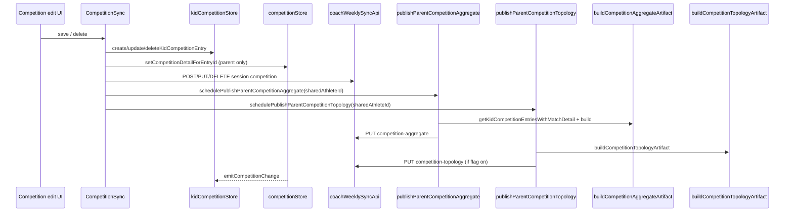
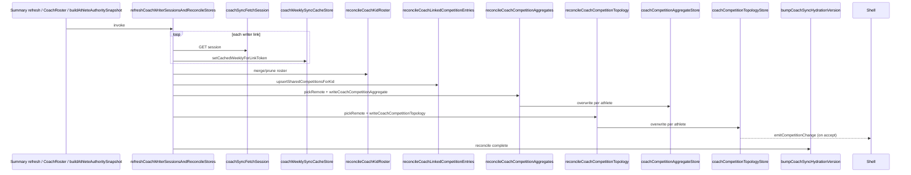
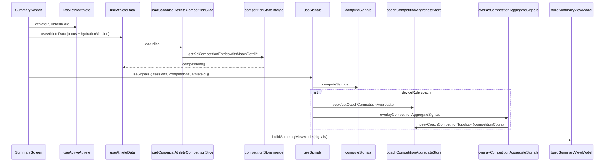
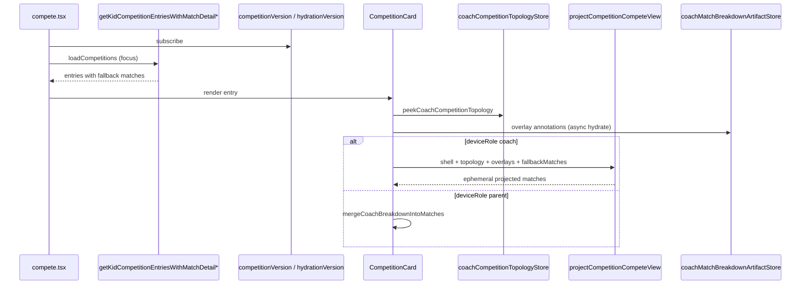
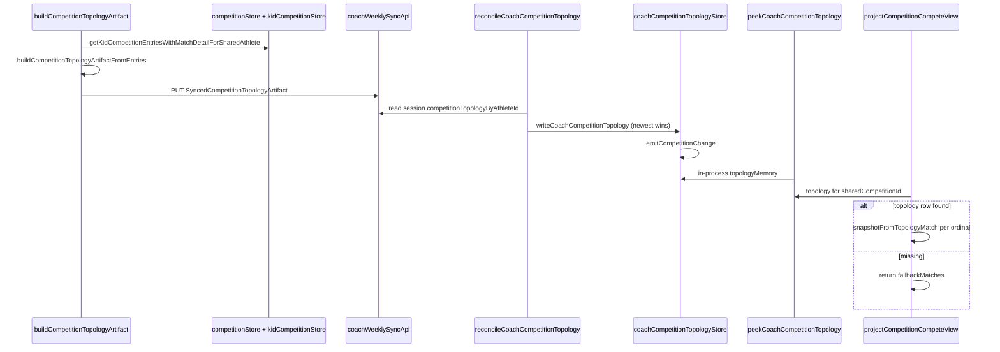
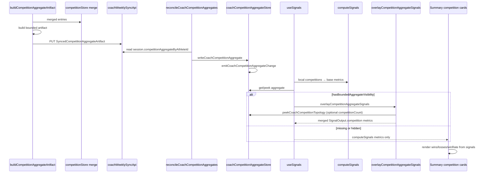

# Sequence Diagrams v1

Mermaid diagrams grounded in current repo call paths. Participant names match modules/stores.

---

## Parent competition mutation flow

---

## Coach hydration flow

---

## Summary render flow

---

## Compete render flow

---

## Topology projection flow

---

## Aggregate overlay flow

